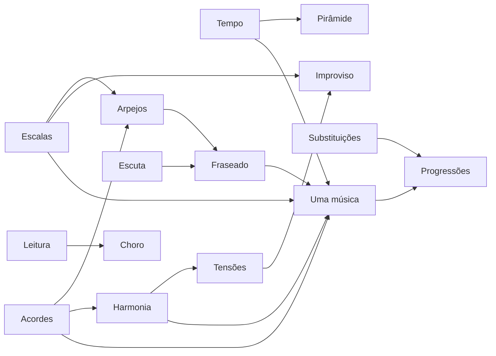

# PLN-02 — Mapas Temáticos por Pilar

> Decomposição de cada pilar em **temas ensináveis**, com objetivos, métodos Nelson Faria, materiais ancora e ligação com repertório BR

---

## Módulo A — Domínio do braço

### A1 — Escalas: mapa completo do instrumento

| Campo | Detalhe |
|-------|---------|
| **Objetivos** | Visualizar e executar escalas em todas as regiões; internalizar sonoridade, não fórmula |
| **Temas** | Maior; menores (3); pentatônicas; blues; diminuta; tom inteiro; cromática; modos gregos; modos artificiais |
| **Método NF** | "Escalas em todo o braço" — praticar por **tipo**, depois por **tom** |
| **Exercícios base** | Explorar tom a tom; região por região no braço; cantar graus antes de tocar |
| **Músicas-lab** | *Samba de Uma Nota Só* (modal); *Insensatez* (menor harmônica); *Blue Bossa* (dórico/F mixolídio) |
| **Aula extensa** | A-A1 (ver PLN-03) — ~2500 palavras, 8 exemplos |

### A2 — Sistema dos 10 acordes + voicings

| Campo | Detalhe |
|-------|---------|
| **Objetivos** | Montar 10 tipos × 4–5 formas; inversões; iniciar tensões |
| **Temas** | 7 qualidades + sus4 + 6M/6m; inversões; voice leading horizontal |
| **Método NF** | Vídeo 160 voicings; fechar o braço por família de acordes |
| **Exercícios base** | Um tipo de acorde por vez × várias formas; II–V–I com mínimo movimento |
| **Músicas-lab** | Progressões Jobim com mesma região de braço |
| **Referência livro** | *O Livro do Violão Brasileiro* — voicings bossa |

### A3 — Arpejos: som, superposição, encadeamento

| Campo | Detalhe |
|-------|---------|
| **Objetivos** | Arpejar cada qualidade; superpor triades; encadear em progressões |
| **Temas** | Arpejo por acorde; poliarpejo; melodia + arpejo simultâneo |
| **Método NF** | 7 acordes básicos como árvore; bossa arpejada cantando melodia |
| **Exercícios base** | *Garota de Ipanema* — arpejar em vez de rasguear; *Desafinado* |
| **Ligação** | Ponte para improvisação (células melódicas = arpejos ornamentados) |

---

## Módulo B — Técnica

### B1 — Precisão e tempo interno

| Campo | Detalhe |
|-------|---------|
| **Objetivos** | Contar e tocar simultaneamente; subdivisões independentes do clique |
| **Temas** | Metrônomo passivo vs. contagem ativa; polirritmia 3:2; pulso cruzado |
| **Método NF** | Exercícios "bobos"; falar o tempo em voz alta; sem instrumento primeiro |
| **Exercícios base** | Semicolcheias + tercinas; metrônomo no 2 e 4 enquanto toca tercinas |
| **Músicas-lab** | Levada samba (2/4) com contagem; bossa MD com subdivisão |

### B2 — Pirâmide rítmica e fluência

| Campo | Detalhe |
|-------|---------|
| **Objetivos** | Subdivisões 1–8 (ideal); reconhecer 9 como múltiplo de 3 |
| **Temas** | Pirâmide 1→12; ligados; palhetada (guitarra); independência MD/ME |
| **Método NF** | Referência Thiago Biazus — clique e subdivisão progressiva |
| **Exercícios base** | Pirâmide rítmica como aquecimento; depois aplicar em escala |
| **Ligação** | Técnica serve acompanhamento — 98% do tempo |

### B3 — Motivo melódico × figura rítmica

| Campo | Detalhe |
|-------|---------|
| **Objetivos** | Deslocar acentos; manter precisão com frase curta |
| **Temas** | 4 notas em semicolcheia vs. tercina; motivo fixo, ritmo variável |
| **Método NF** | Demonstração ao vivo ~29:39 |
| **Ligação** | Prepara fraseado jazz e **choro** (síncope) |

---

## Módulo C — Harmonia

### C1 — Harmonia funcional básica

| Campo | Detalhe |
|-------|---------|
| **Objetivos** | Identificar funções I–IV–V; II–V–I; campo harmônico maior/menor |
| **Temas** | Graus; cadências; dominantes primária/secundária |
| **Método NF** | 11 aulas YouTube — uma regra por aula |
| **Músicas-lab** | *Garota de Ipanema*; *Chega de Saudade*; *Águas de Março* |
| **Referência** | *Harmonia Aplicada* (Nelson Faria) |

### C2 — Tensões e nonas

| Campo | Detalhe |
|-------|---------|
| **Objetivos** | Escolher 9M vs. 9m; alterações em dominantes |
| **Temas** | Tensões disponíveis por função; exceções estilísticas |
| **Método NF** | Exemplo Cmaj → A7; *Wave* com 9M |
| **Exercícios base** | Harmonizar melodia de *Insensatez* com duas opções de 9 |

### C3 — Substituições e encadeamento

| Campo | Detalhe |
|-------|---------|
| **Objetivos** | trítono; subV; reharmonização introdutória |
| **Temas** | Substitutos; planing; empréstimos modais em MPB |
| **Músicas-lab** | *Corcovado*; *Desafinado*; *Luciana* |

---

## Módulo D — Improvisação (vocabulário)

### D1 — Escuta e transcrição

| Campo | Detalhe |
|-------|---------|
| **Objetivos** | Reconhecer frases; transcrever células; imersão auditiva |
| **Temas** | "Era surdo antes de ouvir"; fone à noite; clichês universais |
| **Método NF** | Workshop Ecossom; frase *Books on the table* |
| **Gravações** | Wes Montgomery; Joe Pass; Djavan; Romero Lubambo |
| **Exercícios base** | Uma frase por vez transcrita; cantar antes de tocar |

### D2 — Fraseado: aprender → variar → assinar

| Campo | Detalhe |
|-------|---------|
| **Objetivos** | Malhar frases; evitar repetição na jam; derivar variações |
| **Temas** | Célula melódica; retrograde; transposição; ritmo variado |
| **Método NF** | Curso *Fraseados*; conselho "malhar a frase" |
| **Exercícios base** | 1 clichê → 10 variações (como trítono demo ~61:17) |

### D3 — Improvisação macro → micro

| Campo | Detalhe |
|-------|---------|
| **Objetivos** | Começar por tom; evoluir para acorde-a-acorde |
| **Temas** | Escalas por tonalidade; notas evitadas por função; ouvido primeiro |
| **Método NF** | Backing tracks sem harmonia revelada |
| **Músicas-lab** | *Blue Bossa*; *Autumn Leaves*; *Samba de Uma Nota Só* solo |

---

## Módulo E — Leitura

### E1 — Alfabetização musical aplicada

| Campo | Detalhe |
|-------|---------|
| **Objetivos** | Ler ritmo + pitch em violão; não depender só de cifra |
| **Temas** | Notação; ritmos; posições; leitura à primeira |
| **Método NF** | Episódio Frank Gambale; "pare de ser analfabeto" |
| **Materiais** | Escola de Choro (Básico); partituras Nelson Faria |
| **Exercícios base** | Leitura contínua em paralelo; página a página, sem pressa |

---

## Módulo F — Repertório (integrador)

### F1 — Protocolo "uma música de cada vez"

| Campo | Detalhe |
|-------|---------|
| **Objetivos** | Domínio total de 1 música antes da próxima |
| **Checklist** | Melodia · Harmonia · Todos os tons · Todas oitavas · Solo introdutório |
| **Método NF** | Analogia poesia de cor; Batucada com cantora |
| **Primeiras músicas sugeridas** | *Corcovado* → *Garota de Ipanema* → *Desafinado* → *Insensatez* |

### F2 — Progressões-família (repertório como teoria)

| Campo | Detalhe |
|-------|---------|
| **Objetivos** | Reconhecer "a mesma música" em obras diferentes |
| **Temas** | I–VI–II–V; modulação por dominante; samba-canção vs. bossa |
| **Método NF** | Demonstração Wave/Samba Uma Nota/Desafinado |
| **Aula extensa** | Análise comparativa 3 obras — 1 foco por aula |

### F3 — Repertório brasileiro por gênero

| Gênero | Músicas-lab | Pilar prioritário |
|--------|-------------|-------------------|
| Bossa | Jobim standards | A2, C2, F1 |
| Samba | Cartola, Martinho | B1, F3 |
| Choro | Pixinguinha, Jacob | A3, B2, E1 |
| MPB | Djavan, Bosco | D1, F2 |

---

## Matriz de dependências

---

## Discos de referência (Q&A ~79–82 min)

Para módulo D1 e escuta guiada:

| Disco | Artista | Uso pedagógico |
|-------|---------|----------------|
| *My Funny Valentine* (ao vivo) | Miles Davis | Interação, improviso |
| *Stella by Starlight* | (referência no disco acima) | Vocabulário essencial |
| *Affinity* | Bill Evans | Harmonia piano |
| *Samambaia* | Hélio Delmiro + César Camargo | Violão + piano BR |
| *Brazilian Serenata* | Dori Caymmi | Arranjo MPB |
| *Inédito* (Bros 166) | Sérgio Mendes | Arranjo Jobim |
| *Words of João Bosco* | João Bosco | Repertório essencial |

Nelson: **6 discos bastam para vida inteira** — releitura ao longo de décadas aprofunda percepção.
