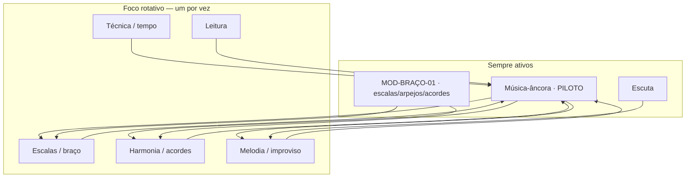

# PLN-04 — Progressão Integrada (Não Linear)

> Trilha **evolutiva** — mistura músicas, melodia, harmonia, escalas e acordes  
> Inspirada na rotina Nelson Faria, **sem calendário**: avança-se por **profundidade** e **prontidão**, não por prazo

---

## Princípios

1. **Repertório sempre presente** — mesmo quando o foco é escala ou harmonia, a música-âncora continua no radar.
2. **Macro antes do micro** — tonalidade antes de acorde-a-acorde (improviso).
3. **Uma música profunda** antes de acumular repertório raso.
4. **Escuta contínua** — imersão auditiva como aprendizado de língua (Nelson: ouvir até reconhecer).
5. **Técnica integrada** — precisão e tempo interno entram no fluxo, não como bloco isolado de meses.
6. **Sem cobrança de ritmo** — o currículo descreve **direção** e **camadas**; o tempo de maturação é seu.

---

## Modelo: espiral evolutiva (dois eixos)



**Como funciona**: você mantém **âncora + braço + escuta** enquanto **gira** o foco principal. [MOD-BRAÇO-01](modulos/MOD-BRAÇO-01-desvendando-acordes-arpejos-escalas/) (aulão ~2h36) e módulos repertório (ex. PILOTO-01) **correm em paralelo** — o braço alimenta a música; a música testa o braço.

---

## Camadas de maturidade (geral)

| Camada | Nome | O que muda na prática |
|--------|------|------------------------|
| **0** | Contato | Conhece a música; ouve; cifra/partitura |
| **1** | Braço | Escalas e acordes da obra em várias regiões |
| **2** | Forma | Melodia + harmonia separadas, tom original |
| **3** | Integração | Melodia e harmonia juntas; transposição |
| **4** | Linguagem | Improviso macro; frases transcritas |
| **5** | Domínio | De cor, vários tons; ouve progressão em outras obras |
| **6** | Repertório vivo | Toca em contexto real; harmoniza à pedido |

Não há obrigação de passar por todas as camadas em todas as músicas — mas **repertório Nelson** exige camada 5 antes de chamar uma música "sabida".

---

## Músicas-âncora — trilha sugerida

Ordem **pedagógica**, não cronológica. Avance quando a âncora atual estiver **confortável na camada 4–5**.

| Ordem | Música | Progressão-família | O que esta âncora ensina |
|-------|--------|-------------------|--------------------------|
| 1 | *Corcovado* | II–V–I maior | Bossa intimista; voicings M7; melodia mínima |
| 2 | *Garota de Ipanema* | Bossa clássica | Braço + repertório; modulação da ponte |
| 3 | *Chega de Saudade* | Menor → maior | Marco histórico; alternância de modo |
| 4 | *Desafinado* | I–VI–II–V | Melodia + harmonia; voice leading; cromatismo |
| 5 | *Samba de Uma Nota Só* | Modal / nota pedal | Modos; nota parada, harmonia que escorre |
| 6 | *Insensatez* | Menor Jobim (condução descendente) | Tensões; círculo de quintas; melodia icônica |
| 7 | ★ *Águas de Março* | Harmonia **não-funcional** (condução de vozes) | MPB profunda; baixo descendente; pensar pela linha |
| 8 | Livre | Revisão | Integração; escolha do aluno |

> ★ **Módulo piloto escrito**: *Águas de Março* é a âncora desenvolvida por inteiro em [modulos/PILOTO-01-aguas-de-marco/](modulos/PILOTO-01-aguas-de-marco/) — prova de formato. Embora apareça aqui como âncora **avançada** (harmonia não-funcional), serve de demonstração da profundidade que cada módulo terá.

**Conexão Nelson**: *Corcovado*, *Desafinado* e *Samba de Uma Nota Só* compartilham o DNA da bossa de Jobim; *Insensatez* e *Águas de Março* compartilham a **condução de vozes descendente** — dominar uma acelera a outra (NF-F2).

---

## Profundidade por âncora — *Águas de Março* (modelo replicável)

Use este esqueleto para **qualquer** música. Não é checklist com prazo — é **mapa de profundidade**.

### Foco rotativo possível (qualquer ordem, conforme necessidade)

| Foco | Conteúdo | Liga com |
|------|----------|----------|
| Escalas | Centro de Dó (jônio + cor menor); a escada do baixo | NF-A1 |
| Acordes | `C/Bb`, `Am6`, `A/G`, `Gb7(#11)`, `Fmaj7`, `Fm6`, `C6/9`, pedais (`Gm7/C`, `D/C`) | NF-A2 |
| Harmonia | Condução de vozes; baixo descendente; substituição de trítono; pedal | NF-C1, C2 |
| Melodia | Motivo silábico (Mi–Ré–Dó); prosódia da enumeração | NF-A3 |
| Improviso | Macro (centro de Dó); depois "tocar pela linha" | NF-D3 |
| Técnica | Independência polegar (baixo caminhante) × dedos | NF-B1 |
| Escuta | Dueto *Elis & Tom* (1974); transcrição do **baixo** | NF-D1 |

### Camadas na obra

| Camada | *Águas de Março* — marcos |
|--------|----------------------------|
| 1 | Toca a escada do baixo e os voicings com baixo invertido em 2+ regiões |
| 2 | Canta a melodia (prosódia) e acompanha a estrofe separadamente |
| 3 | Integra melodia parada + baixo caminhante; transpõe a escada |
| 4 | Improvisa macro (centro de Dó) e "toca pela linha"; transcreve o baixo |
| 5 | Sabe de cor; reconhece a condução descendente de Jobim noutras obras |

Replique a tabela para *Insensatez*, *Corcovado*, etc., trocando conteúdo harmônico e melódico.

---

## Matriz de mistura — o que combinar

Quando estiver trabalhando um foco, **puxe** outro para a mesma sessão de estudo (sem receita de duração):

| Foco principal | Combinar com | Música-lab |
|----------------|--------------|------------|
| Escala dórica | Acorde m7 correspondente | *Blue Bossa*, *So Danco Samba* |
| Voicing M7 | Melodia com 7M na top line | *Garota*, *Corcovado* |
| Arpejo m7 | Cantar melodia arpejando | *Desafinado* |
| Harmonia II–V–I | Improviso macro | Qualquer standard |
| Frase transcrita | Variação rítmica (B3) | Djavan solo |
| Leitura | Trecho do arranjo da âncora | Partitura Nelson |
| Técnica / metrônomo | Levada da âncora | Samba ou bossa |

---

## Sessão de estudo — blocos (sem tempo)

Nelson trabalha **vários eixos** numa mesma rotina; aqui está a **estrutura**, não a duração:

```
1. TÉCNICA / TEMPO     — aquecimento consciente (metrônomo, contagem, pirâmide)
2. REPERTÓRIO ÂNCORA   — melodia, harmonia ou transposição da música atual
3. FOCO DO MOMENTO     — escala OU acorde OU harmonia OU frase (rotação)
4. ESCUTA ATIVA        — transcrição, reconhecimento, imersão
```

**Paralelos opcionais** (quando fizer sentido):

- Leitura de partitura (E1)
- Jam ou backing track (improviso macro)
- Imersão só auditiva (fone, gravações de referência)

---

## Sinais de prontidão — próxima âncora ou próximo foco

Avance **quando sentir**, validando com estes marcos (não todos de uma vez):

- [ ] Melodia **de cor** em **vários tons**
- [ ] Harmonia **sem depender de cifra** no tom original
- [ ] Reconhece a progressão em **outras músicas**
- [ ] Improvisa com continuidade (macro ok no início)
- [ ] Transcreveu **pelo menos uma frase** de gravação

Se faltar um item, **aprofundar a mesma âncora** — Nelson insiste: uma música bem vale mais que dezenas rasas.

---

## Relação entre aulas (PLN-03) e prática

| Fase evolutiva | Aulas que alimentam | Papel |
|----------------|---------------------|-------|
| Fundação braço | **MOD-BRAÇO-01** (PLN-05) + NF-A1, A2 | Sistema GIT escalas→arpejos→acordes |
| Fundação repertório | NF-F1 + PILOTO-01 | Primeira música-âncora |
| Profundidade | NF-A3, C2, D1, F2 | Arpejos, tensões, escuta |
| Integração | NF-D2, D3, F3, F4 | Fraseado, improviso, obras completas |
| Brasilidade | NF-F5, B3, C3, E1 | Samba, choro, leitura |

Ordem das **aulas** é sugestiva; ordem da **prática** segue a espiral da âncora.

---

## Ligação com pesquisa violão BR

Complementa [SYN-07](../research-violao-brasileiro-pedagogia-20260620/04-synthesis/SYN-07-plano-estudo-integrado.md):

| SYN-07 | PLN-04 |
|--------|--------|
| Eixo samba → bossa → choro | Eixo jazz-MPB + braço universal |
| Levada como entrada | Braço + harmonia como entrada |
| Roda / imersão oral | Escuta + repertório profundo |

**Integração**: PLN-04 para **fundamentos universais**; SYN-07 para **profundidade de gênero** (samba, choro) — dois mapas, mesma espiral.

---

## Próximos passos de produção

1. Redigir **MOD-BRAÇO-01** AULA-01 (escalas) — fonte PLN-05 / vídeo `pmrCrcwP65A`.
2. Extrair trechos de vídeo (timestamps PLN-01 e PLN-05) para embutir nos materiais.
3. Backing tracks "harmonia oculta" estilo Fica a Dica (NF-D3).
4. Catalogar cifras/partituras das músicas-âncora no repertório-musicas.
