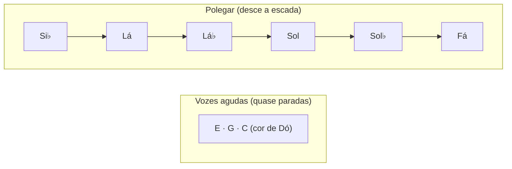

# Águas de Março — voicings, baixo caminhante e levada
> **Foco**: música — *Águas de Março* no violão (tom didático de Dó maior)
> **Módulo**: PILOTO-01 · **Aula**: 02 de 3 · **Pilares Nelson**: braço (1) · técnica (2) · harmonia (3)
> **Pré-requisito**: [AULA-01](AULA-01-repertorio-campo-e-escalas.md) (a linha descendente e o campo harmônico)

---

## Por que estudar isto

Na AULA-01 vimos que *Águas de Março* **é** uma linha de baixo que desce. Agora vamos **tocá-la**. E aqui mora a lição de ouro do violão brasileiro: o segredo desta música **não é decorar acordes** — é **conduzir o baixo com o polegar** enquanto os dedos seguram (quase sem mexer) o miolo do acorde por cima. O polegar é o protagonista; ele desce a escada.

É exatamente a técnica do **violão de 7 cordas** no choro (a "baixaria") e da mão direita de **João Gilberto** na bossa: **duas vozes independentes** — o polegar fazendo a melodia do baixo, os dedos fazendo o acorde sincopado.

Vamos cobrir: (1) **voicings** com o baixo invertido certo; (2) a **redução de condução de vozes** que mostra a escada; (3) a **levada de samba/bossa** com baixo caminhante; (4) **chord-melody** no estilo Nelson Faria.

### Como ler as tablaturas

```
Cordas:  e = 1ª (mais aguda)
         B = 2ª
         G = 3ª
         D = 4ª
         A = 5ª
         E = 6ª (mais grave)

Números = casa (traste).  x = não toca / abafa.  0 = corda solta.
Afinação padrão: E A D G B e.   ← (o baixo de cada acorde está marcado)
```

---

## 1. O princípio: o baixo manda

Antes dos acordes, internalize a regra desta música:

> **Os dedos quase não se mexem; o polegar desce.** Em quase toda a primeira estrofe, as vozes agudas ficam perto de **Mi–Dó / Mi–Ré–Dó**, enquanto o baixo desce `Si♭ → Lá → Lá♭ → Sol → Sol♭ → Fá`. Você está tocando **um acorde de Dó "borrado"** cujo baixo escorrega para baixo.



---

## 2. Voicings da primeira estrofe (a escada)

Conjunto na **região aberta/baixa**, escolhido para o **baixo descer nas cordas graves** com o mínimo de movimento nos dedos. O baixo de cada acorde está identificado à direita.

### `C/Bb` — tônica desestabilizada (baixo Si♭)

```
e|-0-|  E
B|-1-|  C
G|-0-|  G
D|-2-|  E
A|-1-|  Bb   ← baixo
E|-x-|
```
> Soa como um Dó com a 7ª no baixo (o "topo da escada"). É o acorde da introdução — repita-o com groove sentindo a suspensão.

### `Am6` — degrau Lá (baixo Lá)

```
e|-2-|  F#
B|-1-|  C
G|-2-|  A
D|-2-|  E
A|-0-|  Lá   ← baixo
E|-x-|
```
> `Am6 = A C E F#`. Guarde: estas são **as mesmas 4 notas de `F#m7(b5)`** — muda só o baixo (ver §4).

### `Fm6/Ab` — degrau Lá♭ (baixo Lá♭) · *harmonização do módulo-mãe*

```
e|-1-|  F
B|-3-|  D
G|-1-|  Ab
D|-3-|  F
A|-x-|
E|-4-|  Ab   ← baixo
```
> Este acorde **completa o cromatismo** Lá → **Lá♭** → Sol. Em muitas cifras populares ele é "pulado" e troca-se direto por `A/G` (ver abaixo). As duas leituras são válidas (AULA-01).

### `A/G` — degrau Sol (baixo Sol)

```
e|-0-|  E
B|-2-|  C#
G|-2-|  A
D|-2-|  E
A|-x-|
E|-3-|  Sol   ← baixo
```
> `A` maior (A C# E) sobre Sol. O **Dó# brilha** aqui — uma cor "de fora" do tom, típica de Jobim.

### `Gb7(#11)` — degrau Sol♭ (baixo Sol♭) · *substituição de trítono*

```
e|-2-|  F#(=Gb)
B|-2-|  C   (#11)
G|-3-|  Bb  (3ª)
D|-2-|  E   (b7 = Fb)
A|-x-|
E|-2-|  Gb   ← baixo
```
> No lugar do `C7` (dominante), Jobim usa o **trítono-substituto** `Gb7`. O baixo desce ½ tom (Sol→Sol♭) rumo ao Fá. A #11 (Dó) é a cor.

### `Fmaj7` — degrau Fá (baixo Fá)

```
e|-0-|  E
B|-1-|  C
G|-2-|  A
D|-3-|  F
A|-x-|
E|-1-|  Fá   ← baixo
```

### `Fm6` — a sombra menor do Fá (baixo Fá)

```
e|-1-|  F
B|-3-|  D
G|-1-|  Ab
D|-3-|  F
A|-x-|
E|-1-|  Fá   ← baixo
```
> O par `Fmaj7 → Fm6` (maior depois menor sobre o mesmo baixo) é uma das cores mais "Jobim" da peça: a luz que escurece.

### `C6/9` — o repouso colorido (baixo Dó)

```
e|-3-|  G
B|-3-|  D
G|-2-|  A
D|-2-|  E
A|-3-|  Dó   ← baixo
E|-x-|
```
> Nunca um Dó "seco": a chegada é sempre **6/9** (com Lá e Ré). É o "repouso que não repousa".

---

## 3. Acordes de pedal e do trecho variado

Quando o baixo para no **Dó (pedal)** ou no trecho "É um estrepe, é um prego":

### `Gm7(9)/C` — pedal de Dó

```
e|-3-|  G
B|-3-|  D
G|-3-|  Bb
D|-3-|  F
A|-3-|  Dó   ← baixo (pedal)
E|-x-|
```

### `F#m7(b5)` — o meio-diminuto (= `Am6` com outro baixo)

```
e|-x-|
B|-1-|  C
G|-2-|  A
D|-2-|  E
A|-x-|
E|-2-|  F#   ← baixo
```

### `Cmaj7/G` — pedal/inversão (baixo Sol)

```
e|-0-|  E
B|-0-|  B
G|-0-|  G
D|-2-|  E
A|-3-|  C
E|-3-|  Sol   ← baixo
```

### `Cm7` — a inflexão menor (baixo Dó)

```
e|-x-|
B|-4-|  Eb
G|-3-|  Bb
D|-5-|  G
A|-3-|  Dó   ← baixo
E|-x-|
```

### `D/C` — pedal de Dó com cor lídia

```
e|-2-|  F#
B|-3-|  D
G|-2-|  A
D|-0-|  D
A|-3-|  Dó   ← baixo (pedal)
E|-x-|
```

---

## 4. A grande economia: acordes que são "o mesmo acorde"

Esta peça recompensa quem enxerga **identidades** (puro Nelson Faria — "acorde dentro do acorde"):

| Identidade | Notas | Lição |
|------------|-------|-------|
| `Am6` = `F#m7(b5)` | A C E F# | Mesmas 4 notas; muda **só o baixo** → condução de vozes pura |
| `Fm6` = `Dm7(b5)` | F Ab C D | A "sombra menor" do Fá é um meio-diminuto disfarçado |
| `C/Bb` ≈ `C7` no topo | Bb C E G | A tônica "pendurada" tem som de dominante — por isso quer descer |

> **Por que importa**: se você decora **uma** forma (digamos `Am6`/`F#m7b5`) e aprende a **deslocar o baixo**, já toca vários "acordes diferentes" da música com a mesma mão esquerda. A música tem menos formas do que parece.

---

## 5. Condução de vozes (a redução)

Aqui está o esqueleto: **as vozes agudas seguram, o baixo desce**. Toque nas cordas **D–G–B** (3 vozes agudas) + o baixo no polegar.

```
        C/Bb    Am6     Fm6/Ab   A/G     Gb7#11   Fmaj7
B|------1-------1-------3-------2-------2-------1----|  voz aguda
G|------0-------2-------1-------2-------3-------2----|  voz média
D|------2-------2-------3-------2-------2-------3----|  voz grave (interna)
                                                       
baixo: Bb      A       Ab      G       Gb      F      ← polegar desce a escada
```

**O que se move (e o que fica):**

| Transição | Vozes agudas | Baixo |
|-----------|--------------|-------|
| `C/Bb → Am6` | quase paradas (C fica) | Si♭ → Lá |
| `Am6 → Fm6/Ab` | pequeno ajuste | Lá → Lá♭ |
| `Fm6/Ab → A/G` | retoma cor maior | Lá♭ → Sol |
| `A/G → Gb7#11` | C# → C (½ tom) | Sol → Sol♭ |
| `Gb7#11 → Fmaj7` | resolve | Sol♭ → Fá |


**Regra de ouro**: nunca "salte" pelo braço. Segure as notas comuns no topo e deixe **só o polegar trabalhar** descendo de semitom em semitom. É assim que a música soa como água escorrendo, e não como acordes batidos.

---

## 6. Levada de samba/bossa com baixo caminhante

A canção é, na origem, um **samba** (Chico Buarque: "o samba mais bonito do mundo"), mas é tocada com a batida íntima de bossa. A mão direita divide-se em **duas vozes**:

- **Polegar (p) = baixo**: aqui ele não fica só na fundamental — ele **caminha para baixo** (a escada). É o coração rítmico e melódico.
- **Dedos (i-m-a) = acorde sincopado**: atacam as agudas como bloco, acentuando os **contratempos**.

### Padrão básico (grade de colcheias, 2/4 de samba sentido em 4)

```
Contagem:   1   &   2   &   3   &   4   &
Polegar(p): B   ·   ·   ·   B   ·   ·   ·     ← baixo (desce a cada compasso)
Dedos(ima): C   ·   ·   C   ·   C   ·   C     ← acorde sincopado
```

### O baixo caminhante na prática

A cada compasso (ou meio compasso), **o polegar toca o próximo degrau**:

```
Comp. 1: baixo Si♭   |  Comp. 2: baixo Lá   |  Comp. 3: baixo Lá♭/Sol ...
   p: Bb ........ Bb  |     p: A ......... A  |     p: Ab ........ G
 ima: acorde sincop. |   ima: acorde sinc.  |   ima: acorde sinc.
```

> **A imagem mental**: a mão esquerda segura a "cor de Dó"; o polegar direito desce a escada do baixo. Os dedos sincopam por cima sem mudar quase nada. É a textura exata de João Gilberto.

### Independência polegar × dedos (exercício nº 1)

```
Contagem:   1   &   2   &   3   &   4   &
p:          B               B
ima:        C       ·   C       C       C
```
Lentíssimo, com metrônomo: o polegar metronômico **descendo a escada**, os dedos flutuando nos contratempos. Sem isso, a música não acontece.

### Dedilhado

- `p` → cordas graves (6/5/4): **o baixo que desce**.
- `i-m-a` → as três agudas, atacadas **juntas** (encoste os dedos — é o segredo do *thump* sincopado).
- Deixe as notas **soarem e ligarem** (não abafe com a direita); a escada do baixo precisa "encadear".

---

## 7. Chord-melody (estilo Nelson Faria)

Como a **melodia** é quase parada (Mi–Ré–Dó) e o **baixo** é que se move, *Águas de Março* é um caso perfeito de chord-melody "às avessas": a **melodia fica no topo, sustentada**, enquanto o **polegar desenha a música** embaixo.

**Receita**:

1. Monte a "cor de Dó" nas agudas com a **nota da melodia** no topo (E, D ou C).
2. Polegar toca o **degrau do baixo** no tempo 1.
3. Dedos arpejam de baixo para cima (i→m→a), mantendo a melodia soando.

Exemplo — melodia em **Mi** (topo) enquanto o baixo desce `Bb → A`:

```
        (Bb no baixo)        (A no baixo)
e|------0-- E (melodia)  |  --0-- E (melodia)  |
B|------1-- C            |  --1-- C            |
G|------0-- G            |  --2-- A            |
D|------------           |  ------             |
A|--1-------- Bb (p)     |  --0-- A (p)        |
E|------------           |  ------             |
```

A melodia (Mi) **não se mexe**; o polegar conta a história. Esse é o coração da interpretação de Jobim/João.

---

## 8. Ordem de estudo e erros comuns

### Ordem sugerida (sem prazo — avance quando confortável)

1. **A escada só no polegar**: toque só o baixo descendente (`Si♭–Lá–Lá♭–Sol–Sol♭–Fá`) nas cordas graves, com groove.
2. **Cor de Dó parada**: segure as agudas (E–G–C) e só **troque o baixo** por baixo dela.
3. **Voicings reais** (§2), um por compasso, lento.
4. **Redução de condução de vozes** (§5): sentir o que fica e o que desce.
5. **Levada + baixo caminhante** (§6).
6. **Chord-melody** (§7).

### Erros comuns (e como evitar)

| Erro | Correção |
|------|----------|
| Tratar cada acorde como "novo" e saltar pelo braço | Veja a **cor de Dó parada** + baixo que desce |
| Polegar parado na fundamental | Aqui o polegar **caminha** (é o protagonista) |
| Bater o acorde no tempo forte | A alma está nos **contratempos** + baixo encadeado |
| Abafar as notas | Deixe a escada do baixo **ligar** de um degrau ao outro |
| Decorar cifra sem ouvir o baixo | Cante o baixo descendente antes de tocar |
| Ignorar `Fmaj7 → Fm6` | A troca maior→menor sobre o mesmo Fá é uma cor essencial |

### Transposição

A peça gira em torno de **uma escada de baixo**. Para mudar de tom, **transponha a escada** (em Si♭: La♭–Sol–...; em Lá, como João Gilberto: Sol–Fá#–...). Use as formas com baixo na 6ª e 5ª corda como âncoras e deslize. Cante o baixo no tom novo **antes** de tocar.

---

## Exercícios práticos

1. **A escada nua**: só o baixo descendente nas cordas graves, com metrônomo, sentindo cada degrau.
2. **Cor parada + baixo móvel**: segure E–G–C nas agudas e troque só o baixo (Bb→A→Ab→G→Gb→F).
3. **Voicings em sequência**: a primeira estrofe inteira, um acorde por compasso, lentíssimo.
4. **Identidade `Am6`/`F#m7b5`**: alterne os dois mudando só o baixo.
5. **`Fmaj7 → Fm6`**: toque a troca maior→menor 10 vezes, ouvindo a cor escurecer.
6. **Levada + caminhante**: a estrofe com a batida de bossa e o polegar descendo.
7. **Chord-melody**: a melodia parada no topo (Mi–Ré–Dó) enquanto o polegar desenha o baixo.

---

## Síntese

- O segredo do violão nesta música: **dedos quase parados (cor de Dó) + polegar que desce a escada**.
- Os **slash chords** (`C/Bb`, `Fm6/Ab`, `A/G`, `D/C`) existem para pôr o **degrau certo no baixo**.
- **Economia de formas**: `Am6 = F#m7(b5)`, `Fm6 = Dm7(b5)` — muda só o baixo.
- **Condução de vozes**: segure as notas comuns, desça só o baixo de semitom em semitom.
- **Levada**: polegar = baixo caminhante (não fixo); dedos = acorde sincopado nos contratempos.
- **Chord-melody "às avessas"**: melodia parada no topo, o baixo conta a história.

---

## Para ir além

- **Leitura**: Nelson Faria — *The Brazilian Guitar Book* (levadas e chord-melody) e *O Violão de 7 Cordas* (baixaria/baixo caminhante).
- **Escuta de comping**: João Gilberto (independência polegar/dedos); Elis & Tom (1974) para o baixo do arranjo.
- **Técnica de choro**: a "baixaria" do 7 cordas é a mesma lógica de baixo descendente.
- **Segue para**: [AULA-03 — Melodia, prosódia e improviso](AULA-03-melodia-improviso-macro.md).
