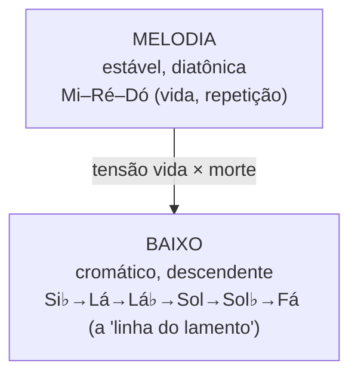

# Águas de Março — melodia, prosódia e improviso pela linha
> **Foco**: música — *Águas de Março*, melodia e improvisação no violão
> **Módulo**: PILOTO-01 · **Aula**: 03 de 3 · **Pilares Nelson**: improvisação (4) · leitura/prosódia (5) · escuta
> **Pré-requisitos**: [AULA-01](AULA-01-repertorio-campo-e-escalas.md) (a linha descendente) · [AULA-02](AULA-02-acordes-voicings.md) (braço)

---

## Por que estudar isto

Nelson Faria tem uma tese central: **escalas são o alfabeto, não a frase**. Saber a escala de Dó não faz você improvisar, do mesmo jeito que conhecer o alfabeto não faz você falar uma língua. O que faz improvisar é **vocabulário** — frases ouvidas, absorvidas, transformadas — e isso se constrói **ouvindo**.

*Águas de Março* é o caso mais radical para entender isso, porque a melodia da própria música **prova a tese de cabeça para baixo**: ela é construída com **pouquíssimas notas** (essencialmente Mi–Ré–Dó), repetidas à exaustão. Não é a "escala" que dá beleza — é o **ritmo das palavras** (a prosódia) e o **baixo que muda embaixo**. Esta aula trata a melodia como vocabulário, a prosódia como partitura, e o improviso como "tocar pela linha".

---

## A melodia: muita palavra, pouca nota

A melodia de *Águas de Março* é **estável, silábica e repetitiva**: uma sílaba por nota, muitas notas repetidas, graus conjuntos, âmbito de cerca de **uma oitava**. O motivo nuclear é curtíssimo:

```
Motivo nuclear (refrão melódico):
Grau:  3 — 2 — 1
Nota:  Mi — Ré — Dó      ("é pau, é pe-dra...")
```

Esse punhado de notas **se repete** enquanto a harmonia (o baixo) muda de significado embaixo. É a mesma ideia do *Samba de Uma Nota Só*, levada ao limite: a melodia "fica parada" e o sentido vem **de baixo**.

### O contraste que gera a música



O **diatônico estável** (melodia) contra o **cromático descendente** (baixo) é o paralelo musical da antítese vida/morte, sol/noite da letra. Quem canta a melodia tem que **ouvir o baixo descer por baixo** — é aí que a mágica acontece.

---

## A prosódia é a partitura

Diferente de uma melodia de bossa lírica (como *Corcovado*), aqui o **ritmo das palavras É a melodia**. A letra é um **inventário** ("é pau, é pedra, é o fim do caminho") em que o fluxo silábico, quase falado, molda o fraseado.

- **Estrutura "É… / É um… / É o…"**: cada item entra na mesma célula rítmica curta.
- **Recursos sonoros que viram música**: pleonasmo ("vento ventando", "pingo pingando"), paronomásia ("é uma ponta, é um ponto", "é uma conta, é um conto") — repetições de som que reforçam a sensação de **enxurrada acumulando**.
- **Ambiguidade métrica**: o primeiro compasso cantado é **ternário** (único na peça), antes de assentar no 2/4 de samba. Cante prestando atenção a esse "tropeço" inicial — é parte do charme.

> ⚠️ **Nota sobre alturas**: as alturas absolutas variam por gravação (Tom em Si maior, Elis em Si♭, João em Lá). O que é **constante** é o mecanismo: **motivo curto e silábico (Mi–Ré–Dó no nosso tom de Dó), repetido, sobre baixo descendente**. Aprenda **cantando a prosódia** antes de procurar tablatura.

### Por que cantar primeiro (Nelson)

Você só "sabe" uma música quando canta a melodia de cor. Aqui é fácil de cantar e difícil de esquecer — justamente por ser silábica. Cante a primeira estrofe inteira (com a letra) **antes** de tocá-la. A letra é o melhor mapa rítmico que existe.

---

## A forma é um fluxo (não há "fim" para preparar)

A forma é **cíclica e cumulativa**: imagens que se acumulam, "termina recomeçando". Para o improvisador, isso muda tudo:

- **Não existe a tensão "vou chegar no I"** — não há cadência conclusiva.
- O improviso aqui não é "frases que resolvem"; é **continuidade**, fluxo, como a própria chuva.
- No dueto *Elis & Tom* (1974), as duas vozes se **sobrepõem em vai-e-vem** (uma canta enquanto a outra responde) — um modelo de como "improvisar" contracantos sobre a linha.

---

## Improviso macro → micro

Nelson descreve dois estágios: **macro** (pensar por tonalidade) e **micro** (pensar acorde a acorde), sempre com o **ouvido** no comando. Em harmonia não-funcional, há ainda um terceiro caminho, o mais idiomático: **tocar pela linha**.

### Nível 1 — Macro: o centro de Dó

```
A peça inteira  →  CENTRO DE DÓ  (jônio, abraçando a cor menor de empréstimo)
```

Como tudo gravita em torno de Dó (com a melodia presa a Mi–Ré–Dó), você pode improvisar **ouvindo Dó como pedal mental** e tratar os acordes como colorações passageiras. Abrace a **ambiguidade maior/menor** (o Mi♭ entra como cor). Só isso já soa musical.

### Nível 2 — Micro: refinar os acordes-cor

Quando quiser detalhar (tabela completa na AULA-01):

| Acorde | Escala | Cor |
|--------|--------|-----|
| `C/Bb`, `C6/9` | Dó jônio | tônica colorida |
| `Am6` / `F#m7(b5)` | Lá menor melódica / Fá# lócrio ♮2 | o "D9 sem fundamental" |
| `A/G` | Lá mixolídio | Dó# brilhando |
| `Gb7(#11)` | Sol♭ lídio dominante | a #11 (Dó) como cor |
| `Fmaj7` / `Fm6` | Fá lídio / Fá menor melódica | luz que escurece |
| `Gm7(9)/C`, `D/C` | sobre pedal de Dó | harmonia muda, baixo fica |

### Nível 3 — Tocar pela linha (o jeito *Águas de Março*)

Esta é a abordagem **idiomática** para harmonia de condução de vozes: em vez de "trocar de escala", **construa o improviso em torno da própria escada descendente**.

```
Toque, numa voz aguda, a mesma descida do baixo:
Si♭ → Lá → Lá♭ → Sol → Sol♭ → Fá
e faça suas frases "se apoiarem" nessas notas-guia, no tempo de cada acorde.
```

Paulo Costa Lima aponta ainda um gesto cromático interno na 2ª parte — uma voz descendo **Lá → Sol# → Sol** sobre o pedal de Dó. **Frasear cromatismos descendentes** é o vocabulário mais autêntico desta peça.

---

## O vocabulário desta música

### Ferramenta 1 — A escada como frase

A própria linha descendente é uma "palavra" pronta. Toque-a como motivo, em ritmos diferentes:

```
Bb — A — Ab — G — Gb — F        (a escada, descendo)
```
Sobre o backing, ela **sempre encaixa**, porque é o esqueleto da harmonia.

### Ferramenta 2 — Notas comuns que "viram" de acorde

Como `Am6 = F#m7(b5)` e `Fm6 = Dm7(b5)`, uma mesma frase **muda de cor** quando o baixo muda. Toque o arpejo `A–C–E–F#` e ouça-o significar **duas coisas** conforme o baixo (Lá ou Fá#):

```
A C E F#  sobre baixo Lá   → Am6   (cor de tônica relativa)
A C E F#  sobre baixo Fá#  → F#m7b5 (cor de pré-dominante)
```

### Ferramenta 3 — Pedal melódico (a "nota só")

Imite a própria estética da música: **segure uma nota aguda** (ex.: Mi ou Sol) e deixe o backing mudar embaixo. O improviso vira "comentário" sobre a harmonia que escorre — muito mais musical do que correr escala.

### Ferramenta 4 — Cor menor no fim

No fechamento ("fechando o verão"), a peça se colore de **menor**. Use o **Mi♭** (3ª menor) e uma micro-linha cromática descendente `Mi♭ → Ré → Dó` para reproduzir essa inflexão.

---

## Como Nelson manda construir vocabulário

Não basta ter as ferramentas — é preciso **absorvê-las e transformá-las**. O ciclo:


1. **Ouvir** o dueto de 1974 até "ouvir o baixo" descer (não só a melodia).
2. **Transcrever** — comece pela **linha do baixo**, não pela melodia (aqui o baixo é o tesouro).
3. **Aprender** a escada em duas regiões e **cantar**.
4. **Malhar**: crie 10 variações rítmicas do motivo Mi–Ré–Dó e da escada.
5. **Integrar**: as frases descendentes viram parte da sua voz — e você passa a ouvi-las em outras músicas de Jobim.

---

## Exercícios práticos

1. **Cantar a estrofe**: a primeira estrofe inteira com a letra, de cor, sem instrumento — sentindo a prosódia.

2. **Cantar o baixo**: cante **só a escada** (`Si♭–Lá–Lá♭–Sol–Sol♭–Fá`) sobre a gravação. Este é o exercício-chave.

3. **Macro puro**: improvise a estrofe usando **só o centro de Dó** (com Mi♭ de cor). Note como já funciona.

4. **Tocar pela linha**: improvise apoiando as frases na escada descendente (Ferramenta 1).

5. **Nota só**: segure um Mi (ou Sol) agudo e deixe o backing mudar — improviso como "comentário".

6. **Identidade que vira cor**: toque `A–C–E–F#` sobre baixo Lá e depois sobre baixo Fá#; ouça a mesma frase mudar de função.

7. **Transcrição**: tire **a linha do baixo** de um trecho do dueto *Elis & Tom*. Cante, toque, transponha.

8. **Inflexão menor**: reproduza o fechamento com `Mi♭ → Ré → Dó` sobre a cor menor.

---

## Síntese

- A **melodia** é estável e silábica (Mi–Ré–Dó repetido); a beleza vem da **prosódia** e do **baixo que muda embaixo**.
- O contraste **diatônico (melodia) × cromático (baixo)** é o paralelo vida/morte da letra.
- A **forma é fluxo** (cíclica/cumulativa) — não há cadência conclusiva a preparar; improvise por **continuidade**.
- **Improviso**: macro (centro de Dó), micro (acordes-cor) e, melhor, **tocar pela linha** (apoiar-se na escada descendente).
- **Vocabulário**: a escada como frase; notas comuns que mudam de cor; pedal melódico; inflexão menor no fim.
- **Vocabulário** se constrói: ouvir → transcrever (o baixo!) → aprender → malhar → integrar.
- O ouvido guia; a escala é só o alfabeto.

---

## Para ir além

- **Transcrever**: a **linha de baixo** do dueto *Elis & Tom* (1974); contracantos das duas vozes.
- **Aplicar a abordagem**: leve "tocar pela linha" para *Insensatez* e *Corcovado* (condução descendente de Jobim).
- **Vínculo estilístico**: a "baixaria" descendente do choro (violão de 7 cordas) usa a mesma lógica.
- **Vídeo Nelson**: [Rotina de Estudos](https://www.youtube.com/watch?v=AvGYd1tv8n0) — improvisação/vocabulário 44:25 e 74:00.
- **Próximo módulo**: PILOTO-02 (*Insensatez*) — outra obra-prima de Jobim sobre condução de vozes, agora em menor.
