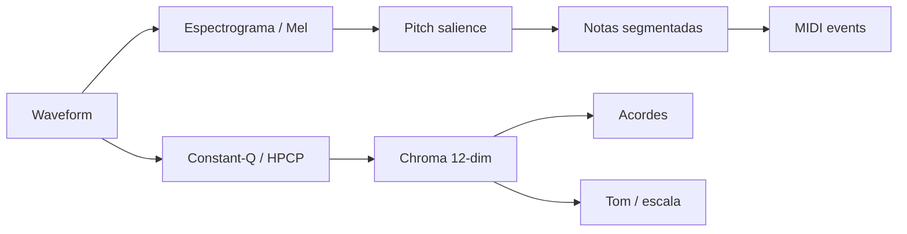

# 01 — Fundamentos e Pipeline de Extração Musical

## O problema central

**Extração de dados musicais** é converter sinais ou documentos não estruturados em **representações manipuláveis**: notas (pitch + onset + offset + velocity), acordes (símbolo + timestamp), instrumento (programa GM ou stem), identidade da obra (título, artista, ISRC) e notação específica (cifra, tablatura, pentagrama).

Diferente de "compreensão musical" via LLM, a extração MIR clássica é **mensurável** (F1, accuracy, SDR) e **determinística** — ideal para feedback em tempo real no tutor.

---

## Duas vias de entrada

| Via | Entrada | Força | Fraqueza |
|-----|---------|-------|----------|
| **Acústica** | microfone, WAV, MP3 | Captura performance real | Ambiguidade polifónica, ruído, latência |
| **Simbólica** | MIDI, MusicXML, GP5, ABC | Ground truth de notas/acordes | Pode não refletir interpretação ao vivo |
| **Híbrida** | OMR (PDF→MusicXML) + áudio alinhado | Partitura + performance | Pipeline longo, erros de OMR |

Para o **music-tutor**, a arquitetura ideal combina:
- **Simbólico como referência** (lição, score esperado)
- **Acústico para comparação** (o que o aluno tocou)

> **Foco do produto (violão + microfone):** o MVP não analisa músicas gravadas — funciona como **afinador estendido** (nota, acorde, ritmo). Ver [09 — Tutor Violão Microfone](./09-tutor-violao-microfone-tempo-real.md).

---

## Representações intermediárias



| Representação | Dimensão | Extrai bem | Ferramentas |
|---------------|----------|------------|-------------|
| **Waveform** | 44,1k × tempo | f0 monofónico | CREPE, YIN, aubio |
| **Mel / STFT** | freq × tempo | onset, timbre | librosa, Essentia |
| **HPCP / Chroma** | 12 × tempo | acordes, tom | Essentia, NNLS Chroma |
| **Pitch salience** | pitch × tempo | notas polifónicas | Basic Pitch, TimbreTrap |
| **MIDI events** | (t, pitch, vel, ch) | tudo simbólico | pretty_midi, mido, music21 |
| **Tokens** | sequência discreta | ML generativo | MT3, DadaGP, REMI |

---

## Pipeline recomendado por objetivo

### A — "O aluno acertou a nota?" (tutor monofónico)

```
Microfone → VAD → CREPE/Pitchy → (nota, cents, confidence) → comparar com score
```

- Latência alvo: **< 50 ms** (AudioWorklet)
- Não precisa de AMT completo

### B — "Quais acordes desta música?"

```
Áudio → (opcional: Demucs bass/other) → HPCP → Chord HMM/CNN → sequência C:maj7 | Am7 …
```

- Essentia `ChordsDetection` ou CREMA
- Melhor sobre **mix limpo** ou stem de harmonia

### C — "Transcrever solo de guitarra para tab"

```
Áudio guitarra → Basic Pitch → MIDI → (opcional) inferir string/fret via GuitarSet-like rules
```

- Tablatura **exacta** (dedos) quase sempre exige **Guitar Pro humano** ou heurísticas frágeis
- AnimeTAB + TABprocessor mostram extração de `<frame>` do MusicXML

### D — "Identificar a música e trazer cifra"

```
Clip 10s → fingerprint ou ACRCloud → Spotify ID → Chordonomicon / API parceiro → cifra
```

- Lookup em KB, não inferência pura

### E — "Partitura a partir de scan"

```
PDF/imagem → Audiveris OMR → MusicXML → music21 → MIDI / análise
```

---

## Métricas de qualidade

| Tarefa | Métrica | Tolerância comum | Biblioteca |
|--------|---------|------------------|------------|
| Nota (onset) | F1 onset | ±50 ms | mir_eval |
| Nota (pitch) | F1 pitch | ±50 cents | mir_eval |
| Multi-inst. | F1 program+pitch+onset | ±50 ms | AMT Challenge 2025 |
| Acorde | Weighted accuracy | Harte grammar | mir_eval.chord |
| Stem | SDR (dB) | — | museval |
| OMR | Symbol error rate | — | Audiveris interno |

**Regra de produto:** apresentar ao músico em linguagem musical ("Mi bemol", "Am7"), não em cents ou classes softmax — a extração calcula, a UI traduz.

---

## Camadas L0–L4 (detalhe)

### L0 — Pré-processamento

- Normalização RMS, high-pass (remove DC/rumble)
- **VAD** (voice activity / note activity) evita falsos positivos
- Resample consistente (16 kHz CREPE, 44,1 kHz Demucs)

### L1 — Detecção de eventos

- **Onset:** Essentia `OnsetDetection`, madmom `RNNOnsetProcessor`
- **Beat:** `RhythmExtractor2013`, madmom DBN
- **f0 monofónico:** CREPE (>90% raw accuracy @10 cents), Pitchy (browser leve)

### L2 — Símbolos

- **AMT:** Basic Pitch (leve), MT3/MIROS (multi-inst.)
- **Acordes:** Chordino, CREMA, ChordFormer
- **Tom:** Essentia `KeyExtractor` (Krumhansl-Kessler)

### L3 — Estrutura instrumental

- **Demucs** 4-stem: drums, bass, vocals, other
- **htdemucs_6s:** + guitar, piano (experimental piano)
- **Programa MIDI** (0–127) em transcrições multi-track

### L4 — Identidade e conhecimento

- Fingerprint espectral (Shazam) ou API (ACRCloud)
- Embeddings (CLAP, MERT) para biblioteca custom
- Join com datasets de cifras (Chordonomicon, Songsterr licenciado)

---

## Erros compostos (armadilhas)

1. **Acordes sobre mix denso** — guitarra + piano na mesma banda → chroma confuso. Mitigar com stems ou band-pass.
2. **AMT multi-inst. sem separação** — instrument leakage (MT3 atribui notas ao instrumento errado). MR-MT3 propõe métricas de leakage.
3. **Confundir cifra com voicing** — `Am7` no leadsheet ≠ voicing na gravação. GuitarSet distingue *instructed* vs *performed* chords.
4. **OMR ≠ performance** — partitura é intent; áudio é interpretação. Alinhamento exige DTW (CrescendAI, score following).
5. **Scraping de tabs** — dados existem mas **licenciamento impede produto comercial** (Songsterr, UG).

---

## Stack mínima por ambiente

| Ambiente | Extração viável | Evitar no client |
|----------|-----------------|------------------|
| **Browser** | CREPE TF.js, Essentia.js (key/chords), Pitchy, basic-pitch-ts | Demucs, MT3 |
| **Edge/Worker** | Basic Pitch ONNX, demucs-onnx (6-stem ~258 MB) | MIROS 370M params |
| **Backend GPU** | MT3, MIROS, Klangio-class, Demucs batch | — |
| **Offline mobile** | CREPE CoreML, Essentia iOS | Modelos >100 MB sem quantização |

---

## Relação com deep-research existente

Este documento aprofunda o capítulo [04 — Análise Musical (MIR)](../deep-research/04-analise-musical-mir.md) com foco exclusivo em **extração estruturada** e ligação a **bases de conhecimento** (cap. 07 desta série).

Próximo: [02 — Transcrição de Notas](./02-transcricao-notas-amt.md)
