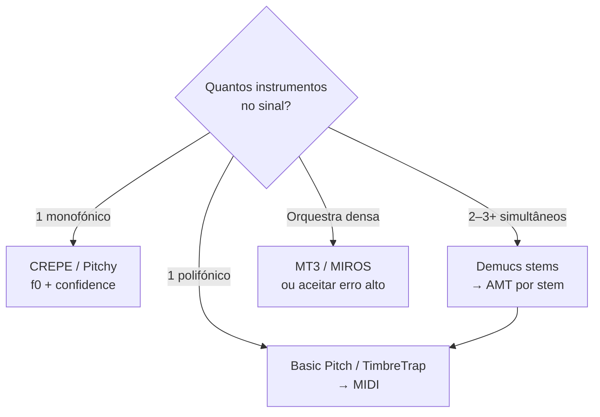

# 02 — Transcrição de Notas (AMT / MPE)

## Definição

**Automatic Music Transcription (AMT)** converte áudio em representação simbólica (tipicamente MIDI): `(onset, offset, pitch, velocity, channel/program)`.

**Multi-Pitch Estimation (MPE)** estima múltiplos f0 por frame, sem segmentar em notas — AMT adiciona **note tracking** (agrupamento temporal).

---

## Ranqueamento de sistemas AMT (2025–2026)

Critérios: F1 multi-instrumento (AMT Challenge 2025), leveza, licença, deploy, generalização 1-instrumento.

| Rank | Sistema | F1 multi* | Params | Licença | Deploy | Melhor para |
|------|---------|-----------|--------|---------|--------|-------------|
| **1** | **MIROS** (MusicFM + YourMT3+) | **0,60** | ~370M | Pesquisa | GPU server | Multi-inst. SOTA |
| **2** | **YourMT3-YPTF-MoE-M** | 0,59 | Grande | Pesquisa | GPU | MoE multi-decoder |
| **3** | **MT3** (Google Magenta) | 0,39 | Base | Apache 2.0 | TPU/GPU | Baseline multi-inst. aberto |
| **4** | **MR-MT3** | ↑ vs MT3 | — | Pesquisa | GPU | Reduz instrument leakage |
| **5** | **TimbreTrap** (Sony) | ~Basic Pitch | Pequeno | Open | HF Space | Low-resource, agnóstico timbre |
| **6** | **Basic Pitch** (Spotify) | 0,06** | ~17K | **Apache 2.0** | **Browser/npm** | **1 instrumento, produto** |
| **7** | **Onsets & Frames** | Legado piano | — | Apache | GPU | Piano solo |
| **8** | **CREPE Notes** | Monofónico SOTA | — | — | TF.js | Violino, voz, monofónico |

\*AMT Challenge 2025, 76 peças, até 3 instrumentos, mir_eval ±50 ms.  
\*\*Basic Pitch não foi desenhado para multi-inst.; incluído como referência de baseline.

---

## Análise aprofundada — Top 4

### 1. MIROS (vencedor AMT Challenge 2025)

**Paper:** [Advancing Multi-Instrument Music Transcription: Results from the 2025 AMT Challenge](https://arxiv.org/pdf/2603.27528)

**Arquitetura:**
- Encoder **MusicFM** (Conformer, self-supervised BEST-RQ) — explora áudio **não rotulado**
- Adapter recorrente com **embeddings de grupo instrumental**
- Decoders **T5-style** paralelos por grupo (FlashAttention)
- Janelas de 5 s, até 1024 tokens/grupo

**Resultados empíricos:**
- F1 global **0,5998** vs MT3 **0,3932**
- Slakh2100 F-measure ~**0,83** (fora do challenge)
- Degradação brutal com polifonia: F1 solo ~0,87 → 3 instrumentos ~**0,46** (MIROS)

**Limitações:**
- Modelo grande, inferência server-side
- Instrument leakage persiste (notas no canal errado)
- Slakh overfitting suspeito vs dados do challenge

**Relevância music-tutor:** referência de **teto técnico**; impraticável no browser. Usar para **batch** (importar MP3 → MIDI multi-track).

---

### 2. MT3 / YourMT3+

**Base:** Gardner et al., tokenização estilo NLP (time, program, note-on/off, velocity)

**YourMT3+ extensões:** Mixture-of-Experts, cross-dataset augmentation, atenção hierárquica tempo-frequência

**Instrument leakage:** MR-MT3 (2024) documenta fragmentação de frases entre instrumentos; propõe memory retention + métricas de leakage F1

**Quando usar:**
- Transcrição multi-instrumento open source
- Fine-tune em domínio específico (ex.: piano MAESTRO)

**Repo:** [google-research/mt3](https://github.com/google-research/mt3) (ecossistema Magenta)

---

### 3. Basic Pitch (Spotify)

**Paper:** ICASSP 2022 — lightweight CNN, pitch bends preservados

**Forças:**
- **Apache 2.0** — amigável para produto comercial
- `pip install basic-pitch` + **`basic-pitch-ts`** para browser
- Polifónico **single instrument**, agnóstico de timbre (guitarra, piano, voz)
- v0.4.0 (2024), mantido ativamente

**Limitações:**
- **1 instrumento por vez** em mix
- Multi-inst. F1 ~0,06 no challenge (esperado)
- GPU opcional; CPU viável para clipes curtos

**Pipeline típico:**

```python
from basic_pitch.inference import predict
model_output, midi_data, note_events = predict("audio.wav")
```

**Relevância music-tutor:** **escolha default** para transcrição em tempo quase real ou upload de take solo.

---

### 4. TimbreTrap (Sony, ICASSP 2024)

**Ideia:** autoencoder único com **switch** — modo transcrição (pitch salience) vs reconstrução (timbre). Separa pitch e timbre no latent.

**Benchmarks (GuitarSet, etc.):** comparável a Basic Pitch e Deep Salience com **poucos dados rotulados**

**HF Space:** [huggingface.co/spaces/cwitkowitz/timbre-trap](https://huggingface.co/spaces/cwitkowitz/timbre-trap)

**Quando preferir a Basic Pitch:** recursos de treino limitados, domínio instrumental niche, pesquisa em timbre-agnostic MPE.

---

## Monofónico vs polifónico vs multi-instrumento



| Cenário | Abordagem | F1 esperado |
|---------|-----------|-------------|
| Violino solo | CREPE + segmentação | >90% pitch |
| Piano solo | Basic Pitch ou Onsets&Frames | Alto em MAESTRO |
| Guitarra acústica | Basic Pitch + GuitarSet fret heuristics | Médio-alto |
| Banda completa | Demucs → Basic Pitch por stem | Médio |
| Orquestra | MIROS / manual | Baixo-médio |

---

## Segmentação de notas

AMT = MPE + **note tracking**:
1. Frame-level salience (Basic Pitch, TimbreTrap)
2. Threshold + hysteresis
3. Agrupamento onset-offset
4. (Opcional) pitch bend como MIDI CC

**CREPE Notes** (2023+): pós-processamento Viterbi sobre contorno CREPE — SOTA monofónico instrumental.

---

## Datasets de treino/avaliação (AMT)

| Dataset | Horas | Instrumentos | Anotação | Uso |
|---------|-------|--------------|----------|-----|
| **MAESTRO** | ~200 | Piano | MIDI alinhado ±3 ms | Piano AMT gold |
| **MusicNet** | ~34 h | Orquestra | Labels | Clássico, difícil |
| **Slakh2100** | 145 h | Multi synth | MIDI multi-track | Multi-inst. benchmark |
| **GuitarSet** | 360 exc. | Guitarra | JAMS por corda | Tab + pitch |
| **URMP** | Câmara | Multi | MIDI + áudio | Multi-inst. |
| **AMT Challenge 2025** | 76 peças | 8 tipos, ≤3/piece | MIDI + PDF + MP3 | Benchmark moderno |

Carregamento unificado: [mirdata](https://github.com/mir-dataset-loaders/mirdata) (`mirdata.initialize('maestro')`, `'guitarset'`, etc.)

---

## Comercial: Klangio

**Klangio Transcription Studio / Plugin / API** — transcrição multi-instrumento (até 8 inst.), export MIDI/MusicXML/GP5/PDF.

- Cloud ~30 s por faixa
- Plugin VST3/AU drag-audio→MIDI
- API: transcription, chord recognition, source separation, beat tracking

**Trade-off:** qualidade e conveniência vs **vendor lock-in** e custo. Alternativa open: Demucs + Basic Pitch + Essentia.

---

## Recomendações music-tutor

| Feature | Stack |
|---------|-------|
| Feedback nota ao vivo (monofónico) | CREPE / Pitchy — **não** Basic Pitch |
| Upload solo → MIDI | Basic Pitch |
| Upload band → stems → MIDI | demucs-onnx + Basic Pitch |
| Importar partitura de referência | MIDI/MusicXML direto (sem AMT) |
| Pesquisa / batch multi-inst. | MT3 ou MIROS no backend |

Próximo: [03 — Acordes e Tonalidade](./03-acordes-tonalidade.md)
