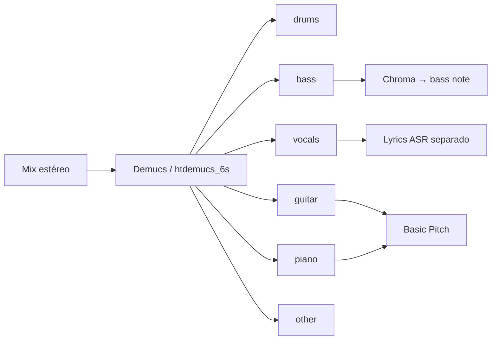

# 04 — Instrumentos Distintos e Separação de Fontes

## Por que separar instrumentos antes de extrair?

Em mix polifónico, **notas e acordes competem no mesmo espectro**. Source separation isola stems → AMT/chord por canal → reduz **instrument leakage** documentado em MT3/MIROS.



---

## Ranqueamento — Source separation

| Rank | Modelo | Stems | SDR (MUSDB) | ONNX/Mobile | Notas |
|------|--------|-------|-------------|-------------|-------|
| **1** | **HTDemucs FT (v4)** | 4 | **~9.0 dB** | ✅ demucs-onnx | Default produção |
| **2** | **htdemucs_6s** | **6** (+guitar, piano) | ~similar 4 | ✅ 258 MB | Piano stem experimental |
| **3** | **Spleeter** (Deezer) | 2/4/5 | ~5.9 | Limitado | Legado, rápido |
| **4** | **Open-Unmix** | 4 | ~6.3 | Parcial | Baseline académico |
| **5** | **Band-Split RNN** | 4 | ~9.0 | — | Pesquisa |

**demucs-onnx** (StemSplit): PyTorch **~2 GB → ~50 MB** onnxruntime; browser via onnxruntime-web; parity ~10⁻⁴ vs fp32.

---

## htdemucs_6s — Guitar e piano

Meta/Demucs README (experimental):
- **Guitar:** qualidade aceitável para isolamento
- **Piano:** bleeding e artefactos frequentes

**Hugging Face:** [StemSplitio/htdemucs-6s-onnx](https://huggingface.co/StemSplitio/htdemucs-6s-onnx)

Ordem stems: `[drums, bass, other, vocals, guitar, piano]`

**Uso music-tutor:**
- Isolar guitarra do aluno em backing track
- Rodar Basic Pitch só no stem `guitar`
- Análise de voicing piano (quando stem limpo)

**Latência:** 30–90 s (GPU cloud) ou 5–15 min CPU local para faixa completa — **não** tempo real.

---

## Detecção de instrumento (classificação)

Distinto de **separação** — classificar *qual* instrumento está presente sem isolar completamente.

| Abordagem | Input | Output | Maturidade |
|-----------|-------|--------|------------|
| **Programa MIDI** (AMT) | áudio → MT3/MIROS | channel 0–127 GM | Multi-inst. AMT |
| **Instrument tagging** | clip | label (guitar, piano…) | OpenL3, PANNs |
| **Timbre clustering** | notas Basic Pitch | clusters por timbre | Paper 2025 (Basic Pitch + spectral clustering) |
| **Klangio** | áudio | até 8 inst. + MIDI each | Comercial |

**Paper relevante (2025):** lightweight model com **deep clustering note-level** sobre backbone Basic Pitch — joint transcription + separação dinâmica por N instrumentos.

---

## Multi-instrument AMT + instrument ID

**AMT Challenge 2025** exige match de `(program, pitch, onset)` — instrumento faz parte da métrica.

Problemas observados:
- **Instrument leakage** — mesma frase fragmentada em 2 programas
- **Confusão timbral** — viola vs violino em registo médio
- ANOVA: F1 cai consistentemente 1→3 instrumentos (todos os modelos)

**MR-MT3** introduz:
- Instrument leakage ratio
- Instrument detection F1
- Memory retention mechanism

---

## Datasets com anotação instrumental

| Dataset | Conteúdo | Extração possível |
|---------|----------|-------------------|
| **Slakh2100** | 2100 mix synth + stems MIDI | Separação + AMT |
| **MUSDB18** | 150 faixas stems reais | Benchmark Demucs |
| **GuitarSet** | 6 canais por corda (hexaphonic) | String/fret ground truth |
| **MedleyDB** | Multi-track profissional | Stems + anotações |
| **DALI** | Áudio + letras + alinhamento | Vocal + harmonia |
| **MusicNet** | Orquestra anotada | Multi-inst. clássico |

**mirdata** unifica loaders — `track.audio_path`, `track.stems`, etc.

---

## GuitarSet — caso especial (tab + instrumento)

Gravação com **captador hexafónico** → 6 streams por corda.

Anotações JAMS (16 por excerto):
- `pitch_contour`, `midi_note` **por corda**
- `leadsheet_chords` vs `inferred_chords`
- beats, downbeats, key, playing style

**360 excertos** — gold standard para **extração guitarra → nota → traste/corda**.

```python
import mirdata
gs = mirdata.initialize('guitarset')
track = gs.track('00_Jazz_1_Solo')
notes_E = track.notes['E']  # notas corda Mi grave
```

---

## Pipeline recomendado por objetivo

### Isolar instrumento para prática

```
Demucs two-stems=vocals  → backing sem vocal
htdemucs_6s → guitar stem → play-along
```

### Transcrever banda

```
htdemucs_6s → [guitar, piano, bass stems]
→ Basic Pitch cada stem
→ merge MIDI com programas GM distintos
```

### Identificar instrumentos presentes (sem MIDI)

```
CLIP audio (PANNs) → tags
ou Klangio API → lista inst. + confidence
```

---

## ONNX / browser

| Artefacto | Tamanho | Stems | Notas |
|-----------|---------|-------|-------|
| htdemucs-ft-onnx (bag) | ~1 GB | 4 | Melhor SDR |
| htdemucs-onnx | menor | 4 | Startup rápido |
| htdemucs-6s-onnx | 258 MB | 6 | Guitar+piano |
| Specialist single-stem | ~65 MB each | 1 | drums-only etc. |

Segmento fixo: **7,8 s** @ 44,1 kHz stereo para inferência ONNX.

---

## Recomendações music-tutor

| Feature | Stack |
|---------|-------|
| Backing track sem vocal | Demucs `--two-stems=vocals` |
| Analisar guitarra em mix | htdemucs_6s guitar stem → Basic Pitch |
| Feedback corda/traste | GuitarSet-like ou input hexaphonic (hardware) |
| Multi-inst. score import | MIDI multi-track (sem separação) |
| Real-time stem | **Não viável** Demucs full — pré-processar offline |

Próximo: [05 — Reconhecimento Musical](./05-reconhecimento-musical-identificacao.md)
