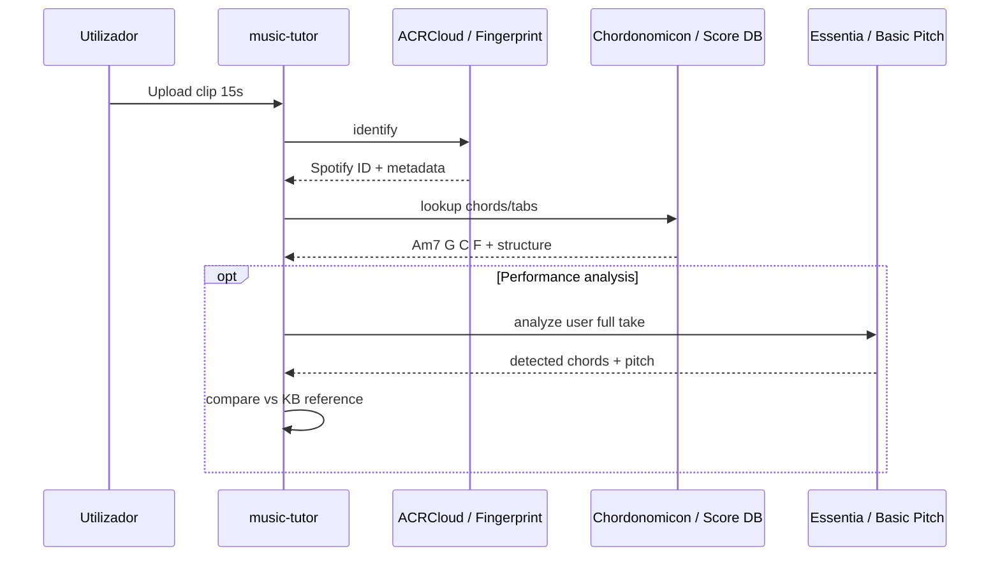

# 05 — Reconhecimento Musical e Identificação

## Distinção conceitual

| Tarefa | Pergunta | Output | Tecnologia típica |
|--------|----------|--------|-------------------|
| **Identificação (ID)** | "Que música é esta?" | título, artista, ISRC | Fingerprint, ACRCloud |
| **Transcrição** | "Que notas são estas?" | MIDI, acordes | AMT, CREMA |
| **Metadados** | "De que álbum, ano, BPM?" | tags | MusicBrainz, Spotify API |
| **Cover detection** | "É cover ou original?" | similaridade | Embeddings + threshold |

Este capítulo foca **identificação + lookup** — ponte entre áudio e **bases de conhecimento** (cifras, tabs).

---

## Ranqueamento — Identificação de áudio

| Rank | Abordagem | Base de dados | Latência | Licença/comercial |
|------|-----------|---------------|----------|-------------------|
| **1** | **ACRCloud** | 150M+ faixas | ~s | API paga, ISRC/Spotify |
| **2** | **Shazam algorithm** (reimplementações) | Custom | ms | MIT (código), dados próprios |
| **3** | **Embeddings CLAP/MERT/MuQ** | Custom FAISS | ms–s | Model weights variadas |
| **4** | **Chromaprint / AcoustID** | MusicBrainz | s | Open source |
| **5** | **Dejavu** (Python) | SQLite local | ms | MIT |

---

## Shazam — fingerprint espectral (sem ML)

**Paper:** Avery Wang, 2003 — "An Industrial-Strength Audio Search Algorithm"

**Pipeline:**
1. FFT → espectrograma
2. **Constelação de picos** espectrais (robusto a ruído)
3. **Combinatorial hashing:** pares (freq₁, freq₂, Δt) → hash 32-bit
4. Match no DB + **votação de offset temporal** (alinhamento diagonal)

**Reimplementações open source (2025–2026):**
- [Danztee/shazam-build](https://github.com/Danztee/shazam-build) — Go, PostgreSQL, React
- [inboxpraveen/Audio-Fingerprint](https://github.com/inboxpraveen/audio-fingerprint) — Python Flask, self-hosted
- [thmsgo18/Shazam](https://github.com/thmsgo18/Shazam) — **híbrido** FAISS embeddings + fingerprint

**Prós:** ultra-rápido, interpretável, funciona com clip 3–10 s  
**Contras:** precisa **indexar** a biblioteca; não generaliza para música não indexada

---

## Abordagem híbrida (embeddings + fingerprint)

**thmsgo18/Shazam** combina:

| Stage | Tecnologia | Função |
|-------|------------|--------|
| 1 | CLAP / MuQ / MERT | FAISS approximate NN |
| 2 | Shazam constellation | Confirmação + offset temporal |

Modelos de embedding musical:
- `laion/larger_clap_music` — music-specialized
- `m-a-p/MERT-v1-95M` — music representation
- `OpenMuQ/MuQ-large-msd-iter` — alta precisão, CUDA

**Quando usar embeddings:** covers, versões live, ruído extremo onde fingerprint falha.

---

## ACRCloud (comercial)

- **150M+ tracks** fingerprint database
- Retorna links **Spotify, Apple Music, Deezer**, ISRC, UPC
- SDKs iOS, Android, Python
- Trial 14 dias

**Caso de uso music-tutor:**
1. Aluno grava clip ou upload
2. ACRCloud → Spotify ID
3. Join **Chordonomicon** ou parceiro licenciado → cifra/tabs

**Custo vs build:** Shazam-like próprio exige manutenção de index; ACRCloud é OpEx previsível.

---

## Chromaprint / AcoustID

- Open source, integrado com **MusicBrainz**
- Usado por Picard, beets
- Fingerprint diferente de Shazam (mais metadata-oriented)
- Base comunitária, cobertura irregular vs serviços comerciais

---

## Chordify, Songsterr, Ultimate Guitar — APIs

| Serviço | API pública | Conteúdo | Legal |
|---------|-------------|----------|-------|
| **Chordify** | ❌ Não (pedidos comunidade) | Acordes sync YouTube | Engine NNLS Chroma |
| **Songsterr** | ⚠️ Contacto comercial | 80k+ tabs JSON | **100% licenciado** (Guitar Tabs LLC) |
| **Ultimate Guitar** | ❌ | Maior arquivo tabs | Licenciamento editorial |
| **Parse.bot Songsterr** | ⚠️ Wrapper pago | `get_tab_data` medidas/notas | Terms Songsterr |

**Songsterr Terms:** conteúdo licenciado de publishers; uso comercial requer aprovação.

**Conare Songsterr MCP:** API pública só metadados; **notação completa só no browser** — limitação arquitectural.

**Implicação:** reconhecer música (ACRCloud) ≠ obter tab legalmente. Precisas **parceria ou dataset próprio**.

---

## MusicBrainz + Spotify + ISRC

Pipeline de metadados (sem transcrição):

```
Fingerprint/ACRCloud → ISRC
ISRC → MusicBrainz recording
Spotify ID → Chordonomicon progressão
```

**Chordonomicon** inclui Spotify IDs — join natural pós-identificação.

---

## Cover / similarity (secundário)

- **Embedding cosine** (CLAP) entre query e referência
- Threshold calibrado por género
- Útil: "o aluno tocou a melodia certa num tom diferente?"

---

## Fluxo produto sugerido



---

## Recomendações music-tutor

| Objetivo | Stack |
|----------|-------|
| MVP "que música é?" | ACRCloud trial → avaliar custo |
| Biblioteca própria (licenciada) | Shazam-build + PostgreSQL index |
| Match robusto covers | CLAP + FAISS |
| Cifra após ID | Chordonomicon join Spotify ID |
| Tab legal | Songsterr partnership — **não** scrape |

Próximo: [06 — Formatos e Parsers](./06-formatos-simbolicos-parsers.md)
