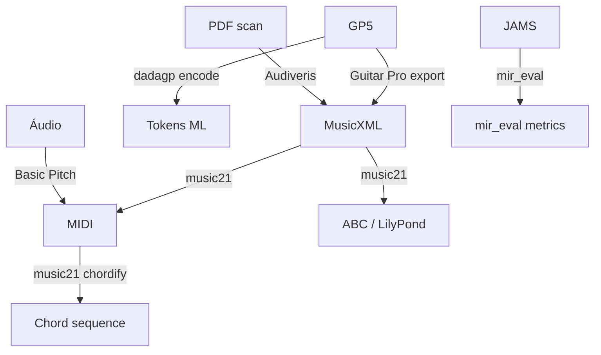

# 06 — Formatos Simbólicos e Parsers

## Mapa de formatos

| Formato | Extensão | Conteúdo extraível | Parser principal | Uso típico |
|---------|----------|-------------------|------------------|------------|
| **MIDI** | .mid | notas, programa, tempo, CC | pretty_midi, mido, music21 | AMT output, DAW |
| **MusicXML** | .xml, .mxl | notas, acordes, tab frames, partitura | music21, partitura | Intercâmbio universal |
| **Guitar Pro** | .gp3–.gp5 | tab, dedos, bend, FX | PyGuitarPro, DadaGP | Tabs populares |
| **ABC** | .abc | melodia folk, simple harmony | music21, abctools | Tradicional |
| **LilyPond** | .ly | notação tipográfica | music21 | Export Klangio |
| **MEI** | .mei | pesquisa early music | Verovio | Académico |
| **JAMS** | .jams | anotações MIR flexíveis | jams | GuitarSet, CREMA output |
| **Humdrum/kern** | .krn | análise computacional | music21 | Corpora clássicos |

---

## MIDI — extração programática

### Estrutura

- **Track** → lista de messages (note_on, note_off, program_change, tempo…)
- **Channel** 0–15; **program** 0–127 (GM instrument)
- **Note:** `(start, end, pitch, velocity)`

### pretty_midi

```python
import pretty_midi
pm = pretty_midi.PrettyMIDI('song.mid')
for instrument in pm.instruments:
    print(instrument.program, instrument.name)
    for note in instrument.notes:
        print(note.start, note.end, note.pitch, note.velocity)
```

### Limitações MIDI

- **Sem acordes explícitos** — inferir via simultaneidades
- **Sem tab** — só pitch; dedos requerem heurística ou GP
- Quantização humana perdida se não capturada

---

## MusicXML — formato ouro para tutor

### Elementos extraíveis

| Elemento XML | Dado | music21 class |
|--------------|------|---------------|
| `<note>` | pitch, duration | `note.Note` |
| `<harmony>` | acorde/cifra | `harmony.ChordSymbol` |
| `<frame>` | diagrama dedos | `ChordWithFretBoard` |
| `<direction>` | dinâmica, tempo | `dynamics`, `metronome` |
| `<barline>` | compassos | `bar.Barline` |

### Parsing

```python
from music21 import converter
score = converter.parse('song.mxl')  # compressed OK
part = score.parts[0]
for m in part.getElementsByClass('Measure'):
    for n in m.notes:
        print(n.pitch, n.offset)
```

**Export:** `score.write('musicxml', 'out.mxl')`, `score.write('midi', 'out.mid')`

### AnimeTAB + TABprocessor

Dataset [AnimeTAB](https://github.com/amamiya-yuuko/AnimeTAB): MusicXML export Guitar Pro 7.

Objeto `Tablature`:
- `pitch`, `finger`, `time`, `info`
- `chord_recognize(pitch_cluster)` — intervalos → tipo acorde
- `finger2midi` / `midi2finger` — pontes tab ↔ pitch

**Lição:** MusicXML de GP preserva **fingerings** em `<frame>` — melhor via que inferir do áudio.

---

## Guitar Pro — tablatura nativa

### DadaGP encoder

```bash
python dadagp.py encode song.gp5 song.tokens.txt artist_name
python dadagp.py decode song.tokens.txt out.gp5
```

- **26.181 songs**, 739 géneros, 116M tokens
- Suporta gp3/gp4/gp5
- Limitações: banjo, instrument-change events

### PyGuitarPro

- Leitura/escrita GP5
- Acesso a `track.strings`, `measure` beats, `note.string`, `note.fret`
- Usado por Siege Analytics Chord Library export

### Conversão GP → MusicXML

- Guitar Pro 7+ export nativo
- **MuseScore** import GP → MusicXML (gratuito)
- Klangio export directo GP5

**music21 não lê GP nativamente** — converter primeiro.

---

## OMR — imagem/PDF → MusicXML

### Audiveris (open source, Java)

**Versão:** 5.x (2025) — editor gráfico completo, MusicXML 4.0 export

**Pipeline:**
1. Import PDF/PNG/JPEG
2. OMR engine (template matching, NN glyphs, OCR texto)
3. Correção manual no editor integrado
4. Export MusicXML / MIDI

**Limitações:**
- Só **notação ocidental impressa** (CWMN)
- **Manuscrito não suportado**
- 100% automático raro — editor complementar essencial

**Casos de uso:**
- Digitalizar método didáctico (IMSLP)
- Importar partitura clássica para MAESTRO-like alignment

**Handbook:** [audiveris.github.io](https://audiveris.github.io/audiveris/_pages/handbook/)

---

## JAMS — anotações MIR

Formato JSON flexível para ground truth:

```python
import jams
jam = jams.load('track.jams')
chords = jam.search(namespace='chord')[0]
for obs in chords.data:
    print(obs.time, obs.duration, obs.value)
```

**CREMA**, **GuitarSet**, competições MIREX — output standard.

---

## Conversões comuns



---

## Bibliotecas ranqueadas

| Rank | Lib | Formatos in | Formatos out | Linguagem |
|------|-----|-------------|--------------|-----------|
| 1 | **music21** | MusicXML, MIDI, ABC, Humdrum… | MusicXML, MIDI, LilyPond, Braille | Python |
| 2 | **partitura** | MusicXML, MEI, MIDI | MIDI score, análise | Python |
| 3 | **pretty_midi** | MIDI | MIDI, synthesize | Python |
| 4 | **PyGuitarPro** | GP3-5 | GP5 | Python |
| 5 | **mido** | MIDI | MIDI | Python |
| 6 | **Verovio** | MEI, MusicXML | SVG render | C++/JS |
| 7 | **jams** | JAMS | JAMS | Python |

---

## Cifra brasileira (texto)

Formato comum `.txt` / HTML:

```
[Intro] Am7 G C
[Verso] Am7 G | C F |
```

**Parsing:** regex + `music21.harmony.ChordSymbol` para validação — **não** há standard único (Ultimate Guitar, Cifra Club variam).

**Estratégia:**
1. Normalizar símbolos (H→B em alemão, etc.)
2. `ChordSymbol(figure='Am7/G')` para slash chords
3. Alinhar a beats via `[Intro]` markers ou estimativa Essentia beat

*Hipótese não verificada:* Cifra Club API oficial para devs — verificar termos antes de integração.

---

## Recomendações music-tutor

| Entrada aluno | Parser |
|---------------|--------|
| Upload GP5 tab | PyGuitarPro → internal model |
| Upload MusicXML | music21 |
| Foto partitura | Audiveris (server) → MusicXML |
| Output AMT | pretty_midi → normalizar → comparar score |
| Lição cifra texto | regex + ChordSymbol validation |

Próximo: [07 — Bases de Conhecimento](./07-bases-conhecimento-datasets.md)
