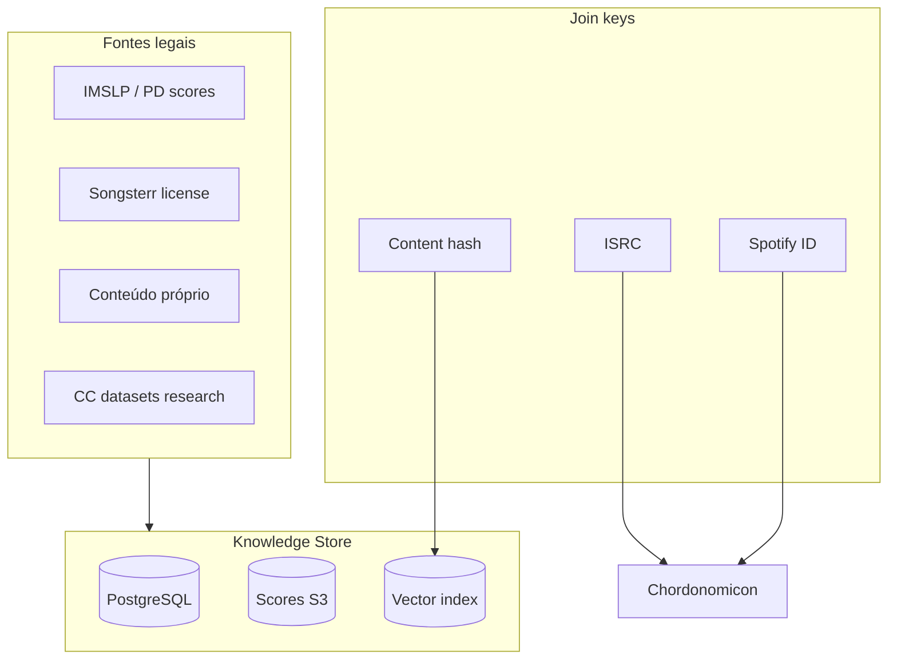

# 07 — Bases de Conhecimento e Datasets

## Taxonomia

| Tipo | Conteúdo | Exemplo | Uso no tutor |
|------|----------|---------|--------------|
| **Simbólico MIDI** | notas multi-track | Lakh, MAESTRO | Treino AMT, referência |
| **Tab / GP** | dedos + ritmo | DadaGP, AnimeTAB | Lições guitarra |
| **Cifra / acordes** | progressões | Chordonomicon | Repertório pop |
| **Partitura** | pentagrama | IMSLP + OMR | Clássico |
| **Áudio + anotação** | alinhado | GuitarSet, POP909 | Eval MIR |
| **Comercial** | tabs licenciadas | Songsterr | Produto legal |

---

## Ranqueamento master — Datasets

Score: **tamanho** (0–2) + **qualidade anotação** (0–3) + **relevância tutor** (0–3) + **acessibilidade** (0–2). Max 10.

| Rank | Dataset | Score | Tipo | Tamanho | Licença |
|------|---------|-------|------|---------|---------|
| **1** | **Discover MIDI** | **9.0** | MIDI + features | 6,74M files | Aberto HF |
| **2** | **Chordonomicon** | **9.0** | Acordes + Spotify ID | 666k songs | HF |
| **3** | **Lakh MIDI (LMD)** | **8.5** | MIDI | 176k (45k aligned MSD) | Aberto |
| **4** | **MAESTRO** | **8.5** | Piano audio+MIDI | 200h | CC BY-NC-SA |
| **5** | **DadaGP** | **8.0** | Guitar Pro tokens | 26k songs | Request research |
| **6** | **GuitarSet** | **8.0** | Guitar audio+JAMS | 360 exc. | Zenodo |
| **7** | **POP909-CL** | **7.5** | Pop MIDI+chords | 909 | Research |
| **8** | **Slakh2100** | **7.5** | Multi-inst. synth | 145h | Research |
| **9** | **PERiScoPe** | **7.0** | Piano score+perf | ~1k+ pairs | HF |
| **10** | **AnimeTAB** | **7.0** | Guitar MusicXML | 400+ songs | CC |
| **11** | **MusicNet** | **6.5** | Orquestra | 34h | Research |
| **12** | **GigaMIDI** | **6.5** | MIDI massivo | Milhões | HF |

---

## Análise por categoria

### MIDI massivo (treino / retrieval)

#### Discover MIDI Dataset (HF: projectlosangeles)

- **6,74M** MIDIs deduplicados (MD5 + pitch/chord counts)
- Features pré-computadas: 961 dims (delta time, duration, patches, pitches, **321-chord vocab**, etc.)
- Metadados: genre, artist/title, karaoke/lyrics matches
- **Uso:** retrieval simbólico, ML generativo, chord mining — **não** anotação humana per-file

#### Lakh MIDI Dataset

- **176.581** MIDIs; **45.129** alinhados ao Million Song Dataset
- Clássico MIR desde 2016
- [colinraffel.com/projects/lmd](https://www.colinraffel.com/projects/lmd/)

#### Tegridy MIDI Dataset (hub)

- Agrega Discover, Godzilla (~5,8M), Lakh, MAESTRO, GiantMIDI
- Scripts Colab, soundfonts, ferramentas
- [github.com/asigalov61/Tegridy-MIDI-Dataset](https://github.com/asigalov61/Tegridy-MIDI-Dataset)

---

### Piano (transcrição + performance)

#### MAESTRO

- **~200h** piano Disklavier, alinhamento **±3 ms**
- Pedal sustain/sostenuto/una corda, velocity
- Train/val/test split oficial
- CC BY-NC-SA — **atenção uso comercial**

#### PERiScoPe (SyMuPe)

- Score MusicXML + performance MIDI alinhados (ASAP, ATEPP, web)
- v2.0: fix velocities, alignments mais rigorosos
- HF: [SyMuPe/PERiScoPe](https://huggingface.co/datasets/SyMuPe/PERiScoPe)

#### ASAP (referenciado em PERiScoPe)

- Aligned MusicXML + MIDI + performance classical piano

---

### Guitarra / tablatura

#### DadaGP

- **26.181** GP songs, **739 géneros**, **~1200h**
- Encoder/decoder tokens para Transformers
- Acesso: pedido research a Dadabots
- Use cases paper: guitar-bass transcription, style transfer

#### AnimeTAB

- **400+** tracks anime/game, MusicXML from GP7
- **500+ clips** por estrutura (I/A/B/C)
- **TABprocessor** toolkit Python
- CC license

#### GuitarSet

- Hexaphonic — **ground truth por corda**
- Chords instructed + inferred
- Essential para eval transcrição guitarra

---

### Acordes / cifra

#### Chordonomicon

- **666k+** progressões, Spotify IDs, secções
- Graph representation incluída
- Scripts augment/transpose/note mapping
- Ideal **KB lookup** pós-identificação Spotify

#### POP909-CL

- 909 pop, acordes expert-reviewed, beat-aligned
- Track 1 = score, Track 2 = chords
- Compatível ecossistema POP909

#### McGill Billboard + Isophonics

- Benchmark clássico ACR (áudio + .lab)
- NNLS Chroma pré-computado (Billboard)

---

### Multi-instrumento

#### Slakh2100

- 2100 mixes sintéticos, stems MIDI separados
- Benchmark MIROS (~0,83 F1)

#### MUSDB18

- 150 faixas reais com stems (train/test)
- Benchmark Demucs

#### MedleyDB

- Multi-track profissional anotado

---

## Bases comerciais / comunitárias (produto)

| Fonte | Escala | Legal produto | API |
|-------|--------|---------------|-----|
| **Songsterr** | 80k+ tabs | ✅ Com licença | Contacto comercial |
| **Ultimate Guitar** | Maior web | ⚠️ Parceria | ❌ |
| **Chordify** | YouTube sync | ❌ Engine fechado | ❌ |
| **IMSLP** | Domínio público | ✅ PD works | ❌ (OMR local) |
| **MuseScore.com** | Comunidade | ⚠️ Terms | Limitada |

**Regra:** datasets comunitários alimentam **pesquisa**; produto comercial precisa **licença explícita** ou conteúdo próprio/PD.

---

## Hugging Face — hub musical (2025–2026)

| Dataset | Foco |
|---------|------|
| ailsntua/Chordonomicon | Acordes |
| projectlosangeles/Discover-MIDI-Dataset | MIDI massivo |
| SyMuPe/PERiScoPe | Piano alinhado |
| Itsuki-music/BACHI_Chord_Recognition | Weights POP909-CL |

---

## mirdata — loader unificado

```python
import mirdata

for name in ['maestro', 'guitarset', 'slakh', 'musdb', 'billboard', 'dali']:
    ds = mirdata.initialize(name, data_home='~/mirdata')
    ds.download()
    track = ds.track(ds.track_ids[0])
```

Garante formato **mir_eval-compatible** para métricas.

---

## Estratégia KB para music-tutor



**MVP sugerido:**
1. MAESTRO + GuitarSet para **eval** interno
2. Chordonomicon para **demo** progressões (Spotify join)
3. Upload user MusicXML/GP5 (sem scrape)
4. Negociar Songsterr se tabs mainstream forem core

Próximo: [08 — Ranking e Matriz](./08-ranking-referencias-matriz-decisao.md)
