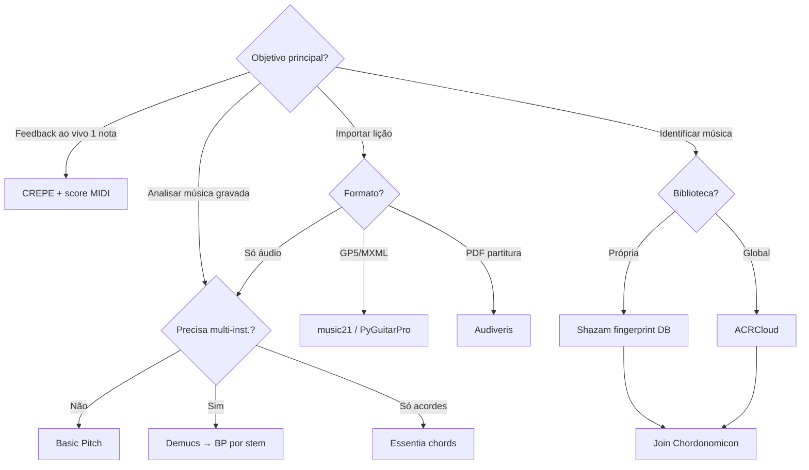

# 08 — Ranking de Referências e Matriz de Decisão

## Metodologia de scoring

Cada referência foi avaliada em **4 eixos** (0–2 ou 0–3 conforme indicado):

| Eixo | Peso | Critério |
|------|------|----------|
| **Maturidade** | 25% | Produção real, docs, manutenção 2025–26 |
| **Evidência empírica** | 25% | Papers, benchmarks, F1/SDR publicados |
| **Fit music-tutor** | 30% | Latência, browser, pedagógico, instrumento-alvo |
| **Licença / acesso** | 20% | Apache, research-only, comercial OK |

---

## Top 20 referências ranqueadas

| # | Referência | Score | Camada | Tarefa principal |
|---|------------|-------|--------|------------------|
| 1 | Spotify Basic Pitch | 9.5 | L2 | Áudio→MIDI 1 inst. |
| 2 | Essentia / Essentia.js | 9.0 | L1–L2 | Key, chords, rhythm |
| 3 | Meta Demucs v4 + demucs-onnx | 8.5 | L3 | Source separation |
| 4 | MIROS / YourMT3+ | 8.5 | L2–L3 | Multi-inst. AMT SOTA |
| 5 | music21 | 8.5 | L2 | Parse MusicXML/MIDI |
| 6 | Audiveris | 8.0 | L2 | OMR → MusicXML |
| 7 | Chordonomicon | 8.0 | L4/KB | 666k progressões |
| 8 | DadaGP | 7.5 | L2/KB | GP tabs tokenizadas |
| 9 | CREMA + madmom | 7.5 | L2 | Chord recognition |
| 10 | ChordFormer | 7.5 | L2 | Large-vocab chords |
| 11 | GuitarSet + mirdata | 7.5 | L1–L2 | Guitar ground truth |
| 12 | MAESTRO | 7.5 | L2 | Piano aligned |
| 13 | TimbreTrap | 7.0 | L2 | Low-resource AMT |
| 14 | MT3 (Magenta) | 7.0 | L2–L3 | Multi-inst. baseline |
| 15 | ACRCloud | 7.0 | L4 | Music ID commercial |
| 16 | Shazam-build / Audio-Fingerprint | 6.5 | L4 | Self-hosted ID |
| 17 | Klangio API/Studio | 6.5 | L2–L3 | Multi-inst. commercial |
| 18 | AnimeTAB + TABprocessor | 6.5 | L2/KB | Guitar MusicXML |
| 19 | POP909-CL / BACHI | 6.5 | L2/KB | Pop chord labels |
| 20 | Discover MIDI | 6.0 | KB | 6.7M MIDI retrieval |

---

## Matriz decisão — Entrada × Saída

| Saída desejada | Entrada | Stack recomendado | Alternativa | Evitar |
|----------------|---------|-------------------|-------------|--------|
| **Nota única + cents** | Microfone | CREPE / Pitchy | aubio YIN | Basic Pitch (overkill) |
| **MIDI monofónico/poly 1 inst.** | WAV upload | Basic Pitch | TimbreTrap | MT3 |
| **MIDI multi-inst.** | WAV full mix | Demucs 6s → BP × N | MIROS backend | Basic Pitch directo |
| **Acordes + timing** | WAV | Essentia ChordsDetectionBeats | CREMA | Chordify scrape |
| **Tom (key)** | WAV | Essentia.js KeyExtractor | librosa | LLM guess |
| **Cifra (progressão)** | Spotify ID | Chordonomicon lookup | POP909-CL template | Inferir só do áudio |
| **Tab com dedos** | GP5/MusicXML | PyGuitarPro / music21 frame | DadaGP decode | AMT → tab heurística |
| **Partitura** | PDF scan | Audiveris → MusicXML | — | OCR genérico |
| **Nome da música** | Clip 10s | ACRCloud | Shazam-build | Whisper (não é ID) |
| **Comparar aluno vs score** | Mic + MIDI ref | CREPE + DTW vs ref | Score following | LLM only |

---

## Matriz decisão — Ambiente de deploy

| Componente | Browser | Edge worker | Backend GPU |
|------------|---------|-------------|-------------|
| Pitch monofónico | ✅ CREPE TF.js | ✅ | ✅ |
| Key / chords | ✅ Essentia.js | ✅ | ✅ |
| Basic Pitch | ✅ basic-pitch-ts | ✅ ONNX | ✅ |
| Demucs 4-stem | ⚠️ lento | ✅ demucs-onnx | ✅ |
| Demucs 6-stem | ⚠️ 258 MB | ✅ | ✅ |
| MT3 / MIROS | ❌ | ❌ | ✅ |
| Audiveris OMR | ❌ | ❌ | ✅ Java |
| ACRCloud | API | API | API |

---

## Gaps abertos (Junho 2026)

1. **Tablatura from audio** — sem SOTA confiável; GP humano ou OMR+GP permanecem necessários.
2. **Multi-inst. real-time** — F1 ~0,46 com 3 inst.; inviável feedback live em banda.
3. **Cifra PT-BR** — sem dataset normalizado; parsing ad-hoc.
4. **API Chordify/UG** — fechadas; produto depende parceria ou KB própria.
5. **Licenciamento MAESTRO/DadaGP** — NC ou request-only bloqueiam ship comercial directo.
6. **Piano stem Demucs** — artefactos; não usar como única fonte para AMT piano.
7. **OMR manuscrito** — fora scope Audiveris; gap total para anotações à mão.

---

## Roadmap sugerido — music-tutor

### Fase 0 — Fundação (2–4 semanas)

- [ ] Definir instrumento MVP (guitarra vs piano vs voz)
- [ ] Pipeline simbólico: music21 + upload MusicXML/GP5
- [ ] Feedback monofónico: CREPE ou Pitchy em AudioWorklet

### Fase 1 — Extração áudio (4–8 semanas)

- [ ] Basic Pitch backend ou basic-pitch-ts para uploads
- [ ] Essentia.js key + chords no client para "analyse this song"
- [ ] GuitarSet eval harness (mir_eval)

### Fase 2 — KB + ID (8–12 semanas)

- [ ] Chordonomicon index (Spotify ID → progressão)
- [ ] ACRCloud POC ou Shazam-build para biblioteca licenciada
- [ ] Songsterr outreach se tabs mainstream forem P0

### Fase 3 — Avançado (opcional)

- [ ] demucs-onnx para stem guitar
- [ ] MT3/MIROS batch import
- [ ] Audiveris para métodos PD (IMSLP)

---

## Árvore de decisão rápida

---

## Referências bibliográficas prioritárias

1. AMT Challenge 2025 — [arxiv.org/pdf/2603.27528](https://arxiv.org/pdf/2603.27528)
2. Basic Pitch — Bittner et al., ICASSP 2022
3. MT3 — Gardner et al., ISMIR 2021
4. TimbreTrap — Cwitkowitz et al., ICASSP 2024
5. ChordFormer — [arxiv.org/html/2502.11840](https://arxiv.org/html/2502.11840v1)
6. Chordonomicon — Kantarelis et al., arXiv 2410.22046
7. DadaGP — Sarmento et al., ISMIR 2021
8. Demucs v4 — Défossez et al., Hybrid Transformers
9. MR-MT3 — instrument leakage, 2024
10. Chord Recognition with Deep Learning — thesis 2025, arXiv 2512.22621

---

## Conclusão

A extração musical madura em **2026** é **modular**: nenhuma caixa preta resolve notas + acordes + instrumentos + identidade + tabs. O music-tutor maximiza valor combinando:

- **L1 determinístico** em tempo real (pitch)
- **L2 batch** open source (Basic Pitch, Essentia)
- **KB simbólico** (MusicXML, Chordonomicon, GP licenciado)
- **L4 ID** comercial ou self-hosted para fechar o loop "qual música → qual cifra"

Investir cedo em **formato de lição simbólico** (MusicXML + `<harmony>` + `<frame>`) evita depender de MIR pesado onde dados humanos já existem em abundância na web — com o custo legal de **não poder scrapear** essa web em produto.
