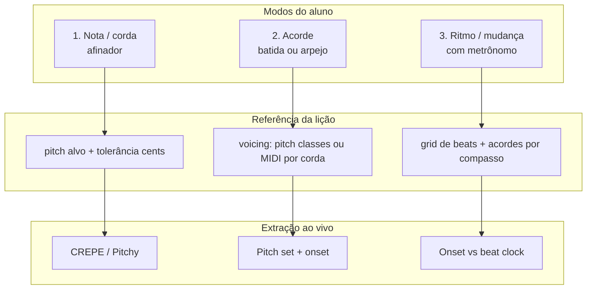

# 09 — Tutor de Violão: Microfone, Acordes e Ritmo em Tempo Real

> **Product lens** · Complementa [01 — Fundamentos](./01-fundamentos-extracao-musical.md)
>
> **Pesquisa técnica completa (v2):** [../deep-research-live-guitar/README.md](../deep-research-live-guitar/README.md)
>
> Foco: aluno com **violão acústico**, **microfone** do dispositivo, feedback tipo **afinador estendido** — nota, acorde, posição (dentro do possível) e **tempo/ritmo**.

---

## O que muda em relação à extração de “música finalizada”

| Dimensão | Música gravada (L2–L4) | Tutor violão ao vivo |
|----------|------------------------|----------------------|
| **Entrada** | MP3 mixado, qualidade estúdio | 1 violão, 1 mic, ambiente ruidoso |
| **Objetivo** | Descobrir o que *é* a música | Comparar com o que *deveria* ser |
| **Referência** | Inferida (AMT, CREMA) | **Pré-definida na lição** (cifra + diagrama) |
| **Latência** | Segundos OK | **< 50–100 ms** no hot path |
| **Polifonia** | Demucs + MT3 | **1 instrumento**, 1–6 notas simultâneas |
| **Output** | MIDI, cifra, tabs | ✅ / ❌ + “corda X”, “atrasado 80 ms” |

A maior parte dos capítulos 02–07 (Demucs, ACRCloud, Chordonomicon, OMR) é **secundária** para este MVP. O núcleo é:

```
Referência simbólica (lição)  +  Extração L0–L1 do microfone  →  Diff pedagógico
```

---

## Três modos de prática (MVP)



| Modo | O que o aluno faz | O que extraímos | Feedback típico |
|------|-------------------|-----------------|-----------------|
| **1 — Nota** | Uma corda solta ou dedo | f0, cents, confidence | “Mi bemol, −12 cents” / “corda errada” |
| **2 — Acorde** | Posição + batida ou dedilhado | conjunto de alturas + ataque | “Falta o Si” / “Acorde correto” |
| **3 — Ritmo** | Progressão no tempo | onset vs metrônomo | “Entrou 120 ms cedo” / “perdeu o compasso” |

---

## Pipeline técnico (hot path)

```
Microfone
  → AudioWorklet (buffer 2048–4096 @ 44,1 kHz)
  → L0: high-pass ~80 Hz, gate de ruído / note activity
  → L1: detector conforme modo
  → Comparador vs referência da lição
  → UI (sem LLM no loop crítico)
```

### Modo 1 — Afinador / nota única

**Stack:** Pitchy ou CREPE via TF.js no AudioWorklet.

| Parâmetro | Valor sugerido violão |
|-----------|------------------------|
| confidence mínima | 0,75–0,85 |
| tolerância afinação | ±15–25 cents (iniciante); ±10 (intermediário) |
| suavização | mediana 3–5 frames ou Viterbi (CREPE) |

Referência da lição: `(corda esperada, traste, MIDI pitch)` — comparar pitch detectado com pitch esperado **e** opcionalmente validar se a altura corresponde à corda pedida (ver limitações abaixo).

### Modo 2 — Acorde (polifonia leve, 1 violão)

**Não usar** CREMA/Chordify-style (desenhados para mix de música completa).

**Abordagem recomendada — template matching de pitch classes:**

1. Lição define voicing: ex. `Am` na posição aberta → MIDI `{45, 52, 57, 60}` (A2, E3, A3, C4) ou diagrama GP `<frame>`
2. Do microfone, obter **conjunto de alturas sounding** no instante do ataque:
   - **Opção A (leve):** analisar FFT/CQT nos instantes de onset (pico de energia da batida)
   - **Opção B (melhor):** Basic Pitch em janelas curtas pós-onset (~200–500 ms), no **Web Worker** (não Worklet — OK para batida discreta, não streaming contínuo)
3. Comparar **pitch classes** (mod 12) ou MIDI exatos com tolerância ±25–50 cents por nota
4. Classificar: acorde OK / falta nota X / nota extra Y / acorde errado (outro conjunto)

**Onset da batida:** envelope + Essentia-style ou detector simples de transient na banda 80 Hz–2 kHz (corpo do violão).

### Modo 3 — Ritmo e mudança de acorde

1. **Metrônomo interno** (Tone.js) → timestamps esperados de cada ataque/mudança
2. **Onset detection** no sinal do aluno
3. Métricas:
   - **Desvio de onset** (ms) vs beat esperado
   - **IOI** entre batidas (regularidade)
   - **Acorde no compasso certo** (Modo 2 só na janela pós-onset)

Referência: `{ compasso 3, beat 1, chord: G }` — não segundos absolutos (score following simplificado).

---

## O que dá para corrigir sobre “posição” do acorde

### Factível com 1 microfone

| Feedback | Como |
|----------|------|
| Acorde **errado** (Am vs D) | Pitch classes não batem |
| **Nota faltando** no voicing (ex. sem Dó no Am) | Pitch esperado ausente no spectrum |
| **Nota a mais** (corda que devia estar abafada soando) | Pitch extra detectado vs mute esperado |
| **Afinação geral** do acorde | Média de cents por nota detectada |
| **Timing** da batida / troca | Onset vs grid |

### Difícil ou enganoso (ser transparente no produto)

| Feedback | Por quê |
|----------|---------|
| “Traste 2 vs traste 3” **mesma altura** | Enarmonia / oitavas — mic não vê dedo |
| **Mesma nota, corda diferente** (Mi grave vs Mi agudo) | Mesmo pitch, timbres sobrepostos no acorde |
| **Qual dedo** usar | Zero informação acústica |
| **Voicing alternativo válido** | `Am` com voicing diferente mas correto → falso negativo se só 1 diagrama |

**Regra de produto:** falar em **“notas do acorde”** e **“diagrama sugerido”**, não “sua mão está errada” — salvo Modo 1 (uma corda) onde pitch ↔ corda é quasi-bijetivo.

GuitarSet prova que **corda + traste** exige hexaphonic ou inferência frágil; para MVP consumer, **referência simbólica + pitch set** é o sweet spot.

---

## Formato da lição (referência simbólica)

Cada exercício deve carregar:

```yaml
exercise:
  mode: note | chord | progression
  tuning: [E2, A2, D3, G3, B3, E4]   # standard
  reference:
    # Modo nota:
    string: 5
    fret: 3
    pitch_midi: 57
    tolerance_cents: 20

    # Modo acorde:
    chord_symbol: Am
    voicing:
      - { string: 5, fret: 0, pitch_midi: 45, optional: false }
      - { string: 4, fret: 2, pitch_midi: 52, optional: false }
      - { string: 3, fret: 2, pitch_midi: 57, optional: false }
      - { string: 2, fret: 1, pitch_midi: 60, optional: false }
    muted: [6]   # cordas que devem estar abafadas

    # Modo progressão:
    bpm: 80
    meter: 4/4
    changes:
      - { bar: 1, beat: 1, chord: Am, voicing: ... }
      - { bar: 1, beat: 3, chord: G, voicing: ... }
```

Importar de **Guitar Pro / MusicXML** (`<frame>`) quando possível — evita desenhar voicings à mão.

---

## Stack recomendada (violão MVP)

| Camada | Escolha | Onde roda |
|--------|---------|-----------|
| Captura | Web Audio API → AudioWorklet | Browser |
| Nota única | **Pitchy** (leve) ou CREPE TF.js | Worklet |
| Onset / batida | Essentia.js ou detector RMS+threshold | Worklet |
| Acorde (pós-batida) | FFT peaks **ou** basic-pitch-ts | Worker |
| Metrônomo + ref | Tone.js | Main thread |
| Lições / voicings | MusicXML/GP5 → JSON interno | Backend ou static |
| Feedback textual | LLM **fora** do hot path | Opcional, pós-sessão |

**Evitar no MVP violão:** Demucs, MT3, ACRCloud, Chordonomicon, análise de MP3 upload.

---

## Métricas de acerto (objetivas → UI)

| Métrica | Modo | Unidade | UI para o aluno |
|---------|------|---------|-----------------|
| `pitch_error` | nota | cents | agulha / “ligeiramente grave” |
| `chord_pitch_recall` | acorde | % notas esperadas | “faltam 2 notas” |
| `chord_pitch_precision` | acorde | % notas extras | “corda Sol a mais” |
| `onset_error` | ritmo | ms | “atrasado” / “adiantado” |
| `beat_ioi_error` | ritmo | ms | “batida irregular” |
| `change_correct` | progressão | bool | “acorde certo no compasso errado” |

Apresentar **verde/amarelo/vermelho** por dimensão, não F1.

---

## Calibração e UX (violão acústico)

1. **Pedir ruído de ambiente** 1 s → threshold do gate
2. **Distância do mic** — iPhone vs notebook muda timbre; normalizar RMS
3. **Batida forte** satura → aviso “toque mais suave”
4. **Modo arpejo** dentro do acorde: alternar temporariamente para **Modo 1** por nota esperada (sequência de dedilhados)
5. **Capotraste / afinação drop** — declarar na lição (`tuning` custom)

---

## Roadmap enxuto (só violão + mic)

### Sprint 1 — Afinador
- [ ] AudioWorklet + Pitchy
- [ ] Lição “corda X traste Y”
- [ ] UI agulha + tolerância

### Sprint 2 — Acorde estático
- [ ] Onset batida
- [ ] Pitch set pós-onset (FFT ou Basic Pitch worker)
- [ ] Diff vs voicing JSON
- [ ] 3–5 acordes abertos (Em, Am, G, C, D)

### Sprint 3 — Metrônomo + troca
- [ ] Tone.js metrônomo
- [ ] Progressão 2 acordes × 4 compassos
- [ ] Feedback timing + acorde

### Sprint 4 — Import GP5
- [ ] PyGuitarPro server-side → voicing JSON
- [ ] Diagrama na UI

---

## Relação com outros capítulos

| Capítulo | Relevância para tutor violão mic |
|----------|----------------------------------|
| 02 AMT | Basic Pitch só em **janelas** pós-batida |
| 03 Acordes | Templates de pitch class, **não** CREMA em mix |
| 04 Stems | ❌ MVP |
| 05 ID música | ❌ MVP |
| 06 Formatos | ✅ GP5/MusicXML para lições |
| 07 Datasets | GuitarSet para **eval** interno, não runtime |
| 08 Matriz | Ver linha “Comparar aluno vs score” |

---

## Conclusão em uma frase

O music-tutor para violão não **extrai uma música desconhecida** — **compara o som do microfone com uma partitura/cifra de referência** usando detecção leve de pitch e onset; acordes são conjuntos de notas esperadas, ritmo é onset vs metrônomo, e “posição” significa **voicing correto**, não visão da mão.
