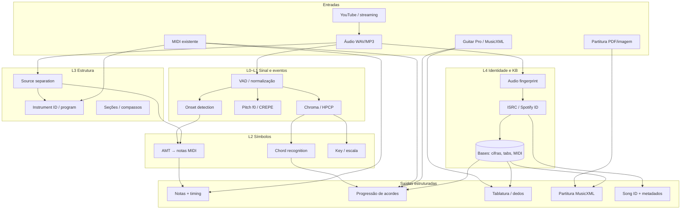

# Deep Research — Extração de Dados Musicais

> **Discovery report** · Junho 2026 · Base de conhecimento para o projeto **music-tutor**
>
> Foco: **notas**, **acordes**, **instrumentos distintos**, **reconhecimento de música** e **bases de conhecimento** (cifras, tablaturas, partituras, MIDI).
>
> **MVP violão + microfone:** ver a pesquisa dedicada em [../deep-research-live-guitar/README.md](../deep-research-live-guitar/README.md).

Este repositório documenta o estado da arte em **extração estruturada de informação musical** — do áudio bruto e de representações simbólicas até pipelines prontos para produto.

---

## Objetivo desta base

Servir como **fonte única de verdade** para decisões sobre:

1. **De onde vêm os dados** (áudio, MIDI, MusicXML, Guitar Pro, OMR, APIs).
2. **Como extrair** notas, acordes, instrumentos e metadados com qualidade mensurável.
3. **Quais bases licenciadas ou abertas** usar para treino, referência ou lookup.
4. **O que é viável em browser vs backend** para o music-tutor.

Complementa (não substitui) a pesquisa geral em [`../deep-research/`](../deep-research/README.md), especialmente o capítulo [04 — Análise Musical (MIR)](../deep-research/04-analise-musical-mir.md).

---

## Metodologia em camadas

A pesquisa foi organizada em **5 camadas empíricas**, do mais determinístico ao mais semântico:

| Camada | O que extrai | Exemplos | Latência típica |
|--------|--------------|----------|-----------------|
| **L0 — Sinal** | amplitude, espectro, chroma | librosa, Essentia, aubio | ms |
| **L1 — Eventos** | onset, pitch f0, batida | CREPE, aubio YIN, madmom | ms–100 ms |
| **L2 — Símbolos** | notas MIDI, acordes, tom | Basic Pitch, MT3, CREMA, ChordFormer | 1 s–min |
| **L3 — Estrutura** | instrumento, stem, seção | Demucs, MIROS, Klangio | seg–min |
| **L4 — Identidade** | qual música, metadados, cifra | Shazam/ACRCloud, Chordonomicon, Songsterr | ms–s |

Cada camada **alimenta a seguinte**; pular camadas gera erros compostos (ex.: acordes errados porque o chroma veio de mix polifónico sem separação).

---

## Como navegar

| Documento | Conteúdo |
|-----------|----------|
| [01 — Fundamentos e Pipeline](./01-fundamentos-extracao-musical.md) | Representações, fluxo áudio→simbólico, métricas, camadas L0–L4 |
| [02 — Transcrição de Notas (AMT)](./02-transcricao-notas-amt.md) | Monofónico, polifónico, multi-instrumento; Basic Pitch, MT3, MIROS, TimbreTrap |
| [03 — Acordes e Tonalidade](./03-acordes-tonalidade.md) | Chord recognition, key detection, ChordFormer, CREMA, Chordonomicon |
| [04 — Instrumentos e Stems](./04-instrumentos-source-separation.md) | Demucs 6-stem, timbre, detecção de programa MIDI |
| [05 — Reconhecimento Musical](./05-reconhecimento-musical-identificacao.md) | Fingerprinting, ACRCloud, embeddings, lookup de metadados |
| [06 — Formatos e Parsers](./06-formatos-simbolicos-parsers.md) | MIDI, MusicXML, GP5, ABC, OMR (Audiveris), music21, pyguitarpro |
| [07 — Bases de Conhecimento](./07-bases-conhecimento-datasets.md) | Datasets ranqueados: Lakh, MAESTRO, DadaGP, GuitarSet, Chordonomicon… |
| [08 — Ranking e Matriz de Decisão](./08-ranking-referencias-matriz-decisao.md) | Top referências por tarefa, gaps, roadmap para music-tutor |
| [09 — Tutor Violão (microfone)](./09-tutor-violao-microfone-tempo-real.md) | **MVP produto:** afinador de acordes, notas e ritmo ao vivo |

---

## Mapa mental do pipeline de extração

---

## Síntese executiva (60 segundos)

1. **Não existe um extrator universal** — extração de qualidade exige **pipeline por camada**: separar stems → transcrever por instrumento → inferir acordes sobre chroma limpo ou score simbólico.
2. **Para notas em produto**: **Basic Pitch** (1 instrumento, leve, Apache 2.0) vs **MT3/MIROS** (multi-instrumento, pesado) — gap enorme em polifonia densa (F1 cai ~0,3 ao passar de 1→3 instrumentos no AMT Challenge 2025).
3. **Para acordes**: **Essentia.js / madmom / CREMA** cobrem pop/rock; **ChordFormer** lidera vocabulário grande (602+ classes); datasets como **Chordonomicon** (666k progressões) e **POP909-CL** alimentam modelos simbólicos.
4. **Para tablatura/cifra**: o ouro está em **representação simbólica** (DadaGP, AnimeTAB, Songsterr) — não em inferir dedos só do áudio. **Guitar Pro → tokens** (DadaGP) ou **MusicXML com `<frame>`** é o caminho pragmático.
5. **Reconhecimento de música** (qual faixa é): fingerprint clássico (Shazam) ou **ACRCloud** comercial; embeddings (**CLAP, MERT, MuQ**) para biblioteca própria. **Chordify não expõe API pública**.
6. **Legal é gatekeeper**: Songsterr/Ultimate Guitar licenciam conteúdo; datasets académicos têm restrições NC; **IMSLP + OMR** para clássico; **cifras comunitárias** exigem curadoria ou parceria editorial.

---

## Top 10 referências (ranqueamento global)

Score composto: **maturidade** (0–3) + **relevância music-tutor** (0–3) + **licença/acessibilidade** (0–2) + **evidência empírica** (0–2). Máximo = 10.

| Rank | Referência | Score | Papel principal |
|------|------------|-------|-----------------|
| 1 | [Spotify Basic Pitch](https://github.com/spotify/basic-pitch) | **9.5** | Áudio → MIDI, 1 instrumento, browser-friendly |
| 2 | [Essentia / Essentia.js](https://essentia.upf.edu/) | **9.0** | Key, acordes, onset, beat — WASM no browser |
| 3 | [Meta Demucs v4 / demucs-onnx](https://github.com/facebookresearch/demucs) | **8.5** | Stems (4 ou 6), pré-processamento para AMT |
| 4 | [MT3 / YourMT3+ / MIROS](https://arxiv.org/pdf/2603.27528) | **8.5** | Multi-instrument AMT state-of-the-art |
| 5 | [music21](https://web.mit.edu/music21/) | **8.5** | Parser universal MusicXML/MIDI → análise simbólica |
| 6 | [Audiveris](https://github.com/Audiveris/audiveris) | **8.0** | OMR: imagem/PDF → MusicXML |
| 7 | [Chordonomicon](https://huggingface.co/datasets/ailsntua/Chordonomicon) | **8.0** | 666k progressões + metadados Spotify |
| 8 | [DadaGP](https://github.com/dada-bots/dadaGP) | **7.5** | 26k Guitar Pro tokenizados — tablatura nativa |
| 9 | [CREMA / madmom Chordino](https://github.com/bmcfee/crema) | **7.5** | Acordes em áudio, pipeline madmom |
| 10 | [ACRCloud](https://www.acrcloud.com/music-recognition/) | **7.0** | Identificação comercial + ISRC/Spotify |

Detalhamento completo em [08 — Ranking e Matriz de Decisão](./08-ranking-referencias-matriz-decisao.md).

---

## Fontes e metodologia

- Pesquisa web, papers e documentação oficial (Maio–Junho 2026)
- Papers-chave: AMT Challenge 2025, ChordFormer (2025), Chordonomicon (2024), DadaGP (ISMIR 2021), TimbreTrap (ICASSP 2024), Basic Pitch (ICASSP 2022)
- Repositórios: Basic Pitch, Demucs, MT3, Audiveris, music21, mirdata, Chordonomicon
- **Hipóteses não verificadas** marcadas em cada documento

---

## Próximo passo sugerido

Ler [08 — Matriz de Decisão](./08-ranking-referencias-matriz-decisao.md) e definir **qual combinação entrada→saída** o MVP do music-tutor precisa (ex.: microfone violão → nota + acorde vs upload MP3 → cifra + tabs).
