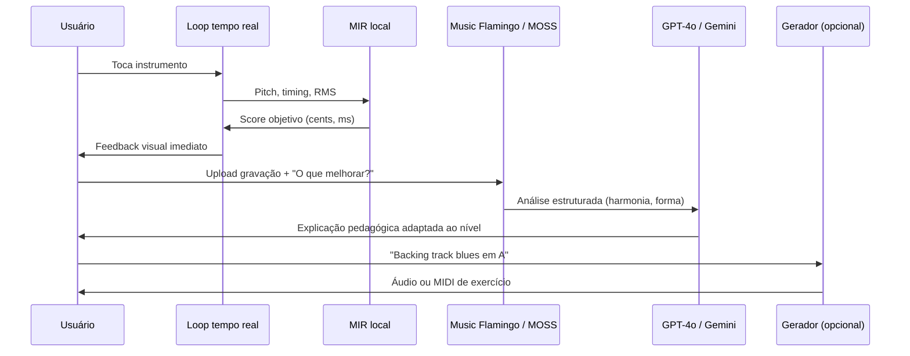

# 02 — LLMs e Audio-Language Models

## Taxonomia: nem todo "LLM de música" faz a mesma coisa

| Categoria | Entrada | Saída | Exemplo de uso no tutor |
|-----------|---------|-------|-------------------------|
| **LLM de texto** | Texto (+ imagem) | Texto | Explicar teoria, corrigir partitura escaneada |
| **LLM multimodal com áudio** | Áudio + texto | Texto (ou áudio) | Tutor conversacional, análise de performance |
| **Audio-Language Model (ALM)** | Áudio longo + pergunta | Texto analítico | "Qual a progressão de acordes desta faixa?" |
| **LLM simbólico** | Texto | MIDI / ABC | Gerar exercícios, harmonizações |
| **Modelo generativo de áudio** | Texto | Waveform | Backing tracks, exemplos sonoros |

---

## LLMs generalistas multimodais

### OpenAI GPT-4o / Realtime API

- **Arquitetura:** rede única end-to-end para texto, visão e áudio (não pipeline STT→LLM→TTS separado)
- **Latência de voz:** ~232 ms mínimo, ~320 ms médio — adequado para diálogo pedagógico
- **API:** texto + visão maduros; áudio/vídeo em rollout para parceiros
- **Uso no tutor:** explicações Socráticas, feedback verbal, análise de partitura via câmera
- **Limitação:** não substitui análise musical precisa (pitch cents, timing ms) — complementa MIR

### Google Gemini (2.0 Flash, Live API, Lyria)

- **Gemini 2.0 Flash:** aceita áudio como input (AAC, FLAC, MP3, WAV, etc.); contexto grande (1M tokens em variantes)
- **Live API:** streaming bidirecional de áudio — competidor direto do GPT-4o Realtime
- **Lyria 3 Pro:** geração de música via Vertex AI / Gemini API (ver doc 03)
- **Uso no tutor:** agente consultor (caso Melody Sage), geração de currículo, busca grounded

### Anthropic Claude

- Forte em raciocínio longo e código; áudio nativo menos central que OpenAI/Google
- **Uso no tutor:** pipeline "teacher delivery" (ex.: CrescendAI usa Claude para feedback pedagógico)

### Modelos locais (Gemma, Llama, Qwen)

- **Gemma / Llama via Ollama:** tutoria offline, baixa latência, privacidade
- **Trade-off:** qualidade de raciocínio musical inferior a frontier models + ALMs especializados

---

## Audio-Language Models especializados

### Music Flamingo (NVIDIA) — **referência para compreensão musical**

| Atributo | Detalhe |
|----------|---------|
| Base | Audio Flamingo 3 + Whisper encoder + Qwen2 LM |
| Dataset | MF-Skills: ~2M músicas, 2,1M captions (~452 palavras), 900K Q&A |
| Raciocínio | MF-Think (chain-of-thought com teoria musical) + GRPO |
| Áudio max | 20 min (janelas de 30 s, até 40 janelas) |
| RoTE | Rotary Time Embeddings para modelagem temporal |
| Benchmarks | SOTA em 10+ benchmarks (harmonia, estrutura, timbre, letras) |
| Licença | Open weights (verificar termos NVIDIA) |
| Checkpoint | `nvidia/music-flamingo-2601-hf` |

**Capacidades:** análise de harmonia, forma, timbre, contexto cultural, Q&A longo sobre músicas.

**Ideal para:** backend de "professor analítico" que ouve uma performance/gravação e explica *por quê* algo soa de certa forma.

### MOSS-Music (OpenMOSS) — maio 2026

| Variante | Foco |
|----------|------|
| MOSS-Music-8B-Instruct | Seguir instruções musicais diretas |
| MOSS-Music-8B-Thinking | Chain-of-thought para análise |

**Tarefas:** captioning, lyrics ASR, análise estrutural, acordes/tom/tempo, Q&A longo.

**Stack:** MOSS-Audio-Encoder + Qwen3-8B (~9B params total).

**Pipeline de dados:** [MOSS-Music-Data-Pipeline](https://github.com/wx9songs/MOSS-Music-Data-Pipeline) — extração MIR, segmentação, ASR de letras, geração de captions com Qwen3-Omni e MusicFlamingo.

### Qwen2-Audio (Alibaba)

- **Modos:** análise de áudio + voice chat unificado
- **Cobertura:** fala, sons, música, áudio misto — 30+ tarefas no pré-treino
- **Tamanho:** 7B (Qwen2-Audio-7B-Instruct)
- **Benchmarks:** competitivo em MusicCaps, AIR-Bench (música)
- **Comparação:** Music Flamingo supera em benchmarks musicais específicos (2025–2026)

### Audio Flamingo 2 (NVIDIA)

- 3B params, áudio até 5 min
- Datasets AudioSkills + LongAudio
- Supera Qwen2-Audio, SALMONN, GPT-4o-audio em vários benchmarks de raciocínio

### Whisper / faster-whisper

- **Não é ALM**, mas encoder de referência para fala e letras
- Usado em pipelines de transcrição de exercícios vocais e análise de letras

---

## LLMs para música simbólica

### MIDI-LLM (NeurIPS AI4Music 2025)

- Base: **Llama 3.2 1B** + 55K tokens MIDI (gramática AMT)
- **Texto → MIDI** multitrack com controle semântico
- Inferência acelerada via vLLM
- Demo: [midi-llm-demo.vercel.app](https://midi-llm-demo.vercel.app)

### NotaGen (2025)

- Foco: **partitura clássica** em notação ABC
- Pré-treino: 1,6M partituras; fine-tune: 9K peças de 152 compositores
- Condicionamento: `"Baroque-Bach-Keyboard"` (período-compositor-instrumentação)
- RL: CLaMP-DPO para musicalidade sem labels humanos

### Magenta / Music Transformer (Google — legado ativo)

- Geração de melodias e drums em MIDI no browser via TensorFlow.js
- Menor qualidade que MIDI-LLM, mas **zero servidor** e maduro para protótipos

---

## Como combinar LLMs no produto

### Princípios de design

1. **Nunca delegue pitch/timing ao LLM** — use MIR determinístico; LLM interpreta resultados.
2. **ALM para análise holística** — timbre, estilo, contexto, letras.
3. **LLM de texto para pedagogia** — adaptar linguagem ao nível do aluno.
4. **Cache e RAG** — teoria musical, exercícios, progressões em vector DB (caso Melody Sage).

---

## Comparativo resumido (compreensão musical)

| Modelo | Params | Áudio max | Música profunda | Self-host | API comercial |
|--------|--------|-----------|-----------------|-----------|---------------|
| GPT-4o | — | minutos | Médio | Não | Sim |
| Gemini 2.0 | — | minutos | Médio | Não | Sim |
| Qwen2-Audio-7B | 7B | minutos | Bom | Sim | Via providers |
| Audio Flamingo 2 | 3B | 5 min | Muito bom | Sim* | Não |
| Music Flamingo | ~7B+ | 20 min | **SOTA open** | Sim | Não |
| MOSS-Music-8B | ~9B | longo | Muito bom | Sim | Não |

*Verificar licenças NVIDIA/Alibaba para uso comercial.

---

## APIs unificadas (gateway)

Provedores agregam múltiplos modelos de música:

- **MusicAPI.ai** — Lyria 3 Pro, segment replace, producer workflows
- **FAL.ai** — MiniMax Music 2.x (~$0,035/geração — econômico para volume)
- **Replicate / Hugging Face Inference** — MusicGen, Stable Audio, Demucs

Úteis para **abstrair auth e polling**, mas adicionam markup e dependência.
