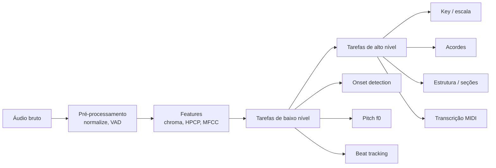

# 04 — Análise Musical (MIR)

## O coração técnico de um tutor

Apps como Yousician, Simply Piano e Melodics **não dependem de LLMs** para o feedback core — usam **análise de sinal em tempo real**: pitch, onset, timing, comparação com score de referência.

LLMs entram **depois**, para explicar, adaptar lições e analisar gravações completas.

---

## Pipeline MIR por camada



---

## Pitch detection (monofónico — tutor de instrumento/voz)

### CREPE

- **Tipo:** CNN sobre waveform (domínio do tempo)
- **Saída:** f0 + confidence por frame
- **Sample rate:** treinado em 16 kHz (resample automático)
- **Precisão:** >90% raw accuracy a 10 cents
- **Uso:** violino, voz, instrumentos monofónicos

```python
import crepe
from scipy.io import wavfile
sr, audio = wavfile.read('audio.wav')
time, frequency, confidence, _ = crepe.predict(audio, sr, viterbi=True)
```

### Alternativas mais leves (browser)

| Lib | Método | Latência | Precisão |
|-----|--------|----------|----------|
| **Pitchy** | autocorrelação/YIN | Muito baixa | Boa (monofónico) |
| **@playground-sessions/pitch-detection-analysis** | CREPE via TF.js | Média | Alta |
| **aubio** (C/Python) | YIN, FFT | Baixa | Média-alta |

### Boas práticas para tutor

- Rodar em **AudioWorklet** ou Web Worker (não bloquear UI)
- Threshold de confidence (ex.: 0,8) antes de julgar "nota errada"
- Suavização temporal (Viterbi no CREPE; mediana móvel)
- Calibrar **cents tolerance** por instrumento (violino vs piano)

---

## Transcrição polifónica → MIDI

### Basic Pitch (Spotify)

- **Polifónico**, agnóstico de instrumento (1 instrumento por vez)
- **Pitch bends** preservados (vibrato, slides)
- Output: MIDI + eventos de nota
- **npm:** `basic-pitch-ts` para browser; Python para servidor
- **Licença:** Apache 2.0 — **amigável para produto**

```python
from basic_pitch.inference import predict
model_output, midi_data, note_events = predict("audio.wav")
```

### CREPE Notes (2023+)

- Pós-processamento de contorno CREPE → segmentação em notas
- State-of-the-art em monofónico instrumental

### Limitações

- Polifonia com múltiplos instrumentos misturados: ainda difícil
- Percussão: pipelines separados (onset + classificação)

---

## Tonalidade, acordes e ritmo

### Essentia (C++ / Python / **Essentia.js** WASM)

Ferramenta de referência acadêmica e industrial (Spotify usa internamente):

| Algoritmo | Função |
|-----------|--------|
| `KeyExtractor` | Tom + escala (major/minor) via perfis Krumhansl-Kessler |
| `ChordsDetection` | Acordes em janela deslizante sobre HPCP |
| `ChordsDetectionBeats` | Acordes por segmento entre batidas |
| `RhythmExtractor2013` | BPM + grid de batidas |
| `OnsetDetection` | Início de notas/eventos |

**Essentia.js no browser:** usado em produção (ex.: TagMyBeat) com Web Workers — key detection client-side sem upload.

### librosa (Python)

- Prototipagem rápida: chroma, CQT, onset, beat tracking
- Menos otimizado que Essentia para produção em escala

### CREMA (chord recognition)

- Modelo deep learning referenciado em apps acadêmicos (SoundSignature)
- Output: sequência de acordes com timestamps + confidence

### music21 (Python)

- Análise **simbólica** (MusicXML, MIDI): graus, progressões, voicings
- Complementa MIR de áudio quando há score disponível

---

## Source separation (stems)

### Demucs v4 (Meta) — HTDemucs

| Modelo | Stems |
|--------|-------|
| htdemucs | drums, bass, vocals, other |
| htdemucs_6s | + guitar, piano |
| `--two-stems=vocals` | modo karaoke |

- **Arquitetura:** híbrido espectrograma + waveform + Transformer cross-domain
- **API Python:** `demucs.separate.main([...])` ou classe `Separator`
- **ONNX:** [demucs-onnx](https://github.com/StemSplit/demucs-onnx) — browser, iOS, Android sem PyTorch (~50 MB vs ~2 GB)

**Uso no tutor:**

- Isolar instrumento do aluno em mix de backing
- Gerar play-along sem faixa de referência
- Análise de voicing de acordes no piano (stem isolado)

**Latência:** 30–90 s online com GPU; 5–15 min CPU local.

---

## Score following e alinhamento

Problema: alinhar performance ao **score de referência** (não só timestamps).

**CrescendAI** (referência 2026):

- Onset + pitch **DTW** (Dynamic Time Warping) entre AMT output e MIDI do score
- Feedback referencia **número de compasso**, não segundos
- Essencial para piano e instrumentos com partitura fixa

---

## Benchmarks e datasets MIR

| Dataset | Uso |
|---------|-----|
| MUSDB18 | Source separation |
| MAESTRO | Piano transcription |
| NSynth | Timbre / pitch |
| MusicNet | Transcrição clássica |
| FMA | Genre / tags |
| MusicCaps / MusicQA | Avaliação ALMs |

---

## Stack MIR recomendada por cenário

| Cenário do tutor | Stack |
|------------------|-------|
| Violino/guitarra — nota certa | CREPE ou Pitchy + tolerância cents |
| Piano — nota + timing vs score | Basic Pitch ou onset+pitch + DTW |
| "Qual tom é esta música?" | Essentia.js KeyExtractor |
| "Quais acordes?" | Essentia ChordsDetection ou CREMA |
| Remover vocal para praticar | Demucs two-stems |
| Transcrever solo para MIDI | Basic Pitch |

---

## Métricas de feedback (objetivas)

| Métrica | Unidade | Uso pedagógico |
|---------|---------|---------------|
| Desvio de pitch | cents | afinação |
| Desvio de onset | ms | ritmo/atraso |
| IOI error | ms | regularidade rítmica |
| Dynamic RMS | dB | dinâmica (avançado) |
| Pedal CC64 | on/off | piano (CrescendAI) |

**Regra:** apresentar ao usuário em linguagem musical ("ligeiramente abaixo do F#"), não em cents — MIR calcula, LLM traduz.

---

## Self-supervised MIR (frontier research)

Modelos pré-treinados em centenas de milhares de horas (MERT, MusicFM, etc.) melhoram beat tracking, key/chord com fine-tune mínimo. Relevante para **fase 2** do tutor, não MVP.
