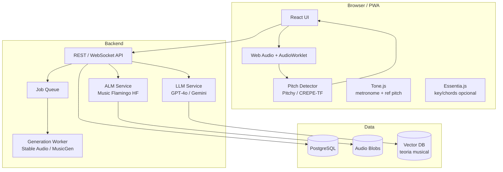

# 07 — Arquiteturas de Apps de Tutoria

## Padrão Yousician-like (referência de mercado)

### Features core

1. **Listen mode** — microfone ou MIDI escuta o usuário
2. **Real-time feedback** — nota certa/errada, timing, streaks
3. **Curriculum gamificado** — paths por instrumento, níveis, XP
4. **Song catalog** — músicas licenciadas com tab/score sincronizado
5. **Personalização AI** — adaptação de dificuldade (fase recente)

### Stack típico (indústria)

| Camada | Tecnologias |
|--------|-------------|
| Audio RT | Core Audio / Oboe, DSP custom |
| Pitch/rhythm | Proprietário + ML híbrido |
| UI | Native (Swift/Kotlin) ou Unity |
| Backend | Microservices, CDN para stems/MIDI |
| AI layer | TensorFlow, Core ML, OpenAI APIs |

**Insight:** o moat não é o LLM — é **latência + acurácia do pitch** + catálogo licenciado.

---

## Arquitetura recomendada para music-tutor (web-first MVP)



### Separação de loops

| Loop | SLA | Tecnologia |
|------|-----|------------|
| **Hot path** | < 50 ms | AudioWorklet, sem rede |
| **Warm path** | < 2 s | REST leve, cache |
| **Cold path** | 5 s – 5 min | LLM, ALM, geração |

---

## Referências open source e acadêmicas

### CrescendAI (2026) — piano, feedback avançado

**Diferencial:** avalia dinâmica, pedaling, articulação — não só notas MIDI.

| Componente | Tech |
|------------|------|
| Scoring | MuQ audio foundation model, 6 dimensões |
| Pipeline | STOP classifier → Groq subagent → Claude teacher |
| Score follow | DTW onset+pitch vs MIDI |
| Web | TanStack Start + WebSocket |
| API | Rust Axum @ Cloudflare Workers |

**Lição:** pipeline **two-stage LLM** (análise rápida + entrega pedagógica) reduz latência percebida.

### SonicAI (2025) — educação + geração

**Diferencial:** workflow `plan → learn → customize → generate`

| Componente | Tech |
|------------|------|
| Geração | MusicGen-small + Bark (vocals) + DSP fallback |
| Backend | FastAPI + Celery + Redis |
| Frontend | React 19 + WaveSurfer |

**Lição:** sempre ter **fallback sem GPU** para demos e mercados emergentes.

### Melody Sage (ITRex R&D)

| Componente | Tech |
|------------|------|
| Currículo | Gemini 2.5 Pro + RAG |
| Imagens | Imagen 3 |
| Agent | Tool-augmented + Google Search |
| Data | Firestore, Vertex AI Vector Search |

**Lição:** RAG com material curado > LLM puro para teoria musical consistente.

### SoundSignature (PMC 2025)

Integra em chat:

- HT-Demucs (stems)
- CREMA (acordes)
- Basic Pitch (MIDI)

**Lição:** expor MIR como **tools invocáveis** por keywords ("stems", "chords", "midi").

### smart-jam (GitHub)

- Pitchy + Tone.js + Magenta.js
- AI responde musicalmente em tempo real

**Lição:** protótipo rápido de jam tutor no browser.

---

## Fluxos de produto por persona

### Iniciante absoluto

```
Lição teórica (LLM + RAG)
    → Demo sonora (Tone.js synth)
    → Exercício guiado (pitch feedback)
    → Reforço positivo + 1 dica (LLM curta)
```

### Instrumentista intermediário

```
Escolhe música / exercício
    → Score sync (MIDI + OSMD)
    → Performance + DTW scoring
    → ALM: "sua interpretação do refrão..."
    → Sugestão de prática targeted
```

### Compositor / produtor

```
Prompt → MIDI-LLM (esboço)
    → Edição no browser
    → Stable Audio (render demo)
    → ALM: análise harmônica
```

---

## Gamificação e retenção (não-AI mas crítico)

- Streaks, XP, desafios diários
- **Accuracy score** objetivo (MIR) + **progress narrative** (LLM)
- Spaced repetition para exercícios fracos
- Social: duetos async, leaderboards por instrumento

---

## Instrumentos — considerações técnicas

| Instrumento | Input preferido | Desafio MIR |
|-------------|-----------------|-------------|
| Piano/teclado | **MIDI** | Baixo — note exact |
| Violino/voz | Microfone | Pitch glissando, vibrato |
| Guitarra | Microfone / DI | Polifonia limitada, bends |
| Bateria | Microfone multi | Onset + classificação hit |
| Sopro | Microfone | Monofónico, dinâmica |

**MVP recomendado:** piano via MIDI **ou** monofónico via microfone (violino/voz).

---

## Anti-patterns

| Evitar | Por quê |
|--------|---------|
| LLM julga afinação | Alucinação; sem precisão cents |
| Upload obrigatório para pitch RT | Latência + privacidade |
| Modelo generativo no hot path | Segundos de delay mata UX |
| Catálogo copyrighted sem licença | Risco legal |
| Uma API de música só | Vendor lock-in + legal single point of failure |

---

## Métricas de produto

| Métrica | Como medir |
|---------|------------|
| Pitch accuracy | % frames dentro de ±N cents |
| Timing accuracy | % onsets dentro de ±N ms |
| Latência feedback | P95 ms AudioWorklet → UI |
| Lesson completion | Funnel analytics |
| LLM helpfulness | Thumbs + eval set humano |
| Time to first sound | < 3 s após click (Tone.start) |

---

## Integrações futuras (backlog)

- **Web MIDI 2.0** — quando suporte browser ampliar
- **Ableton Link / Web** — sync tempo multi-device
- **Spotify/Apple Music SDK** — referência de timbre (não MIR)
- **MCP tools** — ai_jam_sessions pattern para DAW control
