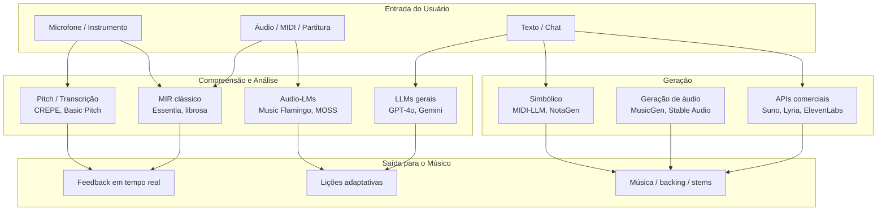

# Deep Research — IA para Desenvolvimento de Software Musical

> **Discovery report** · Maio 2026 · Base de conhecimento para o projeto **music-tutor**

Este repositório documenta o estado da arte em **LLMs**, **modelos de geração de áudio**, **análise musical (MIR)** e **stacks de desenvolvimento** aplicáveis a produtos para músicos.

---

## Objetivo desta base

Servir como **fonte única de verdade** para decisões de arquitetura, escolha de modelos, integrações e roadmap do music-tutor — sem substituir experimentação hands-on, mas reduzindo incerteza estratégica.

## Como navegar

| Documento | Conteúdo |
|-----------|----------|
| [01 — Fundamentos de IA para Áudio](./01-fundamentos-ia-audio.md) | Paradigmas (AR, difusão, flow matching), tokenização, latência |
| [02 — LLMs e Audio-Language Models](./02-llms-e-audio-language-models.md) | GPT-4o, Gemini, Qwen2-Audio, Music Flamingo, MOSS-Music |
| [03 — Geração de Áudio e Música](./03-geracao-de-audio-e-musica.md) | Suno, Udio, Stable Audio 3, MusicGen, ElevenLabs, Lyria |
| [04 — Análise Musical (MIR)](./04-analise-musical-mir.md) | Pitch, MIDI, acordes, stems, transcrição |
| [05 — Stack de Desenvolvimento](./05-stack-desenvolvimento.md) | Web Audio, Tone.js, Essentia.js, TF.js, ONNX, MIDI |
| [06 — Legal e Licenciamento](./06-legal-e-licenciamento.md) | Copyright, fair use, dados licenciados, riscos para devs |
| [07 — Arquiteturas de Apps de Tutoria](./07-arquiteturas-apps-tutoria.md) | Yousician-like, pipelines, referências open source |
| [08 — Matriz de Decisão e Roadmap](./08-matriz-decisao-e-roadmap.md) | Quando usar o quê, MVP sugerido, gaps abertos |

## Mapa mental do ecossistema

## Síntese executiva (30 segundos)

1. **Não existe um único modelo** — o domínio musical exige **pipeline híbrido**: MIR determinístico (pitch, timing) + LLM pedagógico + geração opcional.
2. **Compreensão profunda de música** avançou com **Audio-LMs especializados** (Music Flamingo, MOSS-Music), não com LLMs de texto puros.
3. **Geração com vocais de alta qualidade** concentra-se em APIs comerciais (Suno, Udio, Lyria, ElevenLabs); **open source** lidera em instrumental, SFX e controle (Stable Audio 3, MusicGen).
4. **Legal/licenciamento** é fator de produto: preferir modelos com **dados licenciados** (Stable Audio, ElevenLabs, Lyria) para uso comercial.
5. **Browser-first** é viável para tutoria: pitch (CREPE via TF.js), análise tonal (Essentia.js), síntese (Tone.js); modelos pesados ficam no **backend ou edge**.

## Fontes e metodologia

- Pesquisa web e documentação oficial (Maio 2026)
- Papers: Stable Audio 3, Music Flamingo, AR vs Flow-Matching, MIDI-LLM, NotaGen
- Repositórios: AudioCraft, Demucs, Basic Pitch, Essentia, Tone.js
- Casos de produto: CrescendAI, SonicAI, Melody Sage, SoundSignature
- **Hipóteses não verificadas** estão marcadas como tal em cada seção

## Próximo passo sugerido

Ler [08 — Matriz de Decisão](./08-matriz-decisao-e-roadmap.md) e definir o **MVP do music-tutor** (instrumento alvo, online vs offline, geração sim/não).
