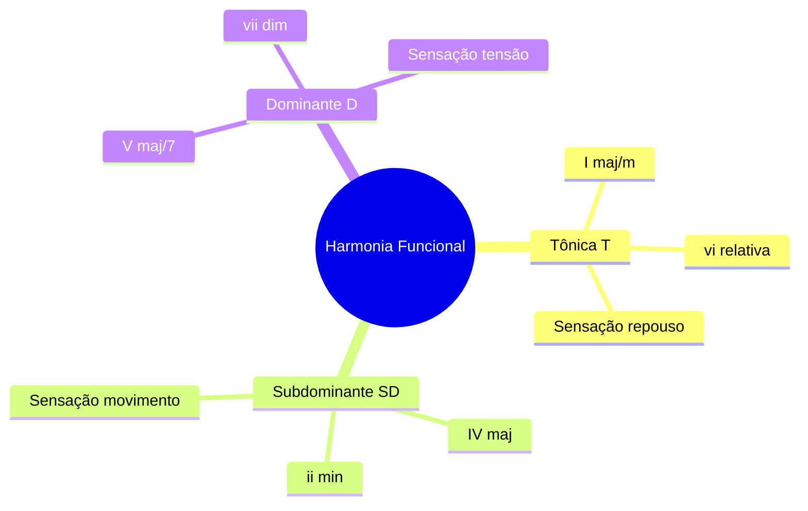
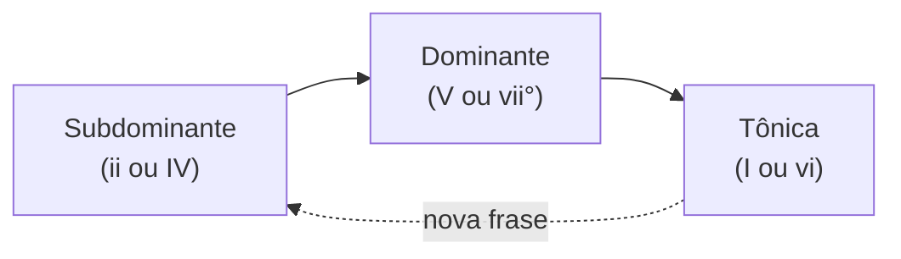

# SYN-01 — Harmonia funcional: prever acordes pela tonalidade

**Charter Q1** | **Evidence**: DA-001, SRC-001, SRC-002, SRC-004, SRC-062

---

## 1. O que é harmonia funcional

Harmonia funcional é o sistema que explica **por que** certos acordes "querem" ir para outros dentro de uma tonalidade. Não é regra arbitrária — é convenção auditiva acumulada por séculos de música tonal (barroco → jazz → pop → MPB).

> "Functional harmony explains why one chord feels like home, why another creates tension, and how those movements shape the emotional flow of a song." — [SRC-001]

Três funções governam 95% das músicas que você vai acompanhar:

---

## 2. Campo harmônico — o mapa de possibilidades

Em **escala maior**, cada grau gera um acorde diatônico:

| Grau | Em Dó | Tipo | Função |
|------|-------|------|--------|
| I | C | maj | T |
| ii | Dm | min | SD |
| iii | Em | min | T fraca |
| IV | F | maj | SD |
| V | G | maj | D |
| vi | Am | min | T |
| vii° | Bdim | dim | D |

**Exercício fundamental**: toque os 7 acordes em sequência cantando "primeiro grau... segundo grau..." até internalizar o **som de cada grau relativo à tônica**, não ao acorde absoluto [SRC-062].

Em **escala menor natural** (Lá menor): Am, Bdim, C, Dm, Em, F, G — funções análogas com ajustes para harmonia menor.

---

## 3. A cadeia SD → D → T

A progressão mais fundamental da música ocidental:

**Exemplos concretos**:
- Dm → G → C (ii–V–I em Dó)
- F → G → C (IV–V–I)
- F → G → Am (IV–V–vi — "decepção" pop)

Quando você ouve **tensão crescente**, aposte dominante chegando. Quando ouve **resolução**, tônica. Quando ouve **abertura** sem tensão, subdominante.

---

## 4. Protocolo de inferência em 5 passos

### Passo 1 — Estabelecer a tônica
- Último acorde de refrão/verso (repouso)
- Nota mais repetida na melodia vocal
- Primeiro acorde se a música "soa completa" nele

### Passo 2 — Ouvir o baixo
> "The single best entry point for recognizing chord progressions is the bass note." — [SRC-004]

Na música popular, a nota mais grave = raiz do acorde na ~80% dos casos.

### Passo 3 — Mapear baixo → grau
Se tônica = Dó e baixo = Fá → IV. Baixo = Sol → V. Baixo = Ré → ii.

### Passo 4 — Determinar qualidade
- Brilhante/estável → maior
- Triste/fechado → menor
- Bluesy/tensão → dom7
- Suspense/instável → dim ou ø7
- Sofisticado/repouso jazz → maj7

### Passo 5 — Antecipar próximo acorde
Use função + estatística (ver SYN-04): após V → I; após IV → V ou I.

---

## 5. Dominantes secundárias — o "acorde estranho" explicado

Quando um acorde de 7ª **não pertence** ao campo harmônico mas resolve em acorde que pertence, é **dominante secundária** (V7/alvo):

| Acorde | Em Dó | Resolve em | Nome |
|--------|-------|------------|------|
| D7 | V7/V | G (V) | Dominante de dominante |
| A7 | V7/ii | Dm (ii) | Dominante de ii |
| E7 | V7/iii | Em (iii) | Dominante de iii |
| C7 | V7/IV | F (IV) | Backdoor/blues |

**Som**: dominante secundária = acorde com 7ª maior + sensação de "quase chegar" no alvo.

---

## 6. Inversões e baixo não-fundamental

Quando o baixo **não** é a fundamental:
- **1ª inversão** (3ª no baixo): som mais suave, passagem
- **2ª inversão** (5ª no baixo): cadencial, instável
- **Baixo melódico**: linha de baixo descendente (line cliché) — comum em baladas MPB

**Dica**: se o baixo se move cromaticamente (Mi→Ré#→Ré), pense passagem diminuta ou dominante alterada.

---

## 7. Casos de uso

### Caso A — Rodízio de samba, cantor começa do zero
Cantor canta "O que será de mim..." em tom desconhecido. Você:
1. Identifica nota de repouso → Si → tonalidade provável Mi ou Lá menor
2. Ouve primeiro acorde de repouso → confirma Mi maior
3. Mapeia: I=Mi, V=Si, IV=Lá, ii=Fá#m
4. Cantor repete frase → confirma I–IV–V ou similar

### Caso B — Primeiro acorde soa "jazz"
Maj7 no repouso → repertório bossa/MPB, não pop triádico. Espere ii7–V7–Imaj7, bIImaj7, diminutos passagem [SYN-05].

---

## Diagrams

- Fig A: mindmap funções T/SD/D (acima)
- Fig B: flowchart SD→D→T (acima)

## Referenced evidence IDs

SRC-001, SRC-002, SRC-004, SRC-062, DA-001

## URLs

- https://greenhillsguitarstudio.com/a-guitarists-guide-to-functional-harmony/
- https://iastate.pressbooks.pub/comprehensivemusicianship/chapter/6-1-diatonic-harmony-tutorial/
- https://guitarwiz.app/articles/recognize-chord-progressions-by-ear/
- https://campoharmonico.com.br/blog/estudando-o-campo-harmonico
