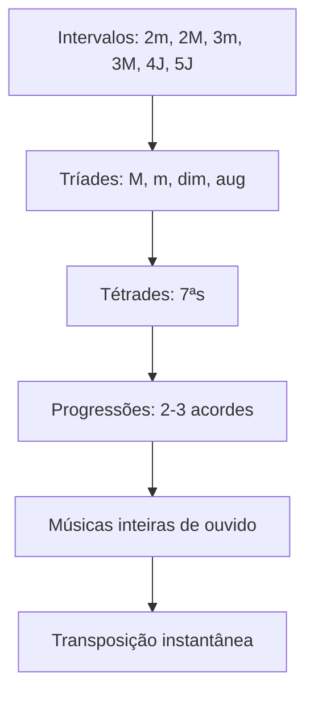
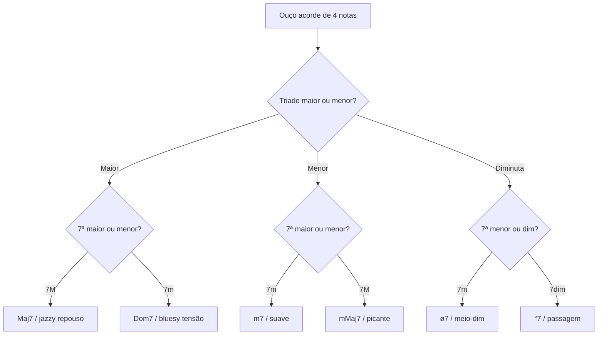

# SYN-02 — Ear training: reconhecer maiores, sétimas, diminutos e afins

**Charter Q2** | **Evidence**: SRC-016, SRC-017, SRC-018, QRF-016

---

## 1. Por que ear training é inegociável

Teoria sem ouvido = decoreba de cifras. Ouvido sem teoria = tentativa e erro lento. A combinação produz o músico que "sabe antes de tocar".

O objetivo não é ouvido absoluto (identificar Dó = 261 Hz). É **ouvido relativo**: identificar intervalos, funções e qualidades **em relação à tônica**.

---

## 2. Hierarquia de treino auditivo

**Tempo mínimo por nível**: 2–4 semanas de prática diária (15–30 min) antes de avançar.

---

## 3. Tríades — os quatro sabores base

| Qualidade | Intervalos | Sensação | Contexto funcional |
|-----------|------------|----------|-------------------|
| **Maior** | 3M + 3m | Brilhante, aberto | I, IV, V |
| **Menor** | 3m + 3M | Fechado, melancólico | ii, iii, vi |
| **Diminuta** | 3m + 3m | Instável, suspense | vii°, passagem |
| **Aumentada** | 3M + 3M | Tensão estranha | passagem rara |

**Método**: arpejar tríade no teclado/violão → cantar notas → tocar bloqueado → repetir em 3 tons diferentes [SRC-016].

---

## 4. Acordes de sétima — triade núcleo + 7ª

> "Different kinds of seventh chords are based on triad 'cores'" — [SRC-016]

| Nome | Triade | 7ª | Símbolo | Som associado | Função típica |
|------|--------|-----|---------|---------------|---------------|
| **Maj7** | M | 7M | Cmaj7, C△7 | Sofisticado, "jazz pop" | I em bossa |
| **Dom7** | M | 7m | C7 | Bluesy, tensão | V em qualquer estilo |
| **m7** | m | 7m | Cm7 | Suave, cool | ii, vi em jazz |
| **mMaj7** | m | 7M | Cm(maj7) | Picante, noir | i em menor |
| **ø7** (meio-dim) | dim | 7m | Cm7b5 | Triste, instável | viiø7, iiø7 |
| **°7** (dim7) | dim | 7dim | Cdim7 | Suspense máxima | passagem cromática |

### Árvore de decisão auditiva

### Dicas de reconhecimento contextual [SRC-018]

- **Dom7 (V7)**: aparece antes de resolução — "quer cair" na tônica
- **Maj7**: repouso sofisticado — bossa, MPB, jazz-pop
- **m7 (iim7)**: preparação suave — quase sempre antes de V7
- **°7**: passagem rápida — dura 1–2 tempos, resolve cromaticamente
- **ø7**: tensão menor — jazz, MPB avançada

---

## 5. Regra da oitava e baixo

Para acordes com baixo diferente da fundamental:
1. Identifique a **nota mais grave**
2. Identifique o **som geral** (M/m/7/°) acima dela
3. Se baixo ≠ fundamental → inversão ou slash chord (ex.: D/F#)

---

## 6. Exercícios práticos diários

### Exercício 1 — Duas qualidades (10 min)
Parceiro ou app toca: C, Cm, C7, Cmaj7, Cdim aleatoriamente. Você nomeia. Meta: 90% acerto.

### Exercício 2 — Progressão de 2 acordes (10 min)
Tocar: G → C (V→I), Dm → G (ii→V), E7 → Am (V/ii→ii). Ouvir e cantar funções.

### Exercício 3 — Rule of the octave [SRC-018 via StackExchange]
Harmonizar escala ascendente/descendente cantando. Internaliza "som de cada grau com 7ª".

### Exercício 4 — Música do repertório (10 min)
Escolha 1 música conhecida. Pause a cada mudança. Nomeie: grau + qualidade. Confira cifra depois.

---

## 7. Apps e recursos

| Recurso | Uso |
|---------|-----|
| Functional Ear Training (Bruce Arnold) | Solfege móvel + função |
| iReal Pro | Play-along com ocultar acordes |
| Hooktheory Trends | Ouvir progressões comuns |
| Teclado (mesmo básico) | Arpejar acordes — violão distorce timbre |

---

## Referenced evidence IDs

SRC-016, SRC-017, SRC-018

## URLs

- https://adambsilverman.com/2015/09/how-to-practice-ear-training-elements/
- https://viva.pressbooks.pub/openmusictheory/chapter/seventh-chords/
- https://uidaho.pressbooks.pub/auralskills/chapter/ear-training-how-seventh-chords-work/
