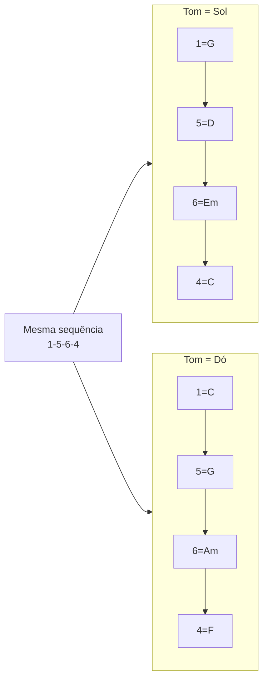

# SYN-03 — Transposição: graus romanos, Nashville e cifra móvel

**Charter Q3** | **Evidence**: SRC-031, SRC-032, SRC-061, SRC-077

---

## 1. O problema da cifra fixa

Cifra em **letras** (C, G, Am, F) acopla o cérebro a **formas** no braço do violão. Quando o cantor pede "sobe meio tom", o músico não treinado entra em pânico recalculando.

A solução: **desacoplar função de letra** — pensar "1–5–6–4" e só depois converter para o tom pedido.

---

## 2. Três sistemas equivalentes

| Sistema | Exemplo (tom C) | I–V–vi–IV |
|---------|-----------------|-----------|
| **Cifra** | Letras | C – G – Am – F |
| **Graus romanos** | Maiúsc/minúsc | I – V – vi – IV |
| **Nashville (NNS)** | Arábicos | 1 – 5 – 6 – 4 |

> "The numbers do not change when transposing the composition into another key. They are relative to the new Tonic." — [SRC-031]



---

## 3. Nashville Number System — como nasceu

História real [SRC-031, SRC-032]:
- Anos 1950, Nashville: session musicians recebiam **só letra**, sem partitura
- Jordanaires criaram números baseados em "Dó-Ré-Mi"
- Charlie McCoy adaptou para acordes
- Músicos chartavam na **primeira audição** de demo
- Cantor declara tom → todos tocam

**Convenções NNS**:
- Número sem modificação = acorde maior
- `-` = menor (6- = Am em tom C)
- `7` = dominante (57 = G7)
- `maj7` ou `△7` = sétima maior
- `°` = diminuto
- `/baixo` = baixo específico (1/3 = C/E)

---

## 4. Workflow de transposição em 3 passos

### Passo 1 — Cifra → Números
```
Original (tom C):  C – G – Am – F
Números:           1 – 5 – 6-  – 4
```

### Passo 2 — Declarar novo tom
Cantor: "Quero em Mi" → 1 = Mi

### Passo 3 — Números → Cifra nova
```
1=Mi, 5=Si, 6-=Fá#m, 4=Lá
Resultado: Mi – Si – Fá#m – Lá
```

> "Take the original chords → Swap out for the number at the top → Then swap those numbers for the new key." — [SRC-077]

---

## 5. Capo como atalho de transposição

Para violonistas que dominam formas em **Sol, Dó, Mi, Lá**:

**Fórmula** [SRC-077]: posição capo depende da diferença em semitons entre tom desejado e tom da forma.

Exemplo: forma em Sol (1=G), cantor quer Lá (2 semitons acima) → capo 2ª casa.

**Vantagem**: dedos no mesmo lugar, tom muda.  
**Limitação**: acima da 7ª casa fica fino; acordes com baixo aberto perdem timbre.

---

## 6. Solfege móvel vs. fixo

| Solfege fixo | Solfege móvel |
|--------------|---------------|
| Dó = C sempre | Dó = tônica (qualquer tom) |
| Bom para leitura | Bom para transposição |
| Conservatório clássico | Berklee, jazz, NNS |

Para **tocar de ouvido com cantor**, solfege **móvel** (Dó = 1 do tom atual) alinha ouvido e função.

---

## 7. Tabela de transposição rápida — graus diatônicos

Em **qualquer tom maior**, os graus são:

| Grau | Qualidade | Em Dó | Em Sol | Em Lá |
|------|-----------|-------|--------|-------|
| 1 | maj | C | G | A |
| 2 | min | Dm | Am | Bm |
| 3 | min | Em | Bm | C#m |
| 4 | maj | F | C | D |
| 5 | maj | G | D | E |
| 6 | min | Am | Em | F#m |
| 7 | dim | Bdim | F#dim | G#dim |

**Exercício**: pegue I–vi–IV–V e toque em **12 tons** em 12 minutos (1 tom/minuto).

---

## 8. Caso de uso — sessão ao vivo

Banda de bar. Cantora: "Vou cantar 'Águas de Março' em Fá#". Violonista mentalmente:
1. Conhece a sequência em números (já estudou Jobim)
2. 1 = Fá# (6ª casa ou formas em Mi com capo 2)
3. Durante execução: ouve se ela desviou → corrige pelo ouvido, não pela cifra

---

## Referenced evidence IDs

SRC-031, SRC-032, SRC-061, SRC-077

## URLs

- https://en.wikipedia.org/wiki/Nashville_number_system
- https://nashvillenumbersystem.com/introduction/
- https://goodguitarist.com/make-songs-easier-to-sing-on-guitar/
- https://violaonumerico.com/plano-de-estudo-45-para-violao/
