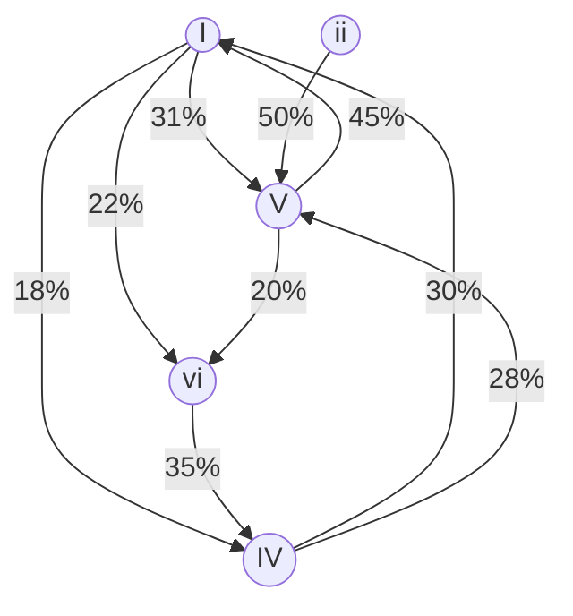

# SYN-04 — Progressões comuns: estatística, pop e predição do próximo acorde

**Charter Q4** | **Evidence**: DA-046, SRC-046, SRC-047

---

## 1. Por que "adivinhar" funciona tão bem

Músicas populares **reutilizam** as mesmas progressões. Hooktheory analisou 70.000+ músicas: após o acorde I, **V aparece 31%** das vezes — o movimento mais provável [SRC-046].

Isso não é preguiça compositiva — é **arquitetura emocional eficiente**: tensão (V) → repouso (I) funciona universalmente.

---

## 2. Top 5 progressões pop (memorizar primeiro)

| # | Progressão | Números | Exemplos | Sensação |
|---|------------|---------|----------|----------|
| 1 | **Axis** | I–V–vi–IV | Let It Be, No Woman No Cry | Esperançosa, circular |
| 2 | **Rock clássico** | I–IV–V | La Bamba, Wild Thing | Energia, forward |
| 3 | **Doo-wop** | I–vi–IV–V | Stand By Me | Nostálgica |
| 4 | **Axis invertida** | vi–IV–I–V | Zombie (Cranberries) | Melancólica |
| 5 | **50s ballad** | I–IV–vi–V | Beautiful (Christina) | Romântica |

**Exercício**: tocar cada uma em 3 tons sem olhar cifra. Depois, ouvir rádio e tentar nomear qual das 5 é.

---

## 3. Matriz de probabilidade (simplificada)

Baseada em análise Markov [SRC-046] — **pop anglo**, use como heurística:

| Se ouvi... | Próximo mais provável | Alternativa |
|------------|----------------------|-------------|
| I | V (31%) | vi, IV |
| V | I | vi |
| vi | IV | V |
| IV | I | V |
| ii | V | I |

---

## 4. Progressões jazz/MPB (além do pop)

| Progressão | Contexto | Exemplo |
|------------|----------|---------|
| **ii7–V7–Imaj7** | Jazz, bossa, standards | Garota de Ipanema (parcial) |
| **Imaj7–vi7–ii7–V7** | Turnaround jazz | Autum Leaves |
| **iii–VI–ii–V** | Bridge MPB | Wave (Jobim) |
| **I–vi–ii–V** | Jazz funcional | Blue Moon |
| **Coltrane changes** | Jazz avançado | Giant Steps (exceção!) |

---

## 5. Estratégia de predição ao vivo

Quando a música é **desconhecida**:

1. **Primeiros 4 compassos**: identifique I e confirme campo (maior/menor)
2. **Aposte na progressão mais comum do gênero**:
   - Sertanejo/pop BR → I–V–vi–IV ou vi–IV–I–V
   - Samba → I–IV–I–V ou ii–V–I
   - Bossa → ii7–V7–Imaj7 + cromatismos
   - Jazz → ii–V–I + substituições
3. **Errou?** Corrija no próximo compasso — ouvido confirma ou nega
4. **Melodia vocal guia**: notas da melodia pertencem ao acorde atual

---

## 6. Internalização por rotação

Mesmos 4 acordes, **6 permutações** = 6 emoções diferentes:

I–V–vi–IV | vi–IV–I–V | IV–I–V–vi | etc.

Rotacionar a axis muda ponto de partida emocional sem mudar material [SRC-046].

---

## Referenced evidence IDs

SRC-046, DA-046

## URLs

- https://www.hooktheory.com/trends
- https://www.hooktheory.com/blog/chord-progression-search-patterns-and-trends/
- https://mixedinkey.com/captain-plugins/wiki/common-chord-progressions-pop-music/
