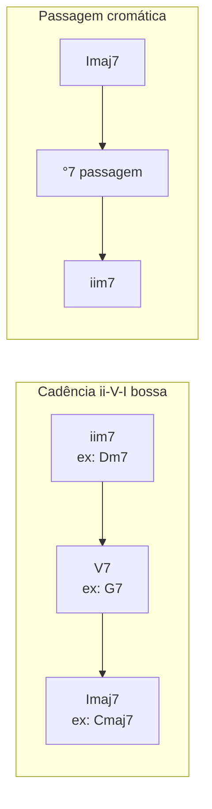

# SYN-05 — Bossa, samba e MPB: dispositivos harmônicos brasileiros

**Charter Q4, Q5** | **Evidence**: DA-048, SRC-047, SRC-048

---

## 1. MPB ≠ pop triádico

Se você internalizou I–V–vi–IV em tríades e encontrar uma bossa, vai errar sistematicamente. MPB usa:

- **Maj7** como tônica (não C, mas Cmaj7)
- **m7 + dom7** como ii–V (não Dm + G, mas Dm7 + G7)
- **Diminutos** como passagem (não acorde "errado")
- **Cromatismo** como regra, não exceção

> "Plain triads are rare in bossa nova." — [SRC-047]

---

## 2. Dispositivos essenciais (checklist auditivo)

### 2.1 bIImaj7 → I (Neapolitana bossa)
```
Dbmaj7 → Cmaj7
Baixo desce semítone — som mais suave possível
```
Aparece em: Garota de Ipanema, Insensatez, inúmeras Jobim.

### 2.2 Substituição trítono
```
Em vez de C7 → Gb7 (mesmos guide tones: B e F)
Garota de Ipanema: Fmaj7 → Gb7 (não C7)
```

### 2.3 m6 como dominante substituto
```
Cm6 funciona como F7 (dominante de Bb ou subdominante de C)
Jobim: Só Danço Samba — G-6 como dominante
```

### 2.4 Diminuto passagem
```
A°7 → Bbmaj7 | A°7 → Am7 | C#°7 → Dm7
Dura 1–2 tempos. Baixo move cromaticamente.
```

### 2.5 Imaj7 → Im7 (mesma tônica)
```
Dmaj7 → Dm7 — alternância major/menor no centro tonal
Olha pro Céu, Wave
```

### 2.6 Backdoor dominant
```
Bb7 → Cmaj7 (bVII7 → I)
Soar "surpresa" mas suave
```

### 2.7 Antecipação harmônica
Acorde entra **ligeiramente antes** do tempo — assinatura rítmica bossa, não harmônica, mas afeta percepção do acompanhante.

---

## 3. Progressões-modelo MPB

| Progressão | Uso | Referência |
|------------|-----|------------|
| ii7–V7–Imaj7 | Cadência central | Insensatez |
| Imaj7–bIImaj7–ii7–V7 | Abertura sofisticada | Garota A section |
| Imaj7–°7–iim7–V7 | Descida cromática | Outra Vez |
| iim7–bV7–Imaj7 | Substituição trítono | Garota |
| Descida baixo: Bbmaj7–A7alt–Gm7 | Voice leading | Brigas Nunca Mais |



---

## 4. Samba vs. bossa — expectativas diferentes

| Aspecto | Samba | Bossa |
|---------|-------|-------|
| Harmonia | Mais triádica, IV–I comum | Maj7, extensions |
| Ritmo | Semínima/compasso forte | Antecipação, syncopation |
| Cromatismo | Moderado | Alto |
| Referência | Cartola, Noel Rosa | Jobim, João Gilberto |

Para **rodízio de samba ao vivo**: espere I–IV–I–V, montagens em Dó/Sol/Ré, modulação por sequência de dominantes.

---

## 5. Exemplo analítico — "Outra Vez" (Jobim)

```
Cmaj7 → Eb°7 → Dm7 → G7b9
  1       passagem   2-      57
```

- **Eb°7**: baixo desce Mi→Ré#→Ré (Eb° = D#° enharmonicamente)
- Prepara **Dm7** (ii)
- **G7b9** domina → resolve Cmaj7

Violonista que conhece o **padrão** (não a cifra) reconhece: maj7 tônica → diminuto passagem → ii–V.

---

## 6. Estudo recomendado para repertório Stefano/MPB

1. Internalize 5 dispositivos acima em **3 tons**
2. Analise 10 Jobim em números (não cifras)
3. Ouça 20 MPB identificando ii–V–I vs. progressão pop
4. Pratique voicings maj7/m7/7/°7 no violão (formas compactas)

---

## Referenced evidence IDs

SRC-047, SRC-048, DA-048

## URLs

- https://chordly.com/tools/chord-progressions/bossa-nova
- https://www.pianogroove.com/live-seminars/so-danco-samba-tutorial-jobim/
- https://www.learnjazzstandards.com/blog/bossa-nova-chord-progressions/
