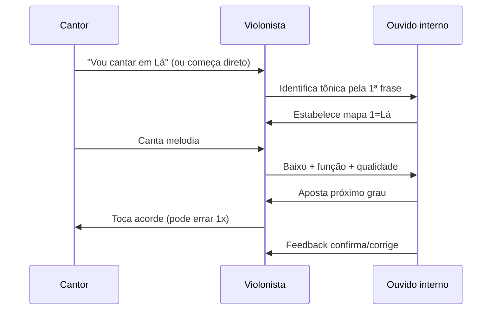

# SYN-06 — Acompanhamento em tempo real: violão, cantor e arranjo instantâneo

**Charter Q5, Q6** | **Evidence**: SRC-004, SRC-076, SRC-077, SRC-061

---

## 1. O fluxo completo ao vivo



**Erros são normais** nos primeiros 2–4 compassos. Músico experiente corrige **silenciosamente** no compasso seguinte.

---

## 2. Tom e voz do cantor — como decidir

### 2.1 Cantor declara o tom
Ideal. Violonista converte números mentais → cifras em Lá (ou tom pedido).

### 2.2 Cantor começa sem avisar
1. Ouça 1–2 frases
2. Identifique nota de **repouso melódico** → candidata a 1, 3 ou 5 da escala
3. Teste maior vs. menor (3ª maior ou menor na melodia)
4. Toque I suspeito — cantor reage (afinação facial = acertou)

### 2.3 Escolher tom confortável [SRC-076]
> "Make sure that most of the song's melody is in the comfortable range."

- Mapeie nota mais alta e mais baixa da melodia
- Compare com tessitura do cantor
- Transponha para que **80% da melodia** fique na zona média da voz
- Pratique a música no tom do cantor **antes** do show se possível [SRC-076]

### 2.4 Fórmula prática [SRC-077]
1. Identifique tom original
2. Localize nota mais alta da melodia na escala
3. Escolha novo tom onde essa posição escalar = sua nota confortável máxima
4. Converta acordes por números

---

## 3. Técnicas de voicing no violão

### 3.1 Formas compactas (4 cordas)
Para acompanhar cantor, **não** precisa de 6 cordas sempre:
- Maj7: xx544x
- m7: xx353x  
- 7: x353xx
- m6: xx233x (dispositivo bossa)

### 3.2 Voice leading — mínimo movimento
Mover **menos dedos possível** entre acordes:
```
Cmaj7 (x3545x) → Am7 (x0201x) → Dm7 (xx0211) → G7 (320001)
```
Baixo melódico quando possível (Mi → Ré → Dó → Si).

### 3.3 Ritmo de acompanhamento
- **Balada MPB**: semínimas, arpejos, poucos acordes por compasso
- **Samba**: batida de contratempo, acordes secos
- **Bossa**: antecipação — acorde no "e" antes do tempo

### 3.4 Quando não souber o acorde
- Toque **pedal de tônica** (5ª ou 6ª corda) até identificar
- Use **5ª e 6ª** genéricas (power chord harmônico = neutro)
- **Pare de tocar** 1 compasso > tocar acorde errado alto

---

## 4. Reharmonização básica (opcional, quando seguro)

Só quando domina a progressão original:

| Original | Substituição | Efeito |
|----------|--------------|--------|
| V7 | vii°7 | Mais tensão |
| IV | ii | Mais suave |
| I | Imaj7 | Bossaficação |
| V7 | bII7 (trítono) | Cromatismo |

---

## 5. Comunicação na banda

- **Dedos** (NNS): líder mostra "4" = quarto grau
- **Olhar** no refrão: "mesmo" ou "sobe meio tom"
- **Cifra mínima**: chart numérico 1-6-4-5-1 basta para sideman profissional [SRC-031]

---

## 6. Checklist pré-música desconhecida (30 segundos)

- [ ] Gênero provável? (pop / samba / bossa / balada)
- [ ] Tom maior ou menor?
- [ ] Cantor definiu tom?
- [ ] Formas de maj7/m7/7 prontas no braço?
- [ ] Progressão default do gênero na cabeça?

---

## Referenced evidence IDs

SRC-004, SRC-061, SRC-076, SRC-077

## URLs

- https://guitarwiz.app/articles/recognize-chord-progressions-by-ear/
- https://www.mascaripiano.com/post/how-to-accompany-singers-five-tips-for-musical-success
- https://goodguitarist.com/make-songs-easier-to-sing-on-guitar/
