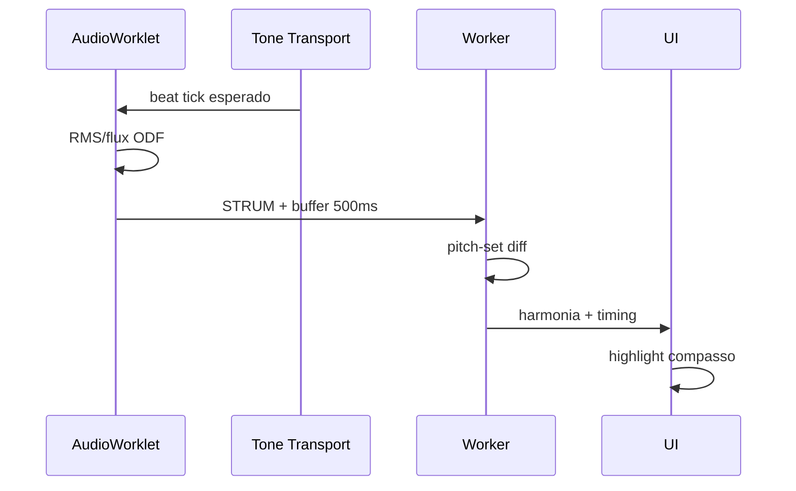

# 03 — Ritmo, Onset e Metrônomo

> Modo: **quando** o aluno tocou vs **quando** devia tocar — batida, strum, mudança de acorde.

---

## Problema

O metrônomo define **timestamps esperados**; o microfone fornece **onsets detectados**. A extração é:

```
onset_error_ms = t_detected - t_expected
IOI_error = (t_n - t_{n-1}) - (beat_period)
```

Não é necessário **beat tracking** completo da performance se o **BPM é fixo** na lição (MVP).

---

## Ranqueamento — Detecção de onset / transient

| Rank | Técnica | Algoritmo | Browser | Latência | Violão strum |
|------|---------|-----------|---------|----------|--------------|
| **1** | **RMS + adaptive threshold** | Energy flux | JS Worklet | <1 ms | ✅ excelente strum |
| **2** | **Essentia OnsetDetection** | hfc, flux, complex, rms | WASM Worklet | ~2–5 ms/frame | ✅ |
| **3** | **Essentia SuperFluxExtractor** | combinado | WASM | batch melhor | ✅✅ preciso |
| **4** | **aubiojs Onset** | aubio default | WASM | ~3 ms | ✅ |
| **5** | **madmom RNNOnset** | deep learning | Python/server | — | ❌ não browser RT |
| **6** | **Spectral flux** custom | STFT diff | JS | ~5 ms | ✅ |

**MVP:** RMS/flux no Worklet; SuperFlux offline para calibrar thresholds.

---

## Essentia.js — padrão real-time

**Paper:** Correya et al., ISMIR 2020 — Essentia.js WASM + Web Audio

**Tutorial:** [Real-time analysis](https://mtg.github.io/essentia.js/docs/api/tutorial-2.%20Real-time%20analysis.html)

### OnsetDetection (por frame)

Métodos (`method`):
- `hfc` — High Frequency Content (percusivo)
- `flux` — spectral flux (**bom para strum**)
- `complex` — magnitude + phase (notas tonais)
- `rms` — energia global (**mais simples**)

**Post-process obrigatório** (issue #36 MTG):

```javascript
// Padrão comunidade Essentia.js
const alpha = 1 - sensitivity;
let lastOnset = false;
const tmpOnset = odf > threshold;
const onset = !lastOnset && tmpOnset;  // rising edge
lastOnset = tmpOnset;
```

**Limitação:** algoritmo `Onsets` (agrupamento) **não exposto** completo em JS — implementar peak-picking manual ou WASM custom wrapper.

### SuperFlux (batch calibration)

```javascript
let bt = essentia.SuperFluxExtractor(audioVector);
console.log(bt.onsets); // segundos — usar para calibrar threshold live
```

---

## Tone.js — relógio de referência

```javascript
import * as Tone from 'tone';

await Tone.start();
Tone.Transport.bpm.value = lesson.bpm;

// Compasso 3, beat 1 = t = 2 * (60/bpm) * 4 beats ... 
const beatDuration = 60 / lesson.bpm;
const expectedTime = Tone.now() + (bar - 1) * lesson.beatsPerBar * beatDuration
                           + (beat - 1) * beatDuration;

// Após onset detectado:
const errorMs = (detectedTime - expectedTime) * 1000;
```

**Sincronização:** iniciar Transport no “3, 4, já” do count-in; guardar `transportStartTime` para mapear onset absoluto → compasso.

---

## IOI e regularidade rítmica

| Métrica | Fórmula | UI |
|---------|---------|-----|
| **Onset error** | `(t_det - t_exp) × 1000` ms | “80 ms adiantado” |
| **IOI** | `t_n - t_{n-1}` | gráfico estabilidade |
| **IOI error** | `IOI - beatPeriod` | “batida irregular” |
| **Miss** | sem onset em janela ±150 ms | “perdeu o compasso” |

Janela de match: **±150 ms** iniciante, **±80 ms** intermediário (alinhar mir_eval onset ±50 ms como referência académica).

---

## Score following simplificado (progressão de acordes)

Inspirado em **CrescendAI** (DTW onset+pitch vs MIDI) — simplificado para violão:

```
Referência: [(bar:1, beat:1, chord:Am), (bar:1, beat:3, chord:G), ...]
Loop:
  se onset detectado na janela do beat esperado:
    avaliar acorde (cap. 02)
    se acorde OK → avançar ponteiro beat
    se acorde wrong → feedback harmónico
  se janela passou sem onset:
    feedback "perdeu entrada"
```

**DTW completo:** só necessário se aluno **rubato** livre; MVP com BPM fixo **não precisa DTW**.

---

## Integração onset → acorde (handshake)



---

## aubiojs — alternativa WASM compacta

- npm: `aubiojs@0.2.1` (~417 KB)
- Classes: `Pitch`, `Tempo`, `Onset` (fork code4fukui documenta Onset)
- Demo: [qiuxiang.github.io/aubiojs](https://qiuxiang.github.io/aubiojs/)

```javascript
import aubio from 'aubiojs';
const { Onset } = await aubio();
const onset = new Onset('default', bufSize, hopSize, sampleRate);
const isOnset = onset.do(audioFrame);
```

---

## Stack recomendado — Modo ritmo

| Camada | Tech |
|--------|------|
| Referência temporal | Tone.js Transport |
| Onset live | RMS flux Worklet (Essentia opcional) |
| Calibração | SuperFlux offline na lição |
| Match | janela ±150 ms + onset_error |
| + harmonia | trigger Worker cap. 02 |

Próximo: [04 — Arquitetura browser](./04-arquitetura-browser-web-audio.md)
