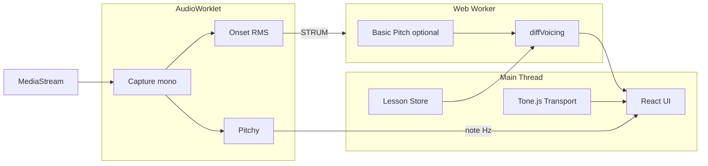

# 04 — Arquitetura Browser e Web Audio

> Objetivo: **< 50 ms** percebidos no Modo nota; **< 300 ms** aceitável pós-strum no Modo acorde.

---

## Por que três threads

| Thread | Responsabilidade | Tecnologia |
|--------|------------------|------------|
| **Main** | UI, Tone.js, lição JSON | React/Vanilla |
| **AudioWorklet** | Captura, pitch mono, onset RMS | pitchy, Essentia WASM |
| **Web Worker** | Basic Pitch, CREPE poly, diff pesado | TF.js |

**Regra:** nunca TF.js no AudioWorklet (sem DOM, load model problemático).

---

## AudioWorklet vs ScriptProcessor vs Worker

| API | Latência | Status | Uso |
|-----|----------|--------|-----|
| **AudioWorklet** | **Menor** (~128 samples quantum) | Standard | ✅ Hot path |
| ScriptProcessorNode | Alta + jitter | **Deprecated** | ❌ |
| Web Worker | N/A (sem áudio direto) | Standard | ML pós-evento |
| SharedArrayBuffer ring | Mínima | Requer COOP/COEP | Avançado |

**Referência:** [Essentia.js tutorial RT](https://mtg.github.io/essentia.js/docs/api/tutorial-2.%20Real-time%20analysis.html), [MusicalBoard pitch blog 2026](https://www.musicalboard.com/blog/2026-05-05-pitch-detection/)

---

## Parâmetros de buffer (44,1 kHz)

| bufferSize | Latência @44.1k | Uso |
|------------|-----------------|-----|
| 128 | 2,9 ms | Quantum nativo |
| 512 | 11,6 ms | Pitch estável |
| **2048** | **46,4 ms** | **Pitchy/YIN default** |
| 4096 | 92,9 ms | Mais estável, menos responsivo |

**Hop = bufferSize** no Worklet (1 callback = 1 análise).

**CREPE:** internamente 16 kHz, 1024 samples — resample no Worker antes de inferir.

---

## Carregar Essentia.js no Worklet

Problema: `import` ES modules limitado em Worklets (Chrome OK, Firefox precisa trick).

**Padrão MTG:** `URLFromFiles()` concatena essentia.js + processor na main thread → `addModule(blobURL)`.

```javascript
// Main thread — padrão essentia.js examples/ringbuf
await audioContext.audioWorklet.addModule(processedBlobUrl);
const node = new AudioWorkletNode(audioContext, 'essentia-processor');
node.port.onmessage = (e) => {
  if (e.data.onset) scheduleChordAnalysis(e.data.buffer);
};
```

---

## Padrão PitchNode (Toptal WASM tutorial)

1. `fetch('pitch.wasm')` na main
2. Instanciar módulo WASM
3. Passar bytes para Worklet via `processorOptions`
4. Worklet chama WASM `detect_pitch(buffer)` → `postMessage({ hz, clarity })`

**Repos de referência:**
- [badlogic/tuner](https://github.com/badlogic/tuner) — YIN pure TS
- [Chris-Zbrojkiewicz/guitar-tuner](https://github.com/Chris-Zbrojkiewicz/guitar-tuner) — Pitchy

---

## TensorFlow.js — backends

| Backend | Onde | Notas |
|---------|------|-------|
| **wasm** | Mobile default | CREPE/Basic Pitch |
| webgl | Desktop | Mais rápido GPU |
| cpu | Fallback | Lento |

```javascript
import * as tf from '@tensorflow/tfjs';
await tf.setBackend('wasm');
await tf.ready();
```

**Playground pitch-detection-analysis:** expõe `TFJSModelManager`, `tf.tidy()` para evitar leak.

---

## basic-pitch-ts no Worker

```javascript
// worker.ts
import { BasicPitch, noteFramesToTime, outputToNotesPoly } from '@spotify/basic-pitch';

self.onmessage = async ({ data: { samples, sampleRate } }) => {
  const audioBuffer = createBuffer(samples, sampleRate);
  const frames = [], onsets = [], contours = [];
  await basicPitch.evaluateModel(audioBuffer, (f,o,c) => { ... });
  const notes = noteFramesToTime(outputToNotesPoly(frames, onsets, 0.3, 0.3, 5));
  self.postMessage({ notes });
};
```

Transferir `Float32Array` com **Transferable** para zero-copy:

```javascript
worker.postMessage({ buffer: samples }, [samples.buffer]);
```

---

## Permissões e mobile

| Issue | Mitigação |
|-------|-----------|
| iOS Safari suspend AudioContext | `Tone.start()` no gesto utilizador |
| Sem fones → feedback acústico | UI headphones hint |
| Eco em speakers | Detetar e avisar |
| `getUserMedia` latency | `echoCancellation: false` para timbre violão (*testar*) |

---

## Diagrama de componentes MVP



---

## Projetos OSS para copiar padrões

| Projeto | O que copiar |
|---------|--------------|
| [badlogic/tuner](https://github.com/badlogic/tuner) | YIN Worklet + smoothing |
| [guitar-tuner (Pitchy)](https://github.com/Chris-Zbrojkiewicz/guitar-tuner) | UI agulha + Worklet |
| [playground pitch-detection-analysis](https://www.npmjs.com/package/@playground-sessions/pitch-detection-analysis) | CREPE poly + Worklet option |
| [essentia.js examples](https://github.com/MTG/essentia.js) | WASM no Worklet, ring buffer |
| [greblus/solitito](https://github.com/greblus/solitito) | Pipeline acorde CPU (Rust) |

Próximo: [05 — Produtos e patentes](./05-produtos-patentes-pipelines.md)
