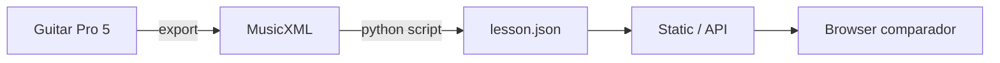

# 06 — Referência de Lições e Voicing (lado simbólico)

> Tecnologias para **armazenar o esperado** — independente do microfone.

---

## Ranqueamento — Formatos de referência

| Rank | Formato | Corda/traste | Acorde símbolo | Ritmo | Parser | Licença lição |
|------|---------|--------------|----------------|-------|--------|---------------|
| **1** | **JSON voicing interno** | ✅ explícito | ✅ | ✅ | custom | — |
| **2** | **MusicXML 4.0** + `<frame>` | ✅ | ✅ `<harmony>` | ✅ | music21 | varies |
| **3** | **Guitar Pro 5** | ✅ nativo | ✅ | ✅ | PyGuitarPro | varies |
| **4** | **GuitarSet JAMS** | ✅ research | ✅ | ✅ | mirdata | Zenodo |
| **5** | **AnimeTAB MusicXML** | ✅ | parcial | ✅ | TABprocessor | CC |
| **6** | Cifra `.txt` | ❌ | ✅ | ⚠️ | regex | varies |

**MVP:** author em **GP5/MusicXML** → script converte → **JSON voicing** runtime.

---

## Schema JSON recomendado (runtime)

```json
{
  "id": "lesson-am-open-01",
  "mode": "chord",
  "tuning": [40, 45, 50, 55, 59, 64],
  "bpm": 80,
  "beatsPerBar": 4,
  "steps": [
    {
      "bar": 1,
      "beat": 1,
      "chordSymbol": "Am",
      "voicing": [
        { "string": 5, "fret": 0, "midi": 45, "finger": 0, "optional": false },
        { "string": 4, "fret": 2, "midi": 52, "finger": 2, "optional": false },
        { "string": 3, "fret": 2, "midi": 57, "finger": 3, "optional": false },
        { "string": 2, "fret": 1, "midi": 60, "finger": 1, "optional": false }
      ],
      "mutedStrings": [6],
      "toleranceCents": 35
    }
  ]
}
```

---

## MusicXML — `<frame>` + `<harmony>`

```python
from music21 import converter, harmony

score = converter.parse('lesson.mxl')
for el in score.recurse():
    if isinstance(el, harmony.ChordSymbol):
        print(el.figure, el.offset)
    if hasattr(el, 'fretboard'):  # ChordWithFretBoard
        fb = el.fretboard
        # fb.fretStrings, fb.firstFret, etc.
```

**Export GP7 → MusicXML** preserva diagramas — pipeline author preferido.

---

## PyGuitarPro — GP5

```python
import pyguitarpro as gp

song = gp.parse('lesson.gp5')
track = song.tracks[0]
for measure in track.measures:
    for voice in measure.voices:
        for beat in voice.beats:
            if beat.effect.chord:
                chord = beat.effect.chord
                # chord.strings → (fret, finger) por corda
```

---

## GuitarSet — ground truth pesquisa

- **360 excertos**, anotação **por corda** (hexaphonic)
- `leadsheet_chords` vs `inferred_chords`
- Uso: **calibrar** thresholds pitch-set, não runtime

```python
import mirdata
gs = mirdata.initialize('guitarset')
t = gs.track('00_Jazz_1_Solo')
expected_midi = [n.pitch for n in t.notes['A'].to_dataframe()]
```

---

## Heurística pitch → string/fret (evitar no MVP)

Algoritmos existem (AnimeTAB `finger2midi`, GuitarSet papers) mas **ambíguos** com 1 mic:

- Mesmo pitch, múltiplas cordas
- Harmónicos mascaram traste

**Só usar** quando Modo 1 (1 nota) + corda declarada na lição.

---

## Pipeline author → runtime



Próximo: [07 — Stack MVP](./07-stack-mvp-matriz-decisao.md)
