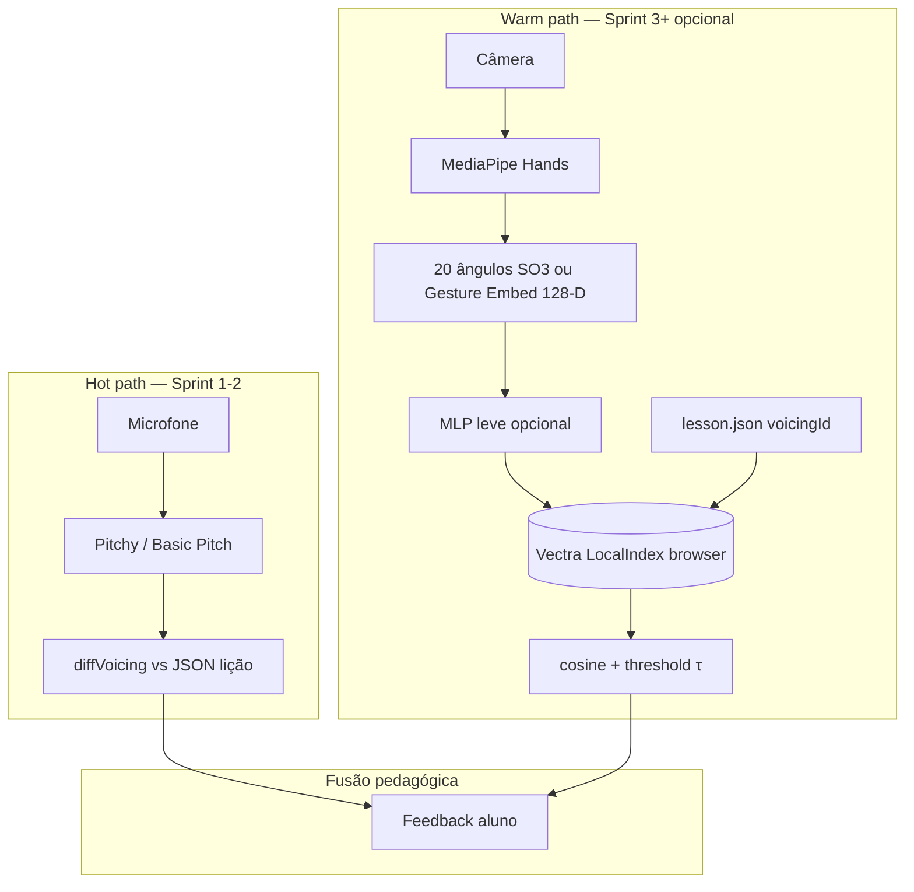

# 08 — Embeddings + Vector DB para Postura de Mão (Acordes Violão)

> Pesquisa aprofundada: comparar voicings via landmarks MediaPipe, metric learning, few-shot e indexação em vector DB (ex. **Vectra** local no browser).
>
> Complementa [06 — Referência e Voicing](./06-referencia-licoes-voicing.md) (lado simbólico) e [02 — Acordes tempo real](./02-acordes-validacao-tempo-real.md) (validação por microfone).

---

## 1. Problema e restrições do domínio

| Desafio | Impacto | Mitigação |
|---------|---------|-----------|
| **Mesma forma, traste diferente** | `F` open vs barre em 1.º traste = landmarks quase iguais | Fretboard awareness (ArUco, detector de braço) ou **lição fixa** com `firstFret` no JSON |
| **Voicing ≠ símbolo** | `Am7` tem dezenas de digitações | ID de índice = `lessonId + voicingId`, não só `Am7` |
| **Mão parcial / oclusão** | MediaPipe zera ou imputa joints | `handedness` + score de presença; rejeitar frame se confiança baixa |
| **Variação de câmera** | Escala, rotação, distância | Ângulos SO(3)-invariantes ou normalização punho + escala |
| **Transições** | Postura estática ≠ movimento entre acordes | DTW em sequências curtas; estado “holding” vs “transition” |

**Conclusão de produto:** visão por landmarks é **complementar** ao MVP por microfone (já ranqueado em [07](./07-stack-mvp-matriz-decisao.md)). Use embeddings visuais para feedback de **dedos/trastes**, não para substituir validação harmónica por pitch.

---

## 2. Representações a partir de MediaPipe Hands

MediaPipe expõe **21 landmarks × (x, y, z)** → vetor **63-D** por mão ([arXiv:2006.10214](https://arxiv.org/abs/2006.10214)).

| Representação | Dim | Invariâncias | Uso |
|---------------|-----|--------------|-----|
| Raw 63-D (normalizado punho + escala) | 63 | Parcial (não rotação 3D forte) | Baseline, CNN-1D |
| **20 ângulos inter-articulares** | 20 | **SO(3), translação, escala isotrópica** (provável) | Protótipos estáveis, few-shot |
| raw_angle (concat) | 83 | Mista | Datasets grandes (ASL) |
| Sequência T×63 ou T×20 | — | Temporal | LSTM, DTW, Siamese |

Referência central: **Geometry-Aware Metric Learning** — descritor de 20 ângulos + encoder MLP (~105k params) → embedding 128-D + **Prototypical Networks** ([arXiv:2603.09213](https://arxiv.org/html/2603.09213), código: [github.com/fjkrch/sign_metric_learning](https://github.com/fjkrch/sign_metric_learning)).

---

## 3. Prototypical Networks, Siamese e contrastive learning

### 3.1 Prototypical Networks (ProtoNet)

- **Ideia:** protótipo da classe = média dos embeddings do support set; query classifica por distância ao protótipo mais próximo ([arXiv:1703.05175](https://arxiv.org/abs/1703.05175), [NeurIPS 2017](https://proceedings.neurips.cc/paper/2017/hash/cb8da6767461f2812ae4290eac7cbc42-Abstract.html)).
- **Treino:** episódios N-way K-shot que imitam inferência.
- **Métrica:** no paper original, **distância euclidiana** no espaço aprendido supera **cosine** para ProtoNet; em busca ANN com vetores L2-normalizados, cosine ≈ euclidiana no ranking.
- **Ligação com vector DB:** indexar protótipos (ou todas as refs) = **mesma matemática** que ProtoNet na inferência, sem softmax treinado — ver §7.

### 3.2 Siamese + contrastive / triplet

| Abordagem | Loss | Pares | Referência |
|-----------|------|-------|------------|
| **Contrastive** | Aproximar positivos, afastar negativos com margem | (x_i, x_j, y_ij) | Gestos esqueleto SPD+Siamese ~95% DHG-14 ([Academia](https://www.academia.edu/79563823/SPD_Siamese_Neural_Network_for_Skeleton_based_Hand_Gesture_Recognition)) |
| **Triplet** | d(a,p) + margin < d(a,n) | âncora, positivo, negativo | Comparativo HAR ([MDPI](https://www.mdpi.com/2079-9292/13/9/1739)) |
| **Siamese LSTM** | Similaridade em sequências | Vídeo → landmarks → fluxo | Reders ~94% few-shot gestos ([GitHub](https://github.com/Lyman-Smoker/Reders-gesture-meeting-control-system)) |

**Quando preferir cada uma no tutor:**

- **ProtoNet / índice de protótipos:** catálogo fechado de voicings da lição (5–20 refs) — **MVP**.
- **Triplet/contrastive:** treinar encoder **uma vez** (meta-dataset de posturas) e depois só indexar — Sprint 2+.
- **Siamese temporal:** mudanças de acorde (gesto dinâmico), não pose estática.

### 3.3 Geometry-Aware (ângulos SO(3))

Resultados reportados (5-way 5-shot, landmarks estáticos):

- Ganhos de até **+25 pp** vs coordenadas normalizadas (árabe LIBRAS).
- **Input-space nearest prototype** (sem MLP) já competitivo em ASL — landmarks/ângulos são discriminativos; o encoder comprime ruído.
- Recomendação transferível ao violão: **ângulos 20-D** como feature de indexação; MLP opcional se houver shift de utilizador/câmera.

---

## 4. CNN-1D em vetores 63-D (landmarks estáticos)

Estudo comparativo em **7 acordes**, landmarks MediaPipe, **5-fold CV** ([JAIC 2024](https://jurnal.polibatam.ac.id/index.php/JAIC/article/view/11339)):

| Modelo | Accuracy média | Notas |
|--------|----------------|-------|
| **CNN-1D** | **97,61%** | Mais rápido; robusto a ruído/occlusão simulada |
| ResNet-1D | inferior | Overkill para baixa dimensão |
| Inception-1D | inferior | Idem |

**Lição:** para **postura estática** e classes fixas (acordes abertos da lição), CNN-1D/MLP pequeno ≈ suficiente; não é obrigatório vector DB se o conjunto de classes cabe em softmax on-device.

Projetos comunitários (landmarks → classificador): [Visual-Guitar-Chord-Recognition-MediaPipe](https://github.com/sunman91/Visual-Guitar-Ukulele-Chord-Recognition-using-MediaPipe) — limitação explícita: **barre = mesmo shape** sem traste.

---

## 5. Few-shot: quantos exemplos por acorde/voicing?

Síntese de literatura (gestos mão / landmarks, não violão isolado):

| Regime | Exemplos/classe | Accuracy típica | Fonte |
|--------|-----------------|-----------------|-------|
| **1-shot** | 1 | ~70–90% (5-way) | Jester FSL [arXiv:2212.08363](https://arxiv.org/abs/2212.08363); gestos contínuos ~89% 5-way 1-shot [Semantic Scholar PDF](https://pdfs.semanticscholar.org/24bc/04659c47b80fd4e4fcfeac011f6b3f9495e8.pdf) |
| **3-shot** | 3 | +2–4 pp vs 1-shot | Geometry-aware Tab. ablation [arXiv:2603.09213](https://arxiv.org/html/2603.09213) |
| **5-shot** | 5 | Sweet spot produto | ProtoNet paper; FS-HGR 5-way 5-shot ~86% [TNSRE](https://www.embs.org/tnsre/articles/fs-hgr-few-shot-learning-for-hand-gesture-recognition-via-electromyography/); MediaPipe Model Maker (poucas imagens/gesto) [arXiv:2309.10858](https://arxiv.org/html/2309.10858) |
| **10–20-shot** | 10–20 | Ganhos marginais após 5 | EMG prototype [Nature Sci Reports 2026](https://www.nature.com/articles/s41598-026-40352-6) |

**Recomendação music-tutor (por `voicingId`):**

| Cenário | Refs estáticas | Refs transição |
|---------|----------------|----------------|
| Demo / autor interno | **3–5** poses estáveis | 2 sequências (~0,5–1 s) |
| Lição publicada | **8–15** (ângulos de câmera, mão esquerda/direita) | 3–5 templates DTW |
| Personalização aluno | **+3–5** capturas “minha mão” | opcional |

Indexar **múltiplos vetores por voicing** (não só média) + agregação por **máximo cosine** ou **voto k-NN** (k=3–5) reduz variância vs um único protótipo.

---

## 6. Modelos visuais: CLIP, MediaPipe embedder, MobileNet vs landmarks

| Modelo | Entrada | Dim | Adequação acorde violão |
|--------|---------|-----|-------------------------|
| **Landmarks + ângulos + MLP** | 20–63 numérico | 64–128 | **Melhor custo/benefício**; interpretável |
| **MediaPipe Gesture Embedder** | landmarks → rede | **128** | Pré-treinado gestos; fine-tune com Model Maker ([arXiv:2309.10858](https://arxiv.org/html/2309.10858), [Gesture Recognizer](https://github.com/google-ai-edge/mediapipe/blob/master/mediapipe/model_maker/python/vision/gesture_recognizer/gesture_recognizer.py)) |
| **MobileNet Image Embedder** | crop RGB 224² | 256+ | Precisa **crop mão/braço**; sensível a fundo ([Google Image Embedder](https://developers.google.com/edge/mediapipe/solutions/vision/image_embedder)) |
| **CLIP / ViT** | frame completo | 512+ | Semântica visual + texto; **overkill** para “dedo 2 no traste 2”; útil se houver **descrição textual** do voicing ([CLIP-MG](https://arxiv.org/html/2506.16385), [SkeletonCLIP](https://arxiv.org/pdf/2502.03459)) |

**Hierarquia MVP:**

1. Ângulos 20-D ou MediaPipe 128-D gesture embedding  
2. CNN-1D/MLP se classes < 30 e tudo on-device  
3. CLIP apenas para **busca de lições por linguagem natural**, não para comparar dedos

---

## 7. “Treinar classificador” vs “indexar protótipos no vector DB”

| Dimensão | Classificador (softmax / CNN-1D) | Protótipos + Vector DB |
|----------|----------------------------------|-------------------------|
| **Novas classes** | Retreinar última camada / modelo | Inserir vetores (few-shot imediato) |
| **Voicings alternativos** | Uma classe por voicing → explosão de labels | Metadata `voicingId`, `allowedVoicings[]` |
| **Calibração por aluno** | Fine-tune frágil com poucos dados | Média ou k-NN no índice pessoal |
| **Latência browser** | 1 forward pass | k-NN em <500 vetores: sub-ms ([Vectra](https://stevenic.github.io/vectra/)) |
| **Explicabilidade** | Classe + probabilidade | “Distância ao voicing esperado” + vizinho mais próximo |
| **Risco** | Overfit com N pequeno | Confusão entre acordes simétricos (Em vs G shape) |

**Regra:** se o catálogo de uma lição é **< 50 voicings** e cresce por **captura do autor**, use **indexação de protótipos** (equivalente a ProtoNet na inferência). Se o produto precisa de **100+ símbolos** genéricos sem lição, treine classificador (CNN-1D) ou híbrido.

Snell et al. mostram que **nearest prototype no espaço de features** já é forte; o MLP só aprende a métrica ([§2.2 paper](https://arxiv.org/abs/1703.05175)).

---

## 8. Métricas: cosine, thresholds, DTW

### 8.1 Cosine similarity e thresholds

- **Definição:** cos(θ) = (A·B) / (‖A‖‖B‖); em vetores L2-normalizados, cosine = dot product ([Qdrant — Distance metrics](https://qdrant.tech/documentation/concepts/distance/)).
- **Não existe threshold universal:** calibrar no conjunto de validação (GuitarSet pose ou capturas internas).
- **Procedimento de calibração:**
  1. Para cada `voicingId`, embed das refs → distribuição intra-classe (cosine ref–ref).
  2. Negativos: outros voicings da mesma lição.
  3. Threshold τ = percentil 5% intra-classe **ou** (μ_intra − 2σ) vs máximo negativo.
  4. Em Qdrant/Vectra: `score_threshold` filtra falsos positivos ([Qdrant search](https://qdrant.tech/documentation/search/search/)).
- **Rejeição:** se `max(cosine) < τ` → “postura não reconhecida” (UI: reposicionar mão).
- **ProtoNet original:** preferir **euclidiana** no espaço não normalizado; se normalizar embeddings, cosine é coerente.

**Heurística inicial (landmarks ângulo 20-D + L2 norm, a validar):**

| Decisão | Cosine típico (indicativo) |
|---------|----------------------------|
| Match forte | > 0,92 |
| Zona cinzenta | 0,85 – 0,92 |
| Rejeitar | < 0,85 |

### 8.2 DTW para transições

- **Problema:** comparar sequências de poses com durações diferentes (lift-off, slide).
- **DTW:** alinha temporalmente; custo mínimo de warping ([intro DTW](https://rtavenar.github.io/blog/dtw.html)).
- **Prática:** features = vetor de ângulos por frame; **Sakoe-Chiba band** (r≈10–15% do comprimento) para limitar warping; **FastDTW** se T > 60 frames ([IEEE IDTW gestos](https://ieeexplore.ieee.org/document/9779220)).
- **Pipeline tutor:** estado `HOLD` (cosine vs protótipo estático) → `TRANSITION` (DTW vs template gravado autor) → `HOLD` seguinte.
- Referência open-source: [Sign-Language-Recognition-MediaPipe-DTW](https://github.com/gabguerin/Sign-Language-Recognition--MediaPipe-DTW) (ângulos entre conexões da mão).

**Score DTW:** normalizar distância acumulada pelo comprimento; threshold separado do cosine estático.

---

## 9. Quando NÃO usar LLM / text embeddings (Nomic, OpenAI text)

Modelos como **nomic-embed-text** mapeiam **linguagem natural** para espaço semântico ([Nomic docs](https://docs.nomic.ai/atlas/embeddings-and-retrieval/generate-embeddings)), não geometria 3D.

| Tentativa | Por que falha |
|-----------|----------------|
| Serializar 63 floats como string `"x0=0.12,y0=..."` | Tokenização destrói continuidade; números viram símbolos discretos ([LLM Embeddings for Tabular Data](https://arxiv.org/html/2502.11596v1)) |
| nomic em vetores de pose | Semântica de **palavras**, não distância euclidiana entre articulações |
| RAG com descrição “Am corda 2 traste 2” | Útil para **pedagogia/texto**, não para comparar frame ao frame |

**Usar Nomic/CLIP texto apenas para:** buscar lições, glossário, feedback em linguagem natural — **não** no hot path de comparação de landmarks.

---

## 10. Arquitetura recomendada — MVP music-tutor



### 10.1 Decisões de stack

| Camada | Escolha MVP | Alternativa futura |
|--------|-------------|-------------------|
| Detecção mão | MediaPipe Hands WASM | — |
| Feature | **20 ângulos** (portável do paper) | 63-D + CNN-1D on-device |
| Embedding | MLP 20→128 (treino opcional) | MediaPipe Gesture Embedder 128-D |
| Índice | **Vectra `LocalIndex`** ([docs](https://stevenic.github.io/vectra/getting-started.html)) | Qdrant edge / pgvector servidor |
| Métrica | Cosine + L2 norm | Euclidiana se não normalizar |
| Transição | DTW em ângulos (templates autor) | HMM estados |
| Harmonia | **JSON + microfone** (não vector DB) | — |

### 10.2 Metadados por vetor (Vectra / qualquer VDB)

```json
{
  "lessonId": "lesson-am-open-01",
  "voicingId": "am-open-v1",
  "chordSymbol": "Am",
  "firstFret": 0,
  "captureRole": "reference | user_calibration",
  "hand": "left | right",
  "cameraHint": "front | side"
}
```

---

## 11. Pipeline de indexação (captura → embed → Vectra)

### Fase A — Autor (offline, Node ou script)

1. **Carregar** `lesson.json` com voicings explícitos (corda/traste/dedo).
2. **Gravar** 8–15 frames estáveis por `voicingId` (webcam, fundo neutro, mão na posição da lição).
3. **Extrair** landmarks MediaPipe por frame.
4. **Converter** para 20 ângulos (mesma topologia do paper) ou normalizar 63-D.
5. **Embed:** `v = normalize(MLP(angles))` ou MediaPipe gesture embedder.
6. **Upsert** em `LocalIndex` com metadata acima.
7. **Calcular** protótipo opcional `μ = mean(V_refs)` e guardar como entrada `role: prototype`.

### Fase B — Runtime aluno (browser)

1. MediaPipe em tempo real (≥15 FPS; throttling se CPU alto).
2. Se `handPresence < 0.7` → ignorar frame.
3. Embed frame → `q`.
4. **Query** Vectra: `topK=5`, filtro `{ lessonId, voicingId in allowed }`.
5. **Score:** `cos(q, v_i)`; match se `max > τ` e margem `top1 − top2 > δ` (ex. δ=0,03).
6. Combinar com `diffVoicing` áudio: UI só “dedos OK” se visão OK **e** pitch OK.

### Fase C — Calibração aluno (opcional)

1. “Gravar minha Am” → 3–5 capturas → vetores `captureRole: user_calibration`.
2. Busca: misturar refs globais + refs user (peso 2× nos user no k-NN).

### Snippet conceitual (Vectra LocalIndex)

```typescript
import { LocalIndex } from 'vectra';

const index = new LocalIndex({ folderPath: './indexes/lesson-am-open-01' });

// Inserção (autor)
await index.insertItem({
  id: 'am-open-v1-ref-03',
  vector: embedding128,
  metadata: { lessonId: 'lesson-am-open-01', voicingId: 'am-open-v1', chordSymbol: 'Am' },
});

// Query (aluno)
const results = await index.queryItems(embedding128, 5);
// results[0].score ≈ cosine similarity
```

---

## 12. Matriz de decisão final

| Pergunta | Resposta |
|----------|----------|
| Vector DB no MVP core? | **Não** no Sprint 1–2 (áudio). **Sim** Sprint 3+ para biblioteca de poses |
| Quantos exemplos/voicing? | **8–15** refs; **5** mínimo viável |
| Feature principal? | **20 ângulos SO(3)-invariant** > 63-D raw |
| Classificador ou protótipos? | **Protótipos + k-NN** para lições; CNN-1D se catálogo fixo grande |
| CLIP? | Não no comparador de dedos |
| Nomic? | Só RAG teórico / busca de lições |
| DTW? | **Transições** entre acordes; não para pose estática |
| Fretboard? | Obrigatório se lição não fixa `firstFret` — ver [Computer-Vision-Guitar-Tutor](https://github.com/nathanchiu05/Computer-Vision-Guitar-Tutor), [HackMD fretboard](https://hackmd.io/1B1YNwtLSUOeyzHfWY8yQw) |

---

## 13. Referências (URLs)

### Landmarks, gestos, metric learning

- MediaPipe Hands: https://arxiv.org/abs/2006.10214  
- Geometry-Aware Metric Learning (ângulos SO(3)): https://arxiv.org/html/2603.09213 — PDF: https://arxiv.org/pdf/2603.09213 — código: https://github.com/fjkrch/sign_metric_learning  
- Prototypical Networks: https://arxiv.org/abs/1703.05175  
- Matching Networks: https://arxiv.org/abs/1606.04080  
- Fast Learning Dynamic Hand Gestures (FSL landmarks): https://arxiv.org/abs/2212.08363  
- Custom Hand Gesture (128-D embed): https://arxiv.org/html/2309.10858  
- FS-HGR few-shot: https://www.embs.org/tnsre/articles/fs-hgr-few-shot-learning-for-hand-gesture-recognition-via-electromyography/  
- Siamese skeleton HAR (contrastive/triplet): https://www.mdpi.com/2079-9292/13/9/1739  
- SPD Siamese hand gesture: https://www.academia.edu/79563823/SPD_Siamese_Neural_Network_for_Skeleton_based_Hand_Gesture_Recognition  
- Vision gesture 1 demo: https://arxiv.org/html/2402.08420v2  

### Violão + visão

- CNN-1D 63-D acordes: https://jurnal.polibatam.ac.id/index.php/JAIC/article/view/11339  
- Guitar/Ukulele MediaPipe: https://github.com/sunman91/Visual-Guitar-Ukulele-Chord-Recognition-using-MediaPipe  
- Tutor ArUco + landmarks: https://github.com/nathanchiu05/Computer-Vision-Guitar-Tutor  
- Fretboard + limitações hand-crop: https://hackmd.io/1B1YNwtLSUOeyzHfWY8yQw  

### DTW, CLIP, embeddings visuais

- DTW tutorial: https://rtavenar.github.io/blog/dtw.html  
- MediaPipe + DTW sign: https://github.com/gabguerin/Sign-Language-Recognition--MediaPipe-DTW  
- IDTW gestos IEEE: https://ieeexplore.ieee.org/document/9779220  
- Probabilistic DTW: https://www.maia.ub.es/~sergio/linked/icprdepthdtwgmm.pdf  
- CLIP-MG micro-gesture: https://arxiv.org/html/2506.16385  
- SkeletonCLIP: https://arxiv.org/pdf/2502.03459  
- MediaPipe Image Embedder: https://developers.google.com/edge/mediapipe/solutions/vision/image_embedder  
- MediaPipe Gesture Recognizer (Model Maker): https://github.com/google-ai-edge/mediapipe/tree/master/mediapipe/model_maker/python/vision/gesture_recognizer  

### Vector DB, text embeddings (evitar para pose)

- Vectra (local, cosine): https://stevenic.github.io/vectra/ — https://github.com/Stevenic/vectra  
- Qdrant distance & threshold: https://qdrant.tech/documentation/concepts/distance/  
- k-NN classify com Qdrant: https://docs.dev.voxel51.com/tutorials/qdrant.html  
- Nomic embed text: https://docs.nomic.ai/atlas/embeddings-and-retrieval/generate-embeddings  
- LLM embeddings tabular (limitações): https://arxiv.org/html/2502.11596v1  

### Dados violão (calibração)

- GuitarSet: https://arxiv.org/abs/1809.07809 — https://zenodo.org/record/3371780  

---

*Documento gerado para a série `deep-research-live-guitar`. Próximo passo sugerido: protótipo Vectra + 5 acordes abertos com ângulos 20-D e eval de τ em capturas reais.*
