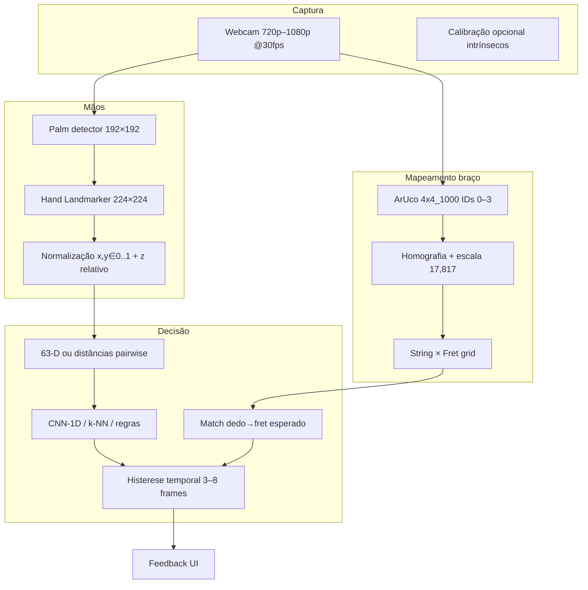

# 09 — Visão Computacional: Câmera + Validação de Acordes

> **Hipótese do usuário:** ligar a câmera e filmar enquanto toca, em vez de (ou além de) gravar áudio — usar o vídeo para identificar o que está errado no acorde.
>
> Complementa [02 — Acordes (áudio)](./02-acordes-validacao-tempo-real.md) e [08 — Embeddings + Vector DB](./08-embeddings-postura-acordes-vector-db.md).

---

## 1. Veredito de viabilidade

| Veredito | **Parcial** — viável como **camada auxiliar de dedilhado/posição de dedos**, não como validador primário de “acorde correto”. |
|----------|--------------------------------------------------------------------------------------------------------------------------------|

### Resposta direta à hipótese

**Sim, é possível** usar câmera para feedback de postura de acorde — há evidência académica e projetos OSS funcionais. **Não substitui** o microfone: visão responde *“os dedos estão onde o diagrama mostra?”*; áudio responde *“soa como o acorde pedido?”*.

### Evidências a favor

| Fonte | Resultado | Condições |
|-------|-----------|-----------|
| **JAIC 2025** (Naya & Tanuwijaya) | **97,61%** accuracy (5-fold CV) com **CNN-1D** sobre **63-D** (21 landmarks × xyz) | 7 acordes (A–G), ~3 784 imagens, mão majoritariamente de um sujeito |
| **Telkom University 2024** | **88,24%** (7 acordes) com **distâncias inter-keypoint** + MediaPipe | Melhor que raw keypoints em neck inclinado |
| **AirStrum** (2024) | **95,92%** em 6 acordes básicos | Ambiente bem iluminado; em campo dinâmico tracking “não satisfatório” |
| **Computer-Vision-Guitar-Tutor** | Feedback de **% acerto** por dedo vs CSV de voicings | Requer **4 marcadores ArUco** no braço |
| **Chordially** (Devpost) | **<50 ms** latência, **30+ FPS**, DB **285 acordes** | Python + OpenCV; smoothing 5 frames (−40% perda de marcadores) |
| **HackMD “Can a Camera Read Your Chord?”** | **88,07%** em 5 acordes (C, D, Em, F, G) | **RF-DETR Nano** no crop do braço — não só mão |

### Evidências contra (limitam o “sim” absoluto)

| Limitação | Impacto medido / relatado |
|-----------|---------------------------|
| **Landmarks sem contexto de traste** | Crop só da mão → **~50%** accuracy em 3 classes (formas idênticas em posições diferentes) — [HackMD](https://hackmd.io/1B1YNwtLSUOeyzHfWY8yQw) |
| **Oclusão de landmarks** | Com **20%** dos 21 pontos zerados, accuracy CNN-1D cai para **~0,30** (teste robustez JAIC) |
| **Ruído Gaussiano nos landmarks** | σ=0,10: degradação forte; σ≤0,05: CNN-1D mantém **>0,80** |
| **Barre / polegar atrás do braço** | Landmarks não codificam **cordas abafadas vs soando** nem pressão real |
| **Generalização** | JAIC: dataset “parece um indivíduo”; std entre folds CNN-1D **0,57%** vs Inception-1D **1,39%** |

### Recomendação para o music-tutor

- **Core (P0):** validação por **áudio** (pitch-set diff) — [02](./02-acordes-validacao-tempo-real.md).
- **Visão (P2, Sprint 3+):** **MediaPipe Hand Landmarker** + **mapeamento de trastes** (ArUco ou detector de braço) + matching geométrico ao voicing da lição.

---

## 2. Pipeline técnico detalhado

### 2.1 Captura

| Parâmetro | Valor recomendado | Notas |
|-----------|-------------------|-------|
| Resolução | **1280×720** mínimo; **1920×1080** preferível | ArUco.js em tutoriais MERN usa buffer 1280×720 |
| FPS | **30 fps** captura; inferência efetiva **15–25 fps** | `requestAnimationFrame` + skip frames se GPU saturada |
| API | `getUserMedia` `{ video: { facingMode, width, height } }` | Espelhar preview para UX; landmarks em coords da imagem |
| Exposição | Evitar HDR agressivo; **300–1000 lux** uniforme | AirStrum degrada fora de “well-lit” |

### 2.2 MediaPipe Hand Landmarker

| Item | Especificação |
|------|---------------|
| Pacote | `@mediapipe/tasks-vision` — `HandLandmarker` |
| Modelo | Palm detection + hand landmarks; crops **192×192** / **224×224** |
| Saída | **21 landmarks** × (x, y, z) + world landmarks |
| Mãos | `numHands: 2` (fretting + possível direita) |
| Modos | `VIDEO` + timestamps monotónicos para tracking |
| Confiança | default **0,5**; subir → mais estável, mais falhas |

**Índices relevantes:** pontas **4, 8, 12, 16, 20** (polegar→mindinho).

### 2.3 Normalização de features

| Abordagem | Vetor | Uso |
|-----------|-------|-----|
| **Raw landmarks** | 63-D (21×3) | JAIC 2025 — melhor com augmentação |
| **Inter-keypoint distances** | ~210 distâncias | Telkom **88,24%** |
| **Relativo ao punho** | `p_i - p_wrist` | Reduz sensibilidade à posição na imagem |
| **Relativo ao braço** | Projetar ponta em **grid (string, fret)** via homografia | **Obrigatório** para barras e capotraste |

### 2.4 Mapeamento fretboard (ArUco)

| Passo | Detalhe |
|-------|---------|
| Marcadores | Dicionário **4×4_1000**, **4 IDs** nos cantos do braço visível |
| Geometria | Distância entre trastes: razão **1/17,817** (escala temperada) |
| Homografia | 4 cantos marcadores → plano 2D do braço |
| Falhas | Oclusão de marcador: Chordially **−40%** perdas com smoothing 5 frames |

Alternativa sem hardware: **detector de braço** (RF-DETR Nano → **88,07%** em 5 acordes no HackMD) — mais frágil que ArUco.

### 2.5 Classificação / matching

| Modo | Entrada | Saída | Quando usar |
|------|---------|-------|-------------|
| **A — Classificação por pose** | 63-D ou distâncias | Label `Am`, `G`, … | Prática silenciosa, conjunto fechado, **sem** barras |
| **B — Matching pedagógico** | (string, fret) por dedo vs voicing esperado | “Dedo 3 deveria estar no traste 2 corda 4” | **Tutor** — alinhado ao music-tutor |
| **C — Pixels + CNN** | Crop braço ou mão | Classe | Máximo accuracy em dataset fechado; custo alto |

Pós-processamento obrigatório:

- **Histerese temporal** (chord-less: estado só muda após **N frames** consecutivos; **150 ms** ≈ 6–7 Hz).
- **Fuzzy NN** para dedos parcialmente oclusos.
- **Votação majoritária** em janela 200–400 ms.

---

## 3. Tabela comparativa de abordagens

| Critério | **Landmarks (MediaPipe)** | **Pixels (CNN 2D)** | **ArUco + fretboard + landmarks** |
|----------|---------------------------|---------------------|-----------------------------------|
| **Accuracy típica** | 88–98% (7 classes, lab) | 83–97% controlado | Qualitativo alto para **posição** |
| **Transposição / traste** | ❌ sem braço | ✅ se braço no frame | ✅ |
| **Cordas mudas / timbre** | ❌ | ❌ | ❌ |
| **Barre chords** | ⚠️ polegar oculto | ⚠️ | ⚠️ melhor com grid |
| **Setup usuário** | Nenhum | Dataset próprio | Imprimir 4 marcadores |
| **Compute browser** | Baixo–médio (WASM) | Alto (TF.js / ONNX) | Baixo + MP |
| **Iluminação** | Média robustez | Baixa | Média |
| **Oclusão** | 20% missing → **~30%** acc | Sombra no braço | Marcador coberto → perda homografia |
| **OSS de referência** | chord-less, JAIC, AirStrum | HackMD RF-DETR | Computer-Vision-Guitar-Tutor |
| **Fit music-tutor** | Auxiliar | Overkill MVP | **Melhor** para “dedo no traste certo” |

---

## 4. Limitações críticas vs feedback por áudio

| Dimensão | Visão (câmera) | Áudio (microfone) |
|----------|----------------|-------------------|
| **O que valida** | Geometria aproximada dos dedos | **Pitch classes** realmente excitadas |
| **Cordas não tocadas / abafadas** | Não distingue | ✅ via ausência de energia |
| **Acorde errado com forma certa** | Falha se só landmarks | ✅ “nota a mais / faltando” |
| **Capotraste / afinação alternativa** | Falha sem recalibração | ⚠️ precisa referência MIDI |
| **Latência MVP** | 80–600 ms (ver §6) | **50–300 ms** |
| **Privacidade** | Vídeo contínuo | Só áudio |
| **Prática silenciosa** | ✅ | ❌ sem som |

---

## 5. Requisitos hardware e câmera

### 5.1 Câmera

| Requisito | Mínimo | Recomendado |
|-----------|--------|-------------|
| Resolução | 720p | **1080p** |
| FPS sensor | 30 | 30–60 |
| Distância | 0,6–1,2 m do braço | 0,8 m |
| Ângulo | **30–45°** lateral; vê **porcas dos dedos** | Evitar top-down puro |
| Montagem | Tripé / clip no headstock | Reduz jitter ArUco |

### 5.2 Iluminação

- Luz frontal suave; evitar contraluz e sombras duras entre cordas.
- AirStrum: degradação fora de ambiente “well-lit”.

### 5.3 Hardware (browser)

| Tier | CPU | GPU / WASM | Experiência |
|------|-----|------------|-------------|
| Mínimo | 4 cores, 8 GB | WASM CPU | 10–15 fps MP |
| Recomendado | 6+ cores | `delegate: "GPU"` WebGL | 20–30 fps MP |
| Ideal | Desktop / Mac M-series | Worker + GPU | 25–30 fps estáveis |

### 5.4 Setup ArUco (opcional P2)

- Imprimir **4 marcadores** `4×4_1000` (~2–4 cm).
- Colar nos **4 cantos** da região visível do braço.
- Calibrar **scale length** uma vez por violão.

---

## 6. Latência estimada no browser

| Etapa | Latência típica | Notas |
|-------|-----------------|-------|
| `getUserMedia` + frame | 0–33 ms | 1 frame buffer |
| **Hand Landmarker** WASM | **15–40 ms** (GPU) / **40–90 ms** (CPU) | Worker recomendado; warm-up +1–3 s |
| Projeção ArUco | **5–15 ms** | OpenCV.js |
| Classificador 63-D | **0,2–2 ms** | CNN-1D tiny |
| Smoothing 5 frames @30fps | **+150–170 ms** | chord-less: 150 ms entre snapshots |

| Cenário | Latência percebida | FPS efetivo |
|---------|-------------------|-------------|
| **A — Local, Worker + GPU, sem smoothing** | **40–80 ms** | 12–25 |
| **B — Local + histerese 5 frames** | **200–350 ms** | 3–5 decisões/s |
| **C — MP no servidor (chord-less)** | **300–600 ms** | ~6–7 classificações/s |

**Comparativo:** pipeline áudio (**50–300 ms** pós-strum) é **mais rápido semanticamente** com hardware modesto.

---

## 7. Projetos OSS e literatura

| Projeto / Referência | URL | Nota |
|----------------------|-----|------|
| Computer-Vision-Guitar-Tutor | https://github.com/nathanchiu05/Computer-Vision-Guitar-Tutor | ArUco + MP + CSV voicings |
| chord-less | https://github.com/AlexTalreja/chord-less | WS + MP; histerese + fuzzy |
| AirStrum | https://rria.ici.ro/documents/1235/art._10_Beulah_Panda_Nair.pdf | 95,92% lab |
| Visual-Guitar-Ukulele | https://github.com/sunman91/Visual-Guitar-Ukulele-Chord-Recognition-using-MediaPipe | Não considera traste |
| JAIC 2025 CNN-1D | https://jurnal.polibatam.ac.id/index.php/JAIC/article/view/11339 | 97,61% |
| HackMD fretboard | https://hackmd.io/1B1YNwtLSUOeyzHfWY8yQw | 88,07%; crop mão ~50% |
| MediaPipe Hands | https://arxiv.org/abs/2006.10214 | 21 landmarks |
| Hand Landmarker Web | https://ai.google.dev/edge/mediapipe/solutions/vision/hand_landmarker/web_js | `@mediapipe/tasks-vision` |
| Chordially | https://devpost.com/software/ai-music-tutor | ArUco, <50 ms, 285 acordes |

---

## 8. Matriz de decisão (resumo)

| Objetivo | Abordagem | Prioridade |
|----------|-----------|------------|
| MVP “acertou o acorde?” | Áudio pitch-set | **P0** |
| Feedback “dedo X no traste Y” | ArUco + MP + match voicing | **P2** |
| Modo silencioso / sala de aula | Landmarks + CNN-1D | **P3** |
| Identificar acorde livre sem lição | Braço inteiro + CNN 2D | **P4** |

---

## 9. Riscos de produto

1. **Voicing vs símbolo** — `Am7` ≠ forma única (GuitarSet: instructed vs performed).
2. **Mão direita / palhetada** — fora do escopo landmark.
3. **Privacidade (LGPD)** — streaming contínuo de vídeo vs só áudio.
4. **Marcadores ArUco** — fricção de onboarding; RF-DETR exige dataset próprio.

---

*Próximo: [08 — Embeddings + Vector DB](./08-embeddings-postura-acordes-vector-db.md) · [10 — Integração local-embedding](./10-integracao-local-embedding-pose.md)*
