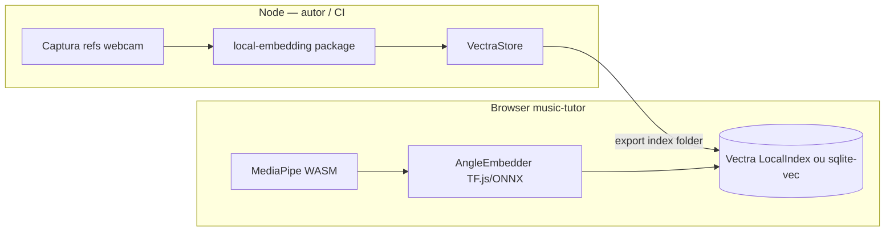

# 10 — Integração com `local-embedding` (Pose + Vector DB)

> Ponte entre o monorepo [`local-embedding`](../../../local-embedding/) e o **music-tutor** para indexar protótipos de postura e comparar frames da mão do aluno.
>
> Complementa [08 — Embeddings + Vector DB](./08-embeddings-postura-acordes-vector-db.md) e [09 — Visão computacional](./09-visao-computacional-acordes-camera.md).

---

## 1. O que o pacote `local-embedding` faz hoje

Monorepo `@ono-sendae/local-embedding`: **embedding local via llama.cpp (GGUF Nomic)** + **índice vetorial Vectra** + **busca híbrida opcional (vetorial + BM25 + RRF)**.

### Fluxo principal (`LocalEmbeddingClient`)

| API | Comportamento |
|-----|----------------|
| `createClient(config, deps?)` | Factory; `deps` permite injetar `embedder` e `store` |
| `index(chunks, options?)` | `embedder.embed(texts, { role: "document" })` → `store.upsert(collection, items)` |
| `indexFile(chunks, options?)` | `index` com `replacePath: true` |
| `search(query, options?)` | Embed query → `store.search` → `SearchResultDetail` com `timing` |
| `warmupModel()` | Carrega GGUF; retorna `{ dimension }` |
| `getStats()` | `chunkCount`, `collections`, disco, `embeddingDimension`, `runtime` |
| `deleteFile(path, collection?)` | `VectraStore.deleteByMetadataPath` |
| `clearIndex()` / `dispose()` | Limpa índice / libera modelo |

Config (`LocalEmbeddingConfig`): `modelPath`, `indexPath`, `profile?: "text" | "code"`.

### Embedder Nomic (`LlamaCppEmbedder`)

- Implementa `EmbeddingProvider`: `embed(texts, options?)`, `dimension`, `modelLoaded`, `dispose()`.
- Carrega GGUF com `node-llama-cpp` → `getEmbeddingFor`.
- Prefixos assimétricos: `search_query:` / `search_document:` (text) ou prefixos HF (code).
- Saída: **L2-normalize**; dimensão tipicamente **768** (Nomic text).

### Store (`VectraStore`)

```typescript
// packages/local-embedding/src/store/vectra.ts
await index.upsertItem({ id, vector, metadata });
const results = await index.queryItems(vector, query, topK, vectraFilter, false);
```

- Campos filtráveis (`INDEXED_META`): `collection`, `path`, `language`, `start_line`, `end_line`, `chunking`, `symbol`, `node_type`, `matchType`.
- Híbrido: BM25 em memória (`rankBm25`, cap **8000**) + fusão `reciprocalRankFusion` (`RRF_K = 60`).

### Roadmap v1

Entregue: Nomic code, coleções, BM25+RRF, chunking estrutural.  
Planejado: **LanceDB se índice > ~50k chunks**; reranker; CLI.

---

## 2. O que REUTILIZAR no music-tutor

| Camada | Reutilizar? | Detalhe |
|--------|-------------|---------|
| `VectraStore` + interface `VectorStore` | **Sim** | `upsert`, `search`, `deleteByMetadataPath`, `countByCollection` |
| Padrão de **coleções** | **Sim** | `metadata.collection`: `poses`, `voicings`, `reference` |
| **Filtros metadata** | **Sim** | `SearchOptions.filter` → `$eq` por campo indexado |
| `SearchResultDetail` + `timing` | **Sim** | Observabilidade embedMs / searchMs |
| Injeção de dependências | **Sim** | `createClient(config, { embedder, store })` |
| `LocalEmbeddingClient` + Nomic + BM25 | **Só RAG texto** | Documentação, cifras, lições em linguagem natural |
| `DualEmbeddingClient`, chunking código | **Não** | Escopo VS Code / código |

### Extensão obrigatória: `INDEXED_META`

Para filtros eficientes no Vectra, adicionar campos de acorde/postura ao array em `vectra.ts`:

```typescript
const INDEXED_META = [
  // ... existentes
  "chord_id",
  "voicing_id",
  "fret",
  "string",
  "capture_session",
  "quality_score",
  "hand",
  "lesson_id",
] as const;
```

Bump em `VECTRA_INDEX_SCHEMA_VERSION` ao alterar schema.

---

## 3. O que NÃO serve (Nomic para landmarks 63-D)

| Tentativa | Por que falha |
|-----------|---------------|
| `embed(["x0=0.12,y0=0.34,..."])` | Tokenização destrói continuidade numérica |
| Nomic 768-D para pose 63-D | **Modalidades diferentes**; dimensões incompatíveis no mesmo índice |
| Prefixos `search_query:` em ângulos | Modelo treinado em linguagem, não geometria 3D |
| `hybridSearch: true` em poses | BM25 em `metadata.text` é ruído sem texto discriminativo |

**Papel correto do Nomic no music-tutor:** RAG de documentação (GP5, MusicXML, glossário) — **não** no hot path de comparação de landmarks.

---

## 4. Proposta: `VectorIndexClient` com embedder plugável

### Interface recomendada

```typescript
interface VectorEmbedder {
  readonly dimension: number;
  embedBatch(
    inputs: number[][],
    opts?: { role?: "query" | "gallery" }
  ): Promise<number[][]>;
  dispose(): Promise<void>;
}

class VectorIndexClient {
  constructor(
    private config: { indexPath: string },
    private embedder: VectorEmbedder,
    private store: VectorStore = new VectraStore(config.indexPath),
  ) {}

  /** Vetores já calculados — sem passar por Nomic */
  async indexVectors(items: IndexItem[], options?: IndexOptions): Promise<void>;

  async searchByVector(vector: number[], options?: SearchOptions): Promise<SearchResultDetail>;

  async searchByPose(landmarks63: number[], options?: SearchOptions): Promise<SearchResultDetail>;
}
```

### Implementações de `VectorEmbedder`

| Implementação | Entrada | Notas |
|---------------|---------|-------|
| `PassthroughEmbedder` | 63-D L2-normalizado | k-NN direto; MVP zero treino |
| `AngleEmbedder` | 20 ângulos SO(3) → 128-D | Portável do paper geometry-aware |
| `LandmarkMlpEmbedder` | 63 → 64/128 | Treino offline; export ONNX |
| `OnnxPoseEmbedder` | tensor `[1,63]` | `onnxruntime-web` no browser |
| `MediaPipeGestureEmbedder` | landmarks → 128-D | Model Maker / Gesture Recognizer |

### Migração mínima

1. Extrair `indexVectors` de `client.ts` (hoje sempre `embedder.embed(texts)`).
2. Generalizar `EmbeddingProvider` → `TextEmbeddingProvider` + `VectorEmbeddingProvider`.
3. `hybridSearch: false` por default em coleções `poses`.
4. Testes com `MockEmbeddingProvider(dimension = 63)` (já existe no pacote).

---

## 5. Schema metadata (acordes / voicings)

Alinhado a `Record<string, string | number | boolean>` do `contract.ts`:

| Campo | Tipo | Uso |
|-------|------|-----|
| `collection` | string | `"poses"` / `"voicings"` |
| `lesson_id` | string | ID da lição |
| `chord_id` | string | `Am`, `Cmaj7` (símbolo normalizado) |
| `voicing_id` | string | `am-open-v1`, hash do diagrama |
| `fret` | number | traste base ou por dedo |
| `string` | number | 1–6 (E grave → E agudo) |
| `capture_session` | string | UUID da sessão de calibração |
| `quality_score` | number | 0–1 (confiança MediaPipe) |
| `hand` | string | `left` / `right` |
| `capture_role` | string | `reference` / `user_calibration` |
| `embedding_model_version` | string | `angle-mlp-v1` |
| `text` | string | opcional: `"Am open voicing"` para debug |

**ID estável:** `{voicing_id}:{capture_session}:{frame_idx}`.

**Filtro típico:**

```typescript
await store.search("poses", queryVector, {
  topK: 5,
  filter: { lesson_id: "lesson-am-01", voicing_id: "am-open-v1" },
  hybridSearch: false,
  minScore: 0.85,
});
```

Nota: `toVectraFilter` só suporta `$eq`; ranges em `quality_score` → pós-filtro em memória (aceitável para <5k itens).

---

## 6. Vectra vs LanceDB vs sqlite-vec (500–5000 protótipos)

Escala: **500–5000 vetores × 63–128-D** — todos **pequenos**; gargalo é captura/embed, não ANN.

| Critério | **Vectra** | **LanceDB** | **sqlite-vec** |
|----------|------------|-------------|----------------|
| Integração atual | **Já no pacote** | Roadmap v1 (>50k) | Zero no repo |
| 5k × 128 floats | ~2,5 MB + metadata; brute-force <10 ms | Overkill | SQL + `vec_distance_cosine` |
| Filtros | `$eq` metadata indexada | SQL rico | `WHERE chord_id = ?` |
| Browser | Node-first; Vectra em Worker possível | Bindings limitados | **sql.js** + extensão — viável web |
| Híbrido texto | BM25 custom | FTS nativo | FTS5 + vetor |

**Recomendação MVP:**

1. **Vectra** — reutilizar `VectraStore`; coerente com `local-embedding`.
2. **sqlite-vec** — se índice precisar viver **100% no browser** (IndexedDB).
3. **LanceDB** — só se escala >50k templates multimodais (áudio+pose+tab).

---

## 7. Pseudocódigo: index + search de postura

```typescript
import { VectraStore } from "@ono-sendae/local-embedding";
import type { IndexItem } from "@ono-sendae/local-embedding";

const COLLECTION_POSES = "poses";

class AngleEmbedder implements VectorEmbedder {
  readonly dimension = 128;
  async embedBatch(angles: number[][]): Promise<number[][]> {
    return angles.map((a) => l2Normalize(mlpForward(a))); // 20 → 128
  }
  async dispose() {}
}

function landmarksToAngles(raw63: number[]): number[] {
  // 21 keypoints → 20 inter-joint angles (SO(3)-invariant)
  return computeAngles(raw63);
}

async function indexPosePrototypes(
  store: VectraStore,
  embedder: AngleEmbedder,
  prototypes: Array<{
    id: string;
    landmarks: number[];
    meta: {
      lesson_id: string;
      chord_id: string;
      voicing_id: string;
      capture_session: string;
      quality_score: number;
    };
  }>,
) {
  const vectors = await embedder.embedBatch(
    prototypes.map((p) => landmarksToAngles(p.landmarks)),
  );

  const items: IndexItem[] = prototypes.map((p, i) => ({
    id: p.id,
    vector: vectors[i]!,
    text: `${p.meta.chord_id} ${p.meta.voicing_id}`,
    metadata: {
      collection: COLLECTION_POSES,
      ...p.meta,
      capture_role: "reference",
      embedding_model_version: "angle-mlp-v1",
    },
  }));

  await store.upsert(COLLECTION_POSES, items);
}

async function searchNearestPose(
  store: VectraStore,
  embedder: AngleEmbedder,
  liveLandmarks: number[],
  opts: { lesson_id: string; voicing_id: string; topK?: number },
) {
  const [queryVec] = await embedder.embedBatch([
    landmarksToAngles(liveLandmarks),
  ]);

  return store.search(COLLECTION_POSES, queryVec!, {
    topK: opts.topK ?? 3,
    filter: {
      collection: COLLECTION_POSES,
      lesson_id: opts.lesson_id,
      voicing_id: opts.voicing_id,
    },
    hybridSearch: false,
    minScore: 0.85,
  });
}
```

### Fluxo runtime (aluno)

1. Câmera → MediaPipe → landmarks 63-D.
2. `landmarksToAngles` + `AngleEmbedder.embedBatch` (query).
3. `VectraStore.search` com filtro `{ lesson_id, voicing_id }` da lição ativa.
4. Se `max(score) > τ` e margem `top1 − top2 > δ` → “postura OK”; senão → feedback por dedo (modo B, §2.5 do doc 09).

---

## 8. Onde vive cada componente



- **Autor da lição:** script Node reutiliza `VectraStore` do pacote; grava pasta de índice versionada com a lição.
- **Runtime aluno:** MediaPipe + embedder leve no browser; índice embarcado (~MB) ou carregado sob demanda.

---

## 9. Resumo executivo

| Pergunta | Resposta |
|----------|----------|
| Reutilizar `local-embedding`? | **Sim** — padrão Vectra, coleções, filtros, API search |
| Usar Nomic para pose? | **Não** — modalidade errada |
| Vector DB para “treinar”? | **Indexar protótipos**, não fine-tune Nomic; equivalente a ProtoNet na inferência |
| Escala 5k poses | **Vectra basta** |
| Próximo passo código | `VectorIndexClient` + `AngleEmbedder` + estender `INDEXED_META` |

---

*Referência cruzada: [08 — Embeddings](./08-embeddings-postura-acordes-vector-db.md) · [11 — Arquitetura híbrida](./11-arquitetura-hibrida-mic-camera.md)*
