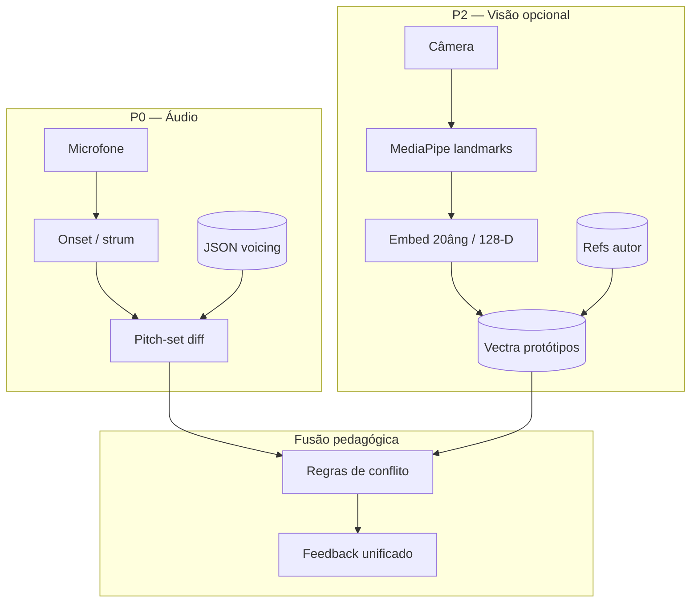

# 11 — Arquitetura Híbrida: Microfone + Câmera

> Síntese da validação da hipótese **“filmar enquanto toca + embeddings + vector DB para comparar postura”** e roadmap de integração no music-tutor.
>
> Série câmera: [09](./09-visao-computacional-acordes-camera.md) · [08](./08-embeddings-postura-acordes-vector-db.md) · [10](./10-integracao-local-embedding-pose.md)

---

## 1. Hipótese original (reformulada)

> O usuário liga a câmera e filma enquanto toca. Em vez de depender só de áudio, usamos vídeo para identificar erros no acorde. Com **embeddings** e **vector DB**, “treinamos” referências e comparamos o frame da mão para validar postura.

### Veredito consolidado

| Aspecto | Veredito |
|---------|----------|
| **Câmera substitui microfone?** | **Não** — visão não ouve cordas abafadas, notas a mais, afinação |
| **Câmera complementa microfone?** | **Sim** — feedback “dedo no traste errado” que áudio não resolve |
| **Embeddings + vector DB?** | **Sim** — padrão **Prototypical / k-NN** sobre protótipos indexados; não é “treinar LLM” |
| **Reutilizar `local-embedding`?** | **Parcial** — **VectraStore + coleções + filtros**; **não** Nomic text |
| **MVP Sprint 1–2?** | **Não** — câmera é **Sprint 3+** opcional |

---

## 2. Por que híbrido é obrigatório



### Matriz “quem responde o quê”

| Pergunta do aluno | Áudio | Visão |
|-------------------|-------|-------|
| “Soa como Am?” | ✅ | ❌ |
| “Falta a nota Si?” | ✅ | ❌ |
| “Dedo 2 no traste certo?” | ❌ | ✅ (com ArUco/grid) |
| “Polegar atrás do braço?” | ❌ | ⚠️ parcial |
| “Praticar sem som?” | ❌ | ✅ |
| “Barre na casa 3 vs open F?” | ⚠️ mesmo pitch class | ✅ com fretboard map |

---

## 3. Pipeline unificado (runtime)

### Fase 1 — Lição carregada

1. `lesson.json` com `voicingId`, `pitch_midi[]`, diagrama dedos.
2. Índice Vectra embarcado: **8–15 protótipos** por `voicingId` (capturas autor).
3. Thresholds calibrados: `τ_cosine`, `δ_margin`, `handPresenceMin`.

### Fase 2 — Loop ao vivo (~30 Hz visão, ~48 kHz áudio)

| Canal | Hot path | Decisão |
|-------|----------|---------|
| **Áudio** | AudioWorklet → onset → pitch-set (50–300 ms pós-strum) | `missing[]`, `extra[]` |
| **Visão** | Worker MP → angles → embed → k-NN (40–350 ms) | `poseMatch`, `nearestRef` |
| **Ritmo** | Tone.js Transport + onset vs grid | `timingOk` |

### Fase 3 — Fusão (regras simples, zero LLM)

```typescript
type FusionResult =
  | { status: "ok"; message: "Acorde correto!" }
  | { status: "pitch_wrong"; missing: number[]; extra: number[] }
  | { status: "pose_wrong"; hint: "Dedo 3 → traste 2, corda 4" }
  | { status: "both_wrong"; pitch: ...; pose: ... }
  | { status: "pose_unknown"; reason: "Mão não visível" };

function fuse(audio: PitchDiff, vision: PoseSearch | null): FusionResult {
  const pitchOk = audio.match;
  const poseOk = vision && vision.topScore > TAU && vision.margin > DELTA;

  if (pitchOk && (poseOk || !vision)) return { status: "ok", ... };
  if (!pitchOk && poseOk) return { status: "pitch_wrong", ... };
  if (pitchOk && vision && !poseOk) return { status: "pose_wrong", ... };
  // ...
}
```

**Prioridade UX:** se áudio diz “errado”, mostrar erro harmónico primeiro; visão como dica secundária (“verifique posição dos dedos”).

---

## 4. “Treinar” com vector DB — o que significa na prática

| Interpretação errada | Interpretação correta |
|---------------------|----------------------|
| Fine-tune Nomic com fotos | **Indexar** vetores de referência no Vectra |
| RAG com descrição textual do acorde | **k-NN** em espaço geométrico (ângulos / MLP) |
| Milhões de exemplos | **8–15 refs/voicing** + 3–5 calibração aluno |
| Retreinar a cada lição | **Upsert** novos `voicingId` sem redeploy de modelo |

### Pipeline de “treino” (autor)

```
1. Gravar 8–15 frames estáveis por voicing (webcam)
2. MediaPipe → landmarks → 20 ângulos SO(3)
3. MLP opcional (20 → 128) ou passthrough L2-norm
4. upsert Vectra com metadata { lesson_id, voicing_id, ... }
5. Calcular τ no conjunto de validação (ref–ref vs ref–neg)
6. Exportar pasta índice + lesson.json no pacote da lição
```

Equivale a **Prototypical Networks na inferência** ([Snell et al., 2017](https://arxiv.org/abs/1703.05175)) — ver [08](./08-embeddings-postura-acordes-vector-db.md).

---

## 5. Stack recomendada por sprint

| Sprint | Entrega | Stack |
|--------|---------|-------|
| **1** | Afinador monofónico | Pitchy + AudioWorklet |
| **2** | Acorde + ritmo | pitch-set diff + Tone.js + JSON voicing |
| **3a** | Visão básica (sem DB) | MediaPipe + match geométrico dedo→grid (ArUco) |
| **3b** | Visão + protótipos | AngleEmbedder + Vectra browser + fusão |
| **4** | Personalização | +3–5 capturas aluno por voicing; peso 2× no k-NN |
| **5** | Transições | DTW em sequências ângulo (trocas de acorde) |

### Ranking tecnologias — modo câmera (Top 8)

| # | Tecnologia | Score | Nota |
|---|------------|-------|------|
| 1 | MediaPipe Hand Landmarker (WASM GPU) | 9.0 | Base de tudo |
| 2 | 20 ângulos SO(3)-invariant | 8.5 | Feature estável |
| 3 | Vectra LocalIndex (browser/Node) | 8.5 | Reuso local-embedding |
| 4 | ArUco fretboard (OpenCV.js) | 8.0 | “Dedo no traste Y” |
| 5 | Passthrough k-NN 63-D | 7.5 | MVP zero treino |
| 6 | CNN-1D classificador | 7.0 | Se catálogo fixo <30 classes |
| 7 | MediaPipe Gesture Embedder 128-D | 6.5 | Fine-tune Model Maker |
| 8 | CLIP / Nomic | 2.0 | **Não** para pose |

---

## 6. Privacidade, permissões e UX

| Tópico | Recomendação |
|--------|--------------|
| **Permissão câmera** | Opt-in explícito; modo “só áudio” default |
| **Processamento** | 100% local (WASM); sem upload de vídeo |
| **Retenção** | Não gravar vídeo; só landmarks efémeros ou refs autor offline |
| **LGPD** | Política clara; calibração aluno = opt-in com delete |
| **Acessibilidade** | Câmera opcional; tutor funcional só com mic |

---

## 7. Critérios de aceite (hipótese validada)

Para considerar a hipótese **validada para produção**:

| Critério | Meta | Como medir |
|----------|------|------------|
| Pose match (voicing fixo, open chords) | **>85%** frame estável | 5 acordes × 10 utilizadores × 5 tentativas |
| Falso positivo pose | **<10%** | Negativos: voicing errado intencional |
| Latência fusão | **<400 ms** pós-estabilização | 5 frames histerese |
| Concordância áudio+visão | **>90%** quando ambos OK | Ground truth instrutor |
| Sem ArUco (só landmarks) | Documentar degradação | Esperado: ~50% em shapes ambíguos |

**Protótipo mínimo:** 5 acordes abertos (C, G, Am, Em, D) + índice Vectra 50 vetores + fusão com pitch-set existente.

---

## 8. Decisões finais (matriz)

| Pergunta | Decisão |
|----------|---------|
| Substituir áudio por câmera? | **Não** |
| Adicionar câmera no produto? | **Sim**, como P2 diferencial |
| Vector DB no core? | **Sprint 3b** — protótipos por lição |
| Reutilizar Nomic? | **Só** RAG docs; pose = embedder numérico |
| Reutilizar Vectra? | **Sim** — padrão `local-embedding` |
| ArUco obrigatório? | **Sim** se feedback por traste; **não** se lição fixa + open chords only |

---

## 9. Referências da série

| Doc | Tema |
|-----|------|
| [02](./02-acordes-validacao-tempo-real.md) | Validação harmónica (P0) |
| [07](./07-stack-mvp-matriz-decisao.md) | Stack MVP microfone |
| [08](./08-embeddings-postura-acordes-vector-db.md) | Metric learning, ProtoNet, thresholds |
| [09](./09-visao-computacional-acordes-camera.md) | MediaPipe, ArUco, latência, OSS |
| [10](./10-integracao-local-embedding-pose.md) | Vectra, schema, pseudocódigo |

Projeto externo: [`local-embedding`](../../../local-embedding/) — `packages/local-embedding/src/store/vectra.ts`

---

*Documento de fechamento da pesquisa “câmera + embeddings”. Próximo passo sugerido: spike Sprint 3a (MediaPipe + overlay dedos) antes de investir em índice Vectra.*
