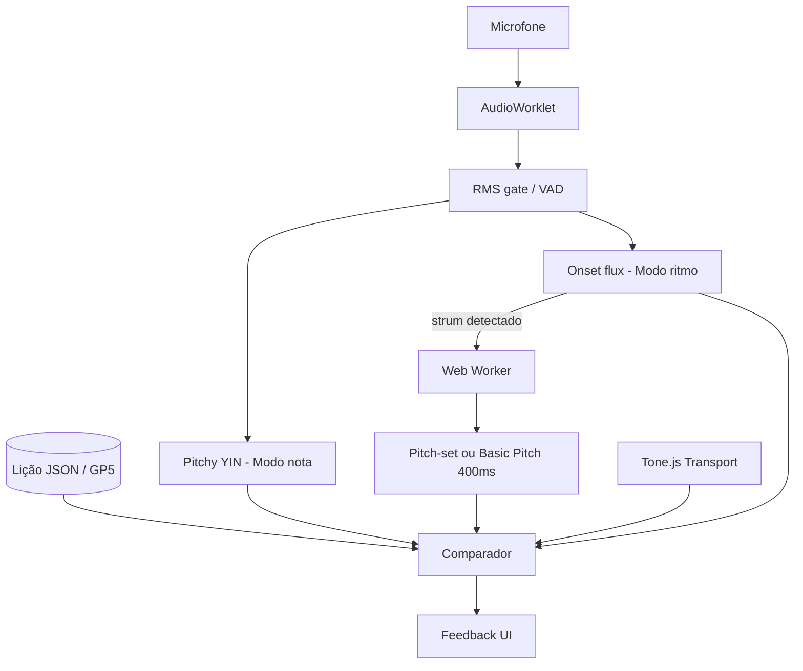

# Deep Research — Tutor de Violão ao Vivo (Microfone)

> **Discovery report v2** · Junho 2026 · Foco exclusivo em **técnicas e tecnologias** para feedback em tempo real via microfone
>
> Produto-alvo: **afinador estendido** — nota, acorde (voicing), ritmo/timing — violão acústico, browser-first.

Esta base **substitui o enquadramento** da [extração de músicas finalizadas](../deep-research-extraction/README.md) para o MVP do music-tutor. Capítulos 02–07 da série anterior permanecem como referência secundária (batch, KB, ID).

---

## Pergunta central

> Como comparar, em **< 100 ms**, o som do microfone com uma **referência de lição** (nota, acorde, compasso) e devolver correção acionável?

Resposta em três pipelines paralelos:

| Pipeline | Técnica core | Quando |
|----------|--------------|--------|
| **P1 — Pitch** | YIN / McLeod / CREPE monofónico | 1 corda, afinação, arpejo nota-a-nota |
| **P2 — Acorde** | Pitch-set diff **ou** NNLS-chroma + template | Batida de acorde vs voicing esperado |
| **P3 — Ritmo** | Onset ODF + relógio metrônomo | Troca de acorde no tempo certo |

---

## Como navegar

| Doc | Conteúdo |
|-----|----------|
| [01 — Pitch monofónico](./01-pitch-monofonico-afinador.md) | YIN, Pitchy, CREPE, Playground Sessions, latência, cents |
| [02 — Acordes ao vivo](./02-acordes-validacao-tempo-real.md) | Pitch-set, NNLS chroma, Basic Pitch janela, Solitito |
| [03 — Ritmo e onset](./03-ritmo-onset-metronomo.md) | Essentia SuperFlux, aubio, IOI, DTW simplificado |
| [04 — Arquitetura browser](./04-arquitetura-browser-web-audio.md) | AudioWorklet, Workers, WASM, buffers |
| [05 — Produtos e patentes](./05-produtos-patentes-pipelines.md) | Yousician US9218748, Rocksmith, clones OSS |
| [06 — Referência de lição](./06-referencia-licoes-voicing.md) | MusicXML frame, GP5, JSON voicing |
| [07 — Stack MVP](./07-stack-mvp-matriz-decisao.md) | Matriz final, roadmap, ranking 25 tecnologias |

### Apêndice — Câmera + Embeddings + Vector DB

> Hipótese: filmar a mão enquanto toca e comparar postura via embeddings indexados (reuso [`local-embedding`](../../../local-embedding/)).

| Doc | Conteúdo |
|-----|----------|
| [08 — Embeddings postura](./08-embeddings-postura-acordes-vector-db.md) | ProtoNet, ângulos SO(3), CNN-1D, few-shot, Vectra, quando **não** usar Nomic |
| [09 — Visão computacional](./09-visao-computacional-acordes-camera.md) | MediaPipe, ArUco, viabilidade **parcial**, latência browser, OSS |
| [10 — Integração local-embedding](./10-integracao-local-embedding-pose.md) | Reuso `VectraStore`, `VectorIndexClient`, schema metadata acordes |
| [11 — Arquitetura híbrida](./11-arquitetura-hibrida-mic-camera.md) | Fusão mic + câmera, critérios de aceite, roadmap Sprint 3+ |

Relacionado: [09 — Tutor violão (product lens)](../deep-research-extraction/09-tutor-violao-microfone-tempo-real.md)

---

## Síntese executiva (90 segundos)

1. **Hot path = zero rede, zero LLM.** Pitch e onset no **AudioWorklet**; ML pesado só pós-batida no **Worker**.
2. **Modo nota:** **Pitchy** (McLeod, 0BSD) ou **YIN** (badlogic/tuner) — ~1–5 ms/frame, clarity gate > 0,75.
3. **Modo acorde:** preferir **diff de pitch classes** (referência JSON) sobre “detectar qual acorde é”; CREMA/Chordify são para **identificação**, não validação pedagógica.
4. **Polifonia leve:** `@playground-sessions/pitch-detection-analysis` (CREPE + NMF, max 4–6 vozes) ou `@spotify/basic-pitch` em janela 300–500 ms pós-strum.
5. **Ritmo:** **Essentia.js** `OnsetDetection` (flux/complex) + threshold; metrônomo **Tone.js** como ground truth temporal.
6. **Patente Yousician (US9218748):** extrai **frequency + salience + timing**, compara item-a-item (nota/intervalo/acorde) com exercise data — valida abordagem “referência + diff”.
7. **Posição/dedo:** mic **não resolve**; feedback = notas esperadas do voicing, não visão da mão.
8. **Câmera (opcional):** viável como **P2** — MediaPipe + protótipos no Vectra; **não substitui** áudio ([apêndice 08–11](./08-embeddings-postura-acordes-vector-db.md)).

---

## Ranking global — Top 12 tecnologias (MVP violão)

| # | Tecnologia | Score | Modo | Licença |
|---|------------|-------|------|---------|
| 1 | **Pitchy** + AudioWorklet | 9.5 | Nota | 0BSD |
| 2 | **Essentia.js** (onset, RMS) | 9.0 | Ritmo / gate | AGPL |
| 3 | **Tone.js** metrônomo | 9.0 | Ritmo ref | MIT |
| 4 | **Pitch-set diff** (custom) | 9.0 | Acorde | — |
| 5 | **@playground-sessions/pitch-detection-analysis** | 8.5 | Acorde poly | MIT |
| 6 | **audiojs/pitch-detection** (NNLS+chord) | 8.0 | Acorde/chroma | — |
| 7 | **@spotify/basic-pitch** (Worker) | 7.5 | Acorde pós-strum | Apache 2.0 |
| 8 | **CREPE** TF.js (tiny/small) | 7.5 | Nota precisa | — |
| 9 | **aubiojs** WASM (YIN/onset) | 7.0 | Nota/ritmo | MIT |
| 10 | **badlogic/tuner** (YIN ref) | 7.0 | Nota | OSS |
| 11 | **Solitito** / chord_detector Rust→WASM | 6.5 | Acorde CPU | MIT |
| 12 | **music21 + GP5** (só referência) | 8.0* | Lição | BSD |

\*Score alto na dimensão **referência**, não captura.

Detalhes: [07 — Stack MVP](./07-stack-mvp-matriz-decisao.md)

---

## Arquitetura alvo (uma página)

---

## Metodologia

- 6 subagentes paralelos (pitch, acordes, ritmo, produtos, arquitetura, formatos) + pesquisa web direta
- Apêndice câmera: 3 subagentes (visão CV, embeddings/metric learning, análise `local-embedding`) + papers JAIC 2025, geometry-aware SO(3), projetos OSS (Computer-Vision-Guitar-Tutor, chord-less)
- Papers: McLeod 2005, YIN de Cheveigné, Fujishima 1999 (chroma), Mauch NNLS 2010, Basic Pitch ICASSP 2022
- Patentes: US9218748 (Yousician/Ovelin), US9839852 (Ubisoft/Rocksmith — rejeitada vs Yousician)
- Repositórios verificados: pitchy, playground pitch-detection-analysis, essentia.js, solitito, badlogic/tuner

---

## Próximo passo

Ler [07 — Stack MVP](./07-stack-mvp-matriz-decisao.md) e escolher **Sprint 1** (só afinador) vs **Sprint 1+2** (afinador + acorde estático).
