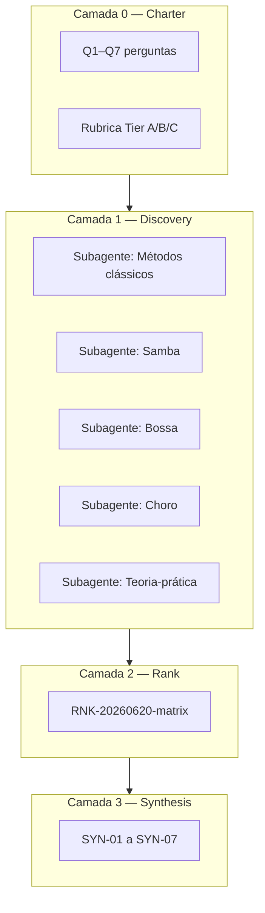

# SYN-00 — Índice da pesquisa: Pedagogia do Violão Brasileiro

> **Engagement**: `research-violao-brasileiro-pedagogia-20260620`  
> **Foco**: metodologias de ensino/aprendizagem de violão para samba, bossa nova e choro — da teoria à prática  
> **Camadas**: 5 subagentes + síntese central + matriz de qualidade

---

## Mapa de relatórios

| Camada | Relatório | Conteúdo |
|--------|-----------|----------|
| 0 | [CHARTER](../00-charter/CHARTER.md) | Perguntas, escopo, rubrica |
| 1 | [RNK-matrix](../03-ranked/RNK-20260620-matrix.md) | Qualificação Tier A/B/C das fontes |
| 2 | [SYN-01 — Métodos clássicos](SYN-01-metodos-classicos-tradicionais.md) | Linha histórica 1960–2020 |
| 3 | [SYN-02 — Samba](SYN-02-pedagogia-samba-violao.md) | Levada, baixaria, partido alto |
| 4 | [SYN-03 — Bossa](SYN-03-pedagogia-bossa-violao.md) | Voicings, dedilhado, harmonia |
| 5 | [SYN-04 — Choro](SYN-04-pedagogia-choro-violao.md) | Escola de Choro, tremolo, repertório |
| 6 | [SYN-05 — Teoria-prática](SYN-05-integracao-teoria-pratica.md) | Modelos pedagógicos + digital |
| 7 | [SYN-06 — Rubrica](SYN-06-rubrica-avaliacao-metodos.md) | Como avaliar um método |
| 8 | [SYN-07 — Plano integrado](SYN-07-plano-estudo-integrado.md) | Trilha 12–24 meses |
| 9 | [APPENDIX — Merge subagentes](APPENDIX-subagentes-merge.md) | Achados exclusivos + validação cruzada |

---

## Síntese executiva (5 bullets)

1. **Duas tradições coexistem**: transmissão oral (roda, imitação) e codificação escrita (partitura + áudio). Os melhores métodos **explicitam** essa tensão — Escola de Choro, monografias Pinto/Costa, Nelson Faria.

2. **Eixo técnico comum**: mão direita (levada/percusão) → harmonia aplicada (baixaria/voicings) → repertório → improviso. A ordem varia: Paulinho Nogueira parte da **harmonia**; Baden/Penezzi da **mão direita**; Escola de Choro da **leitura + repertório**.

3. **Referências Tier A indispensáveis**: Nelson Faria (*Brazilian Guitar Book*), Escola de Choro Brasília, Luiz Otávio Braga (7 cordas/baixaria), Paulinho Nogueira (harmonia), monografias UNIRIO sobre samba.

4. **Gaps críticos**: partido alto sem método único; improviso melódico em samba; pedagogia empírica (estudos com turmas); Hermeto e violão de rodas sem codificação.

5. **Ecossistema 2020–2026**: cursos online (Bertaglia, Penezzi) democratizam baixaria e levadas, mas risco de **cristalizar** variantes regionais se não houver confronto com rodas ao vivo.

---

## Diagrama — Camadas da pesquisa

---

## Nota sobre nomenclatura

Pedidos frequentes citam **"Nelson Ferreira"** — na literatura pedagógica consolidada, o autor de referência é **Nelson Faria** (*O Livro do Violão Brasileiro*, *Toque Junto Bossa Nova*, *Harmonia Aplicada*). Não há método canônico atribuído a "Nelson Ferreira" no mercado editorial brasileiro; trata-se provavelmente de confusão onomástica.
