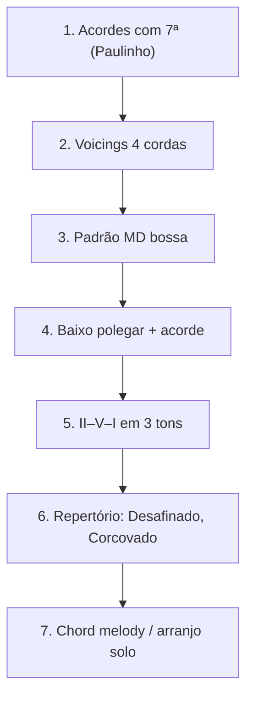

# SYN-03 — Pedagogia do Violão na Bossa Nova

> **Camada**: Discovery C · Tier A: Nelson Faria Parte 2, Paulinho Nogueira, João Gilberto (análise)  
> **Compasso**: 4/4 com subdivisão bossa (semínima pontuada + colcheia)

---

## Por que a bossa exige método próprio

A bossa nova (final dos anos 1950) criou **voicings** e **dedilhado** que não derivam mecanicamente do samba de roda nem do choro de partitura. João Gilberto condensou **harmonia jazzística** (Jobim) em **textura rítmica** minimalista — pedagogicamente, separar:

1. **Voicing** (ME) — tensões, omitir quinta, baixo independente
2. **Dedilhado bossa** (MD) — padrão syncopado 4/4
3. **Harmonia** — II–V–I estendido, planing, modulação cromática

Tentar ensinar bossa só com cifras de songbook produz **acordes certos com groove errado** — problema análogo ao samba sem levada.

---

## Técnicas centrais

| Técnica | Descrição | Ensino típico |
|---------|-----------|---------------|
| **Voicing Jobim** | Maj7, m7(9), 13, alterações | Formações por tríade + tensão |
| **Baixo independente** | Polegar na 5ª/6ª corda; dedos nas tensões | Exercícios polegar solo |
| **Syncopation bossa** | Ataque MD off-beat; silêncios | Padrão Gilberto transcrito |
| **Fingerstyle bossa** | MD dedilhado + ME acordes | Nelson Faria; transcrições |
| **Antecipação harmônica** | Acorde antes do tempo | Escuta Jobim + análise |
| **Planing** | Maj7 paralelos descendentes | Teoria → aplicação |

---

## Campo harmônico — como métodos ensinam

### Tonalidade maior (ex.: C)

| Grau | Acorde bossa típico | Função pedagógica |
|------|---------------------|-------------------|
| I | Cmaj7, C6 | Repouso; 6 como cor bossa |
| ii | Dm7, Dm9 | Subdominante jazz |
| V | G7(9), G13 | Dominante estendida |
| VI | A7(13) | Dominante secundário |
| III | E7(9) | V/V ou plano cromático |

### Progressões-assinatura (ensinar na ordem)

```
II – V – I           | Dm9  G13  Cmaj9 |
I – VI7 – II – V     | Cmaj7  A7  Dm7  G7 |
Planing              | Fmaj7  Emaj7  Ebmaj7  D7 |
```

### Escalas (por acorde)

| Acorde | Escala | Uso melódico |
|--------|--------|--------------|
| Cmaj7 | Major, lydian | 9, 6 |
| Dm7 | Dórico | 6, 9 |
| G7 | Mixolídio, altered (V→I) | Tensões 9, 13 |
| G7→C | Bebop dominant | Cromático 6–b7 |

**Fonte harmônica transversal**: Antonio Adolfo (*O Livro do Músico*), Almir Chediak (*Harmonia e Improvisação*) — teoria em teclado, aplicação violão via Nelson Faria.

---

## Sequência didática recomendada



### Detalhamento por fase

**Fase 1–2 (semanas 1–8)** — Paulinho Nogueira ou Nelson *Acordes, Arpejos e Escalas*  
Formações fechadas; inversões; Cmaj7, Am7, Dm7, G7.

**Fase 3 (semanas 9–12)** — Padrão MD  
Transcrição Gilberto (*Chega de Saudade* intro) — uma batida por compasso internalizada.

**Fase 4 (semanas 13–20)** — Independência polegar  
Exercício: baixo em semínimas, acorde nos tempos 2 e 4.

**Fase 5 (semanas 21–32)** — Harmonia funcional estendida  
II–V–I em C, F, Bb; substituição trítono (introdução).

**Fase 6 (repertório)** — Nelson Faria Parte 2 + *Toque Junto Bossa Nova*  
Áudio online; partitura obrigatória.

**Fase 7 (avançado)** — *Harmonia Aplicada* (chord melody)  
Arranjo solo estilo Paulinho/Oscar Castro Neves.

---

## Bossa vs jazz vs samba — diferença pedagógica

| Dimensão | Bossa | Jazz (bebop) | Samba violão |
|----------|-------|--------------|--------------|
| **Compasso** | 4/4 syncopado | 4/4 swing | 2/4 levada |
| **Voicing** | 4 notas, omit 5ª | Shell + extensões | Triades + baixaria |
| **MD** | Dedilhado suave | Flatpick raro | Percussivo/rasqueado |
| **Harmonia** | Jobim + planing BR | Cycle, substitutions | I–VI–II–V funcional |
| **Pedagogia** | Transcrição Gilberto | Real book + escala | Roda + levada |
| **Entrada** | Após acordes 7ª | Após teoria jazz | Após pulso 2/4 |

**Erro comum**: ensinar bossa com levada de samba 2/4 — groove incompatível.

---

## Métodos e materiais — avaliação

| Material | Tier | Prós | Contras |
|----------|------|------|---------|
| Nelson Faria — Parte 2 Bossa | A | Áudio + levadas escritas | Exige partitura |
| Paulinho — Método 1968 | A | Harmonia profunda | Pouco groove |
| Paulinho — *A nova bossa é violão* (LP) | B | Áudio histórico | Sem vídeo |
| *Toque Junto Bossa Nova* (Nelson) | A | Play-along | Nicho |
| PianoGroove / Jobim analysis | B | Dispositivos harmônicos | Piano-centric |
| Cifra Club bossa | C | Acessível | Sem voicing/Gilberto |

---

## Dispositivos harmônicos Jobim (kit pedagógico)

Extraído de análises consolidadas (PianoGroove, DA-048 research irmão):

1. **M6 como dominante** — C6 no lugar de F7 (samba/bossa)
2. **Imaj7 → Im7** — planing interno
3. **Diminuto de passagem** — entre I e II
4. **Modulação terça relacionada** — C → A → F
5. **Antecipação** — acorde no "&" do compasso anterior

Cada dispositivo: **escuta** → **identificação** → **voicing violão** → **repertório**.

---

## Exercícios práticos

1. **Voicings**: 12 formas de Cmaj7 na região 1–5
2. **MD bossa**: padrão Gilberto 8 compassos loop
3. **Baixo + acorde**: Dm7 | G7 | Cmaj7 — polegar semínimas
4. **II–V–I**: transpor para F, Eb, D
5. **Planing**: Fmaj7–Emaj7–Ebmaj7–D7 com mesma forma MD
6. **Transcrição**: 16 compassos *Insensatez* (violão Jobim ou Oscar)
7. **Acompanhamento vocal**: cantar + voicing mínimo

---

## Lacunas

- Pedagogia **comparativa** Gilberto vs violonistas pós-1980
- **Bossa-samba** (Jobim) vs bossa pura — pouca distinção nos métodos
- **Improviso melódico** bossa violão (entre jazz e choro)
- Materiais em **português** com vídeo de voicings lentos — escassez vs demanda

---

## Referências

- Nelson Faria — *O Livro do Violão Brasileiro* (Parte 2)
- Paulinho Nogueira — Método (1968) + discos 1964–65
- Adolfo, A. — *O Livro do Músico* (1989)
- Dreyfus / análises Jobim — https://www.pianogroove.com/live-seminars/so-danco-samba-tutorial-jobim/
- João Gilberto — transcrições acadêmicas (UFBA, UFRJ diversos)

---

## Síntese

Bossa no violão = **voicing + dedilhado + harmonia estendida**. Paulinho funda a harmonia; Nelson Faria integra ritmo e áudio; Gilberto exige **transcrição**. Não misturar com levada de samba 2/4. Trilha: acordes 7ª → padrão MD → polegar → II–V–I → repertório Jobim.
