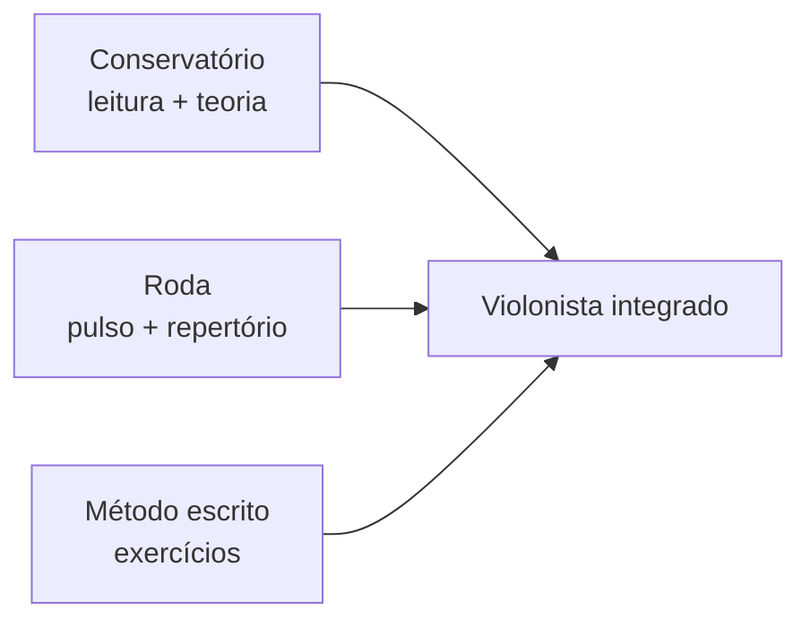

# SYN-05 — Integração Teoria-Prática e Métodos Contemporâneos

> **Camada**: Discovery E · Conservatório · Autodidata · Online · MPB

---

## Modelos pedagógicos aplicados ao violão BR

| Modelo | Descrição | Onde aparece | Adequação violão BR |
|--------|-----------|--------------|---------------------|
| **Audiativo-oral** | Escuta → imitação → refinamento | Rodas, Marcel Powell/Baden | ★★★★★ Essencial |
| **Analítico-sintético** | Teoria → decomposição → síntese | Paulinho, Adolfo, Chediak | ★★★★☆ Harmonia |
| **Imitação modelada** | Transcrição do mestre | Braga, Escola de Choro | ★★★★★ Choro/samba |
| **Corpo primeiro** | Pulso antes instrumento | O Passo (Ciavatta) | ★★★★☆ Ritmos |
| **Kodaly adaptado** | Solfege + movimento | Conservatórios, Villa-Lobos | ★★★☆☆ Base infantil |
| **Constructivista** | Aluno constrói repertório | Cursos online modulares | ★★★☆☆ Variável |
| **Competência** | Demonstração vídeo | Escola de Choro | ★★★★☆ Avaliação |

**Insight**: nenhum modelo sozinho basta. Métodos Tier A **combinam** analítico (partitura) + oral (áudio/roda).

---

## Três eixos institucionais

### Conservatório / universidade (UNIRIO, UFRJ, EBA-PR)

- **Força**: leitura, teoria, legitimidade acadêmica
- **Fraqueza histórica**: violão popular relegado até anos 1980
- **Marcos**: Turíbio Santos (UFRJ/UNIRIO); Braga (UNIRIO); monografias samba
- **Integração**: teoria (Adolfo/Chediak) + prática (Braga) em cursos superiores

### Autodidata / roda

- **Força**: groove autêntico, repertório vivo
- **Fraqueza**: lacunas teóricas, teto técnico irregular
- **Integração**: songbook + transcrição YouTube + método pontual

### Escola popular certificável

- **Força**: currículo + comunidade (Escola de Choro)
- **Modelo**: teoria musical inclusa no básico; híbrido presencial/online

---

## Plataformas e cursos brasileiros (2020–2026)

| Plataforma | Foco | Tier | Integração T↔P |
|------------|------|------|----------------|
| **Escola de Choro** | Choro certificado | A | Alta |
| **Violão Samba e Choro** (Bertaglia) | 11 ritmos MPB | B | Média-alta |
| **Alessandro Penezzi VBO** | Choro + levadas + harmonia | A | Alta |
| **KaiserPlay / Marcel Powell** | Baden levadas | B | Média |
| **Cifra Club Academy** | Pop/genérico | C | Baixa BR |
| **iMusic School** | Variado | C | Baixa |
| **Berklee Online** (PT indirecto) | Jazz | B | Bossa tangencial |

**Tendência 2020–2026**:

1. **Híbrido** presencial/online pós-pandemia (Escola de Choro)
2. **Play-along** em todo método pago
3. **Tab + pauta + cifra** tríplice (Bertaglia)
4. **Comunidade** Discord/WhatsApp como "roda virtual"
5. **Microlearning** — risco de fragmentação sem currículo

---

## Framework sintético teoria → prática

### Estágio 0 — Alfabetização (4–8 semanas)

- Notas, ritmos, pulsos (Villa-Lobos / O Passo)
- Acordes maiores/menores, cifra
- **Prática**: 3 canções simples MPB

### Estágio 1 — Harmonia aplicada (8–16 semanas)

- Campo harmônico T/SD/D
- Acordes 7ª, inversões (Paulinho / Nelson *Acordes*)
- **Prática**: acompanhar canto em 3 tons

### Estágio 2 — Ritmo de gênero (16–24 semanas por gênero)

- **Samba**: levada + baixaria (Nelson P1 + roda)
- **Bossa**: voicing + MD (Nelson P2 + Gilberto)
- **Choro**: arpejo + leitura (Escola Básico 3)

### Estágio 3 — Repertório profundo (6–12 meses)

- Transcrições Braga/Penezzi
- Formas choro AABB; modulações
- **Teoria**: Sève, Chediak vol.2

### Estágio 4 — Improviso e arranjo (contínuo)

- Escalas diminuta, alterada
- Chord melody (Nelson *Harmonia Aplicada*)
- Rearmonização (Adolfo, Penezzi)

---

## Gaps — o que nenhum método cobre bem

| Gap | Impacto | Workaround |
|-----|---------|------------|
| Partido alto sistematizado | Alto | Transcrição Noel Rosa + roda |
| Samba-improviso melódico | Alto | Jazz + transcrição Cartola |
| Pedagogia empírica (RCT) | Médio | — |
| Hermeto violão | Médio | Transcrições isoladas |
| Variantes regionais | Médio | Imersão local |
| 7 cordas em roda 6 cordas | Médio | Arranjo adaptativo |
| Acessibilidade/deficiência | Alto | Literatura quase zero |
| **Nelson Ferreira** (nome) | — | Usar **Nelson Faria** |

---

## MPB além dos três gêneros

Métodos Tier A incluem **frevo, baião, xote** (Nelson Faria Partes 4–5; Bertaglia 11 ritmos). Pedagogia:

- Mesmo eixo: **levada do gênero** → harmonia regional → repertório
- **Guinga**, **João Bosco** — transcrições, não métodos
- **Bozo Iannone**, **Ian Guest** — harmonia prática (Tier B)

---

## Síntese

Integração teoria-prática no violão BR = **três pernas**: conservatório (leitura/teoria), método com áudio (Nelson/Escola), roda (groove). Online 2020+ acelera acesso mas **não substitui** confronto sonoro ao vivo. Framework em 5 estágios cobre 18–36 meses até fluência multigênero.
