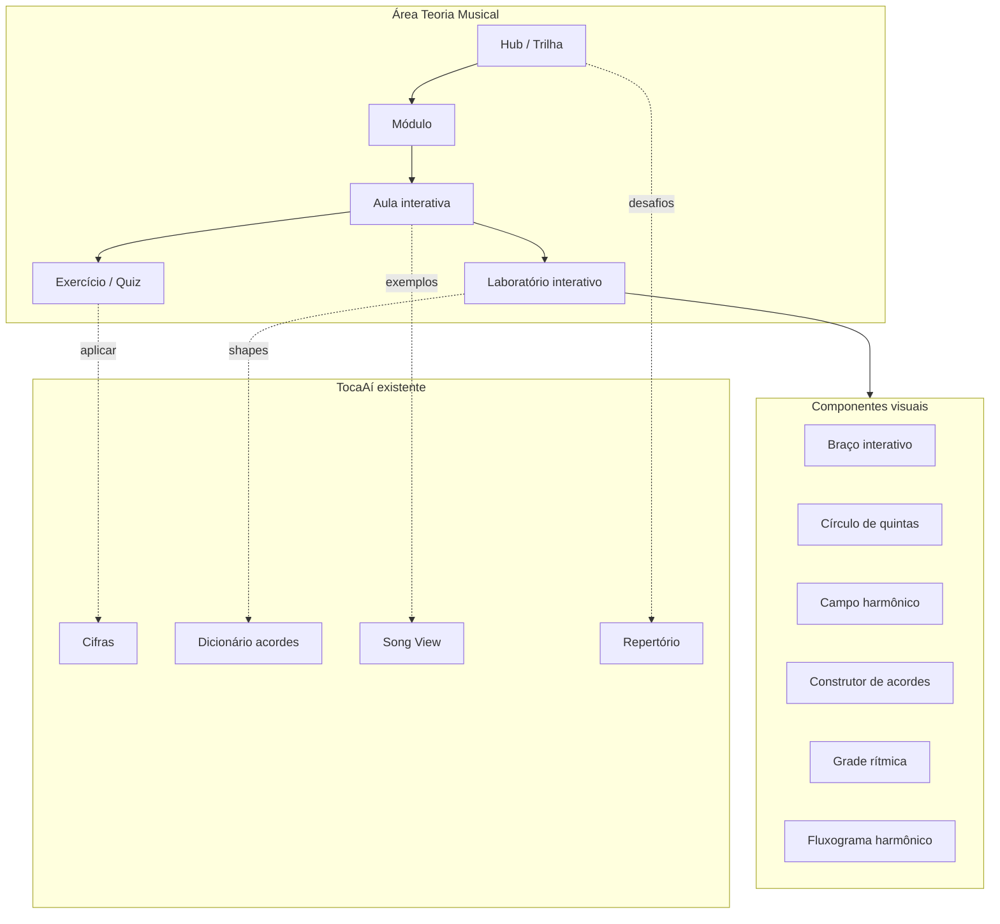

# Teoria Musical — Área de Estudo TocaAí

> **Status:** planejamento + protótipo HTML + **infra no app** (ver [09-IMPLEMENTACAO-ESTRUTURAL.md](./09-IMPLEMENTACAO-ESTRUTURAL.md))
> **Data:** 2026-06-08  
> **Instrumento foco:** violão (6 cordas, afinação padrão)  
> **Contexto cultural:** música brasileira (MPB, bossa nova, samba, choro, regional)

---

## Propósito

Criar uma **sessão completa de estudo teórico-prático** dentro do TocaAí — material progressivo, visual e interativo que leve o músico do básico (notas, intervalos, afinação) até construção avançada de acordes, campo harmônico, arranjos e leitura harmônica de obras do repertório brasileiro.

Diferente do **Dicionário de Acordes** (referência pontual) e do **Modo Estudo por Obra** (SPEC-07), esta área é um **curso estruturado** com trilha, exercícios, diagramas interativos e ligação explícita ao violão e à MPB.

---

## Mapa de documentos

| Doc | Conteúdo |
|-----|----------|
| [01-VISAO-E-TOM-DE-VOZ.md](./01-VISAO-E-TOM-DE-VOZ.md) | Visão, público, princípios pedagógicos, tom de voz |
| [02-ARQUITETURA-INFORMACAO.md](./02-ARQUITETURA-INFORMACAO.md) | IA, navegação, trilhas, metadados de aulas |
| [03-COMPONENTES-UI.md](./03-COMPONENTES-UI.md) | Catálogo de componentes visuais e interativos |
| [04-CURRICULO-PROGRESSIVO.md](./04-CURRICULO-PROGRESSIVO.md) | Trilha completa em 8 níveis, módulos e aulas |
| [05-CONTEUDO-APROFUNDADO.md](./05-CONTEUDO-APROFUNDADO.md) | Desenvolvimento temático detalhado por eixo |
| [06-DINAMICAS-PRATICA.md](./06-DINAMICAS-PRATICA.md) | Exercícios, quizzes, desafios, ligação com obras |
| [07-SPEC-FUNCIONAL.md](./07-SPEC-FUNCIONAL.md) | Especificação SDD: entidades, casos de uso, critérios |
| [08-INTEGRACAO-APP.md](./08-INTEGRACAO-APP.md) | Integração com catálogo, cifras, dicionário, repertório |
| [09-IMPLEMENTACAO-ESTRUTURAL.md](./09-IMPLEMENTACAO-ESTRUTURAL.md) | Infra T0–T5 no app produção (rotas, kernel, componentes, progresso) |
| [10-AUTHORING-CONTEUDO.md](./10-AUTHORING-CONTEUDO.md) | Guia de produção de aulas: modelo pedagógico P1–P9, contrato de blocos, tipos de exercício, componentIds, checklist |

---

## Protótipo HTML

Abrir no browser — sem build:

| Arquivo | Conteúdo |
|---------|----------|
| [`apps/styleguide/screens/teoria-musical/index.html`](../../apps/styleguide/screens/teoria-musical/index.html) | Hub da área — trilha, módulos, progresso |
| [`apps/styleguide/screens/teoria-musical/aula-exemplo.html`](../../apps/styleguide/screens/teoria-musical/aula-exemplo.html) | Aula completa: Campo Harmônico em Dó maior |
| [`apps/styleguide/screens/teoria-musical/componentes.html`](../../apps/styleguide/screens/teoria-musical/componentes.html) | Galeria de todos os componentes teóricos |

```bash
cd musicas && npm start
# → http://localhost:3000/apps/styleguide/screens/teoria-musical/index.html
```

---

## Diagrama de alto nível



---

## Relação com specs existentes

| Spec | Relação |
|------|---------|
| SPEC-03 (Dicionário) | Teoria **explica**; dicionário **referencia** shapes |
| SPEC-07 (Estudo/Arranjos) | Teoria alimenta **compreensão**; estudo por obra aplica |
| SPEC-02 (Cifras) | Anotações teóricas em cifras; graus funcionais |
| SPEC-06 (Repertório) | Desafios "tocar 3 bossas com II-V-I" |

---

## Próximos passos (pós-protótipo)

1. Validar trilha e tom de voz com usuário  
2. Priorizar componentes para implementação em `src/components/theory/`  
3. Definir formato de dados das aulas (`data/theory/`)  
4. Integrar hub na sidebar principal do app  
5. Produzir conteúdo das primeiras 12 aulas (Nível 1–2)
