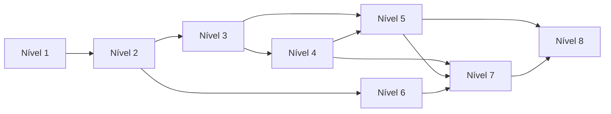

# 04 — Currículo Progressivo (8 Níveis)

> Trilha completa: ~96 aulas · ~40h estimadas · violão + MPB

---

## Visão geral dos níveis

| Nível | Nome | Objetivo | Aulas | Horas |
|-------|------|----------|-------|-------|
| 1 | **O violão como mapa** | Notas, cordas, intervalos no braço | 10 | 3h |
| 2 | **Escalas e tonalidade** | Maior/menor, armaduras, CAGED intro | 12 | 4h |
| 3 | **Campo harmônico** | Funções, graus, diatônico | 14 | 5h |
| 4 | **Construção de acordes** | Terças, tensões, inversões, voicings | 14 | 5h |
| 5 | **Progressões & cadências** | II–V–I, modulações, blues, MPB | 12 | 4h |
| 6 | **Ritmo brasileiro** | Bossa, samba, choro, baião no violão | 10 | 3h |
| 7 | **Arranjo para violão** | Textura, baixo, intro, voicings Jobim | 12 | 5h |
| 8 | **Harmonia avançada BR** | Substituições, modos, choro, Dilermando | 12 | 5h |

---

## Nível 1 — O violão como mapa

### M1.1 — Afinação e anatomia
- Aula 1.1: As 6 cordas e afinação E A D G B e
- Aula 1.2: Números de casa, pestana, cordas abertas
- Aula 1.3: Ler shapes na cifra brasileira

### M1.2 — Notas no braço
- Aula 1.4: Nomenclatura PT/EN (Dó, Ré, Mi…)
- Aula 1.5: Encontrar notas nas cordas Mi e Ré (até 12º traste)
- Aula 1.6: Mapa completo — oitavas repetidas

### M1.3 — Intervalos
- Aula 1.7: Segunda, terça, quarta — ouvir e localizar
- Aula 1.8: Quinta e oitava — alicerces
- Aula 1.9: Semitom vs tom — cromático no 1º traste
- Aula 1.10: **Desafio:** localizar todas as quintas de Lá no braço

**Obra âncora:** *Eu Sei Que Vou Te Amar* (Tom Jobim) — identificar cordas graves

---

## Nível 2 — Escalas e tonalidade

### M2.1 — Escala maior
- Aula 2.1: Fórmula T-T-S-T-T-T-S
- Aula 2.2: Dó maior no braço (posição aberta)
- Aula 2.3: Sol maior e Ré maior — shapes móveis
- Aula 2.4: Círculo de quintas — armaduras

### M2.2 — Escala menor
- Aula 2.5: Menor natural, harmônica, melódica — quando usar
- Aula 2.6: Relativa menor (Lá menor ↔ Dó maior)
- Aula 2.7: Lá menor no braço

### M2.3 — CAGED (intro)
- Aula 2.8: 5 formas de acorde maior no braço
- Aula 2.9: Conectar formas — subir o braço
- Aula 2.10: Escalas dentro das formas CAGED
- Aula 2.11: Pentatônica maior e menor — blues e MPB
- Aula 2.12: **Desafio:** tocar escala de Dó em 3 regiões

**Obra âncora:** *Águas de Março* — tonalidade e mood

---

## Nível 3 — Campo harmônico

### M3.1 — Graus da escala
- Aula 3.1: I II III IV V VI VII — numerals romanos
- Aula 3.2: Campo harmônico de Dó maior (tabela completa)
- Aula 3.3: Funções: Tônica, Subdominante, Dominante
- Aula 3.4: Pré-dominante (II e IV)

### M3.2 — Campo em outros tons
- Aula 3.5: Sol maior, Ré maior, Fá maior
- Aula 3.6: Menor harmônico — acordes alterados
- Aula 3.7: Menor melódico — dominante especial

### M3.3 — Aplicacao MPB
- Aula 3.8: Campo em *Chega de Saudade* (Análise)
- Aula 3.9: Campo em *Construção* (Chico Buarque)
- Aula 3.10: Cadência I–VI–II–V–I na prática
- Aula 3.11: Acordes emprestados (bVII, bVI)
- Aula 3.12: **Desafio:** harmonizar melodia simples com campo
- Aula 3.13: Ficha: todos os campos até 4 sustenidos
- Aula 3.14: Quiz nível 3

**Obra âncora:** *Garota de Ipanema* — II–V–I em Fá maior

---

## Nível 4 — Construção de acordes

### M4.1 — Tríades
- Aula 4.1: Maior, menor, diminuta, aumentada
- Aula 4.2: Empilhamento de terças (visual)
- Aula 4.3: Tríades no braço — 3 voicings por tipo

### M4.2 — Tétrades
- Aula 4.4: 7M, 7, m7, m7M
- Aula 4.5: m7(b5) — meio-diminuto
- Aula 4.6: dim7 e sua simetria

### M4.3 — Tensões
- Aula 4.7: 9, 11, 13 — o que adicionar e quando
- Aula 4.8: 7(9), 7M(9), m7(9) — bossa voicings
- Aula 4.9: Alterações: b9, #11, b13
- Aula 4.10: Suspensões: sus4, 7sus4, 7(13)

### M4.4 — Inversões e slash
- Aula 4.11: Baixo diferente do fundamental (C/E)
- Aula 4.12: Voicings fechados vs abertos no violão
- Aula 4.13: **Desafio:** construir G7(13) de 3 jeitos
- Aula 4.14: Quiz nível 4

**Obra âncora:** *Insensatez* — riqueza harmônica Jobim

---

## Nível 5 — Progressões & cadências

### M5.1 — Cadências clássicas
- Aula 5.1: Autêntica (V–I), plagal (IV–I)
- Aula 5.2: II–V–I maior e menor
- Aula 5.3: Deceptiva (V–vi)
- Aula 5.4: Backdoor (bVII7–I)

### M5.2 — Progressões MPB
- Aula 5.5: I–VI–IV–V e variantes
- Aula 5.6: Progressão de *Triste* (Jobim)
- Aula 5.7: Ciclo de quintas descendente
- Aula 5.8: Blues 12 compassos no violão

### M5.3 — Modulação
- Aula 5.9: Modulação por dominante comum
- Aula 5.10: Modulação em choro (semi-tom)
- Aula 5.11: **Desafio:** analisar 2 modulações em Djavan
- Aula 5.12: Quiz nível 5

---

## Nível 6 — Ritmo brasileiro no violão

### M6.1 — Fundamentos
- Aula 6.1: Pulso, contratempo, syncopation
- Aula 6.2: Padrão bossa nova (baixo + dedilhado)
- Aula 6.3: Samba de partido alto — levada

### M6.2 — Gêneros
- Aula 6.4: Choro — ritmo e harmonia
- Aula 6.5: Baião e xote (Nordeste)
- Aula 6.6: Toquinho / violão popular — groove
- Aula 6.7: Integrar ritmo + harmonia (mesma obra)

### M6.3 — Prática
- Aula 6.8: Metrônomo e subdivisão terciária
- Aula 6.9: **Desafio:** 4 gêneros, mesma progressão
- Aula 6.10: Quiz nível 6

**Obra âncora:** *Desafinado* — bossa clássica

---

## Nível 7 — Arranjo para violão

### M7.1 — Conceitos
- Aula 7.1: O que é arranjo vs cifra crua
- Aula 7.2: Registros: grave, médio, agudo
- Aula 7.3: Baixo independente — walking simplificado

### M7.2 — Técnicas
- Aula 7.4: Intro e outro — frases características
- Aula 7.5: Harmonia + melodia simultânea
- Aula 7.6: Percussão no corpo / strings muted
- Aula 7.7: Voicings Jobim — estudo comparativo

### M7.3 — Projeto
- Aula 7.8: Analisar arranjo Dilermando (GP)
- Aula 7.9: Montar arranjo de verso simples
- Aula 7.10: Ponte e modulação no arranjo
- Aula 7.11: Checklist antes de gravar
- Aula 7.12: **Projeto final:** arranjo 1 minuto

---

## Nível 8 — Harmonia avançada & repertório BR

### M8.1 — Substituições
- Aula 8.1: Substituição trítono
- Aula 8.2: Reharmonização linear
- Aula 8.3: Modal interchange completo

### M8.2 — Modos e escala-limite
- Aula 8.4: Dórico, mixolídio — quando na MPB
- Aula 8.5: Escala diminuta — choro
- Aula 8.6: Lydian — sonoridade Jobim

### M8.3 — Mestres brasileiros
- Aula 8.7: Harmonia de Pixinguinha
- Aula 8.8: Garoto — voicings únicos
- Aula 8.9: Chico Buarque — progressões narrativas
- Aula 8.10: Djavan — modulações elegantes
- Aula 8.11: **Desafio final:** análise completa 1 obra
- Aula 8.12: Certificação trilha (quiz integrado)

---

## Dependências entre níveis

Níveis 6 (ritmo) pode paralelizar com 4–5 após Nível 2.
