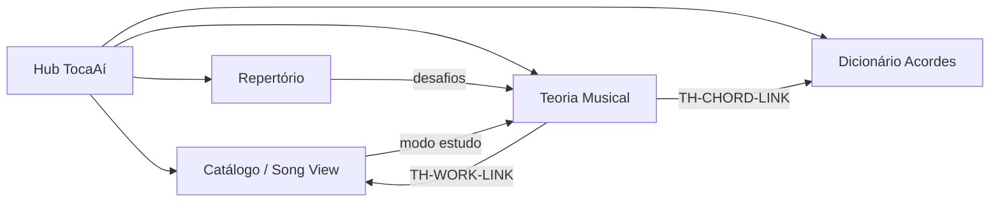

# 08 — Integração com o App TocaAí

---

## Posição no produto

A Teoria Musical é um **bounded context** paralelo ao Catálogo — compartilha acordes, obras e navegação, mas possui **shell próprio** (sidebar secundária) para não poluir a biblioteca.



---

## Entrada na navegação global

### Sidebar principal (hub.html)

Nova seção **Estudo**:

```
Estudo
├── Teoria Musical  ← NOVO
├── Dicionário de acordes
└── Repertório
```

Ícone sugerido: `◈` ou `𝄞` (partitura simplificada)

### Song View — aba ou banner

Opcional Fase 2: aba **Teoria** na Song View quando obra tem `theoryAnnotations`:

- Graus funcionais inline na cifra
- Link "Estudar campo de [tom]"
- Acordes da obra no contexto harmônico

---

## Integração com dicionário (SPEC-03)

| Direção | Comportamento |
|---------|---------------|
| Teoria → Dicionário | TH-CHORD-LINK abre acorde com shape |
| Dicionário → Teoria | Link "Como este acorde se forma?" → aula construtor |
| Dados | Mesmo `dictionary.json` — teoria não duplica shapes |

---

## Integração com cifras (SPEC-02)

Fase 2 — overlay de graus:

```typescript
interface TheoryAnnotation {
  workId: string;
  key: string;
  sections: {
    label: string;       // "Refrão"
    chords: { symbol: string; degree: string; function?: "T"|"SD"|"D" }[];
  }[];
}
```

Storage: `data/theory/annotations/{workId}.json`

---

## Integração com repertório (SPEC-06)

- Desafio semanal pode criar **setlist temporária** "Prática Teoria"
- Notas de repertório linkam aulas (`tags: ["theory:n3-m1"]`)

---

## Integração com modo estudo (SPEC-07)

| Feature | Sinergia |
|---------|----------|
| Notas de estudo | Template "Análise harmônica" com graus |
| Arranjos | Checklist teoria Nível 7 embutido |
| Loop seção | Exercício "tocar cadência 8×" |

---

## Eventos (analytics local — opcional)

```typescript
type TheoryEvent =
  | { type: "lesson_start"; lessonId: string }
  | { type: "lesson_complete"; lessonId: string; score?: number }
  | { type: "lab_interact"; componentId: string; action: string }
  | { type: "work_link_click"; lessonId: string; workId: string };
```

Storage: `data/user/theory-events.json` (opt-in)

---

## Deep links

| URL | Destino |
|-----|---------|
| `/teoria` | Hub |
| `/teoria/nivel/3` | Nível 3 expandido |
| `/teoria/aula/n3-m1-a2` | Aula campo harmônico |
| `/teoria/lab/campo?key=C` | Lab direto |
| `/teoria/glossario/cadencia` | Termo glossário |

Protótipo: links relativos `.html` — produção: router SPA.

---

## Migração styleguide → produção

1. Extrair `teoria.css` → `src/styles/theory.css`
2. Portar `teoria.js` labs → módulos TS em `src/components/theory/`
3. Manter protótipo HTML atualizado como referência visual (SPEC-10)

---

## Checklist integração (implementação)

- [ ] Item sidebar em hub.html e app real
- [ ] Card no styleguide index
- [ ] Link bidirecional dicionário ↔ teoria (1 acorde piloto)
- [ ] 3 obras com TH-WORK-LINK funcional
- [ ] Progresso teoria visível no hub (opcional widget)
